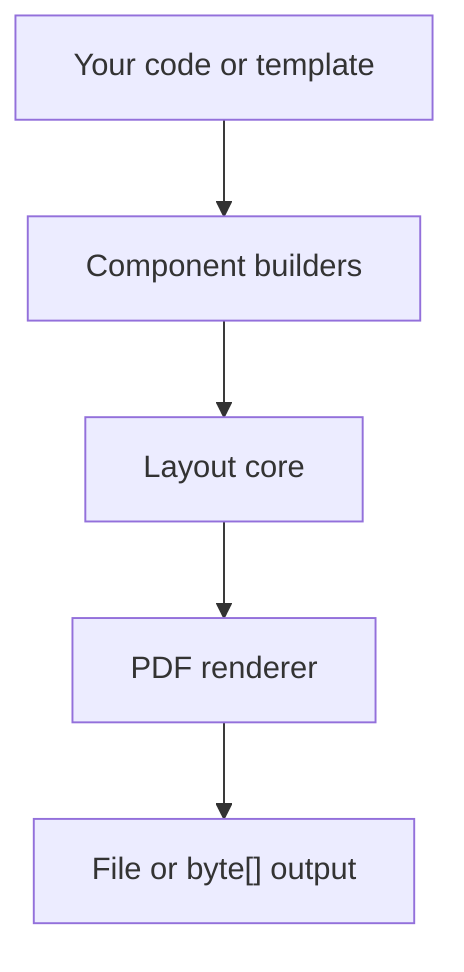

# GraphCompose

**GraphCompose** is a Java document-layout engine for building PDFs from components instead of fixed coordinates. You describe the structure, the layout core calculates placement and pagination, and the PDF renderer turns that into a finished document.

This repository currently ships a production-ready PDF path and a template layer for CV and cover-letter generation built on top of the same engine.

## Why GraphCompose

- Build documents declaratively with builders and containers.
- Let the layout core handle spacing, alignment, and page flow.
- Reuse the same engine for simple PDFs and higher-level templates.
- Generate to a file or keep the result in memory as `byte[]`.

## Current Scope

- `com.demcha.compose.GraphCompose` is the main entrypoint.
- PDF generation is the supported rendering flow today.
- CV and cover-letter templates live in `com.demcha.Templatese` as examples built on top of the engine.
- Internal package names such as `loyaut_core` and `Templatese` remain in place for compatibility during this docs refresh.

## Quick Start

Build a PDF directly to disk with the current engine-first API:

```java
import com.demcha.compose.GraphCompose;
import com.demcha.compose.loyaut_core.components.ComponentBuilder;
import com.demcha.compose.loyaut_core.components.content.text.TextStyle;
import com.demcha.compose.loyaut_core.components.layout.Align;
import com.demcha.compose.loyaut_core.components.layout.Anchor;
import com.demcha.compose.loyaut_core.components.style.Margin;
import com.demcha.compose.loyaut_core.core.PdfComposer;
import org.apache.pdfbox.pdmodel.common.PDRectangle;

import java.nio.file.Path;

Path output = Path.of("target", "hello-graphcompose.pdf");

try (PdfComposer composer = GraphCompose.pdf(output)
        .pageSize(PDRectangle.A4)
        .margin(24, 24, 24, 24)
        .markdown(true)
        .create()) {

    ComponentBuilder cb = composer.componentBuilder();

    cb.vContainer(Align.middle(8))
            .anchor(Anchor.topLeft())
            .margin(Margin.of(8))
            .addChild(cb.text()
                    .textWithAutoSize("Hello GraphCompose")
                    .textStyle(TextStyle.DEFAULT_STYLE)
                    .anchor(Anchor.topLeft())
                    .build())
            .build();

    composer.build();
}
```

Generate a PDF in memory with the same builder flow:

```java
import com.demcha.compose.GraphCompose;
import com.demcha.compose.loyaut_core.components.ComponentBuilder;
import com.demcha.compose.loyaut_core.components.content.text.TextStyle;
import com.demcha.compose.loyaut_core.components.layout.Align;
import com.demcha.compose.loyaut_core.components.layout.Anchor;
import com.demcha.compose.loyaut_core.components.style.Margin;
import com.demcha.compose.loyaut_core.core.PdfComposer;
import org.apache.pdfbox.pdmodel.common.PDRectangle;

try (PdfComposer composer = GraphCompose.pdf()
        .pageSize(PDRectangle.A4)
        .margin(24, 24, 24, 24)
        .create()) {

    ComponentBuilder cb = composer.componentBuilder();

    cb.vContainer(Align.middle(8))
            .anchor(Anchor.topLeft())
            .margin(Margin.of(8))
            .addChild(cb.text()
                    .textWithAutoSize("In-memory PDF")
                    .textStyle(TextStyle.DEFAULT_STYLE)
                    .anchor(Anchor.topLeft())
                    .build())
            .build();

    byte[] pdfBytes = composer.toBytes();
}
```

## Template Layer Example

The template layer is optional. Use it when you want higher-level CV or cover-letter building blocks while keeping the same `GraphCompose` engine underneath.

```java
import com.demcha.Templatese.CvTheme;
import com.demcha.Templatese.TemplateBuilder;
import com.demcha.compose.GraphCompose;
import com.demcha.compose.loyaut_core.core.PdfComposer;
import org.apache.pdfbox.pdmodel.common.PDRectangle;

try (PdfComposer composer = GraphCompose.pdf()
        .pageSize(PDRectangle.A4)
        .margin(24, 24, 24, 24)
        .create()) {

    TemplateBuilder template = TemplateBuilder.from(
            composer.componentBuilder(),
            CvTheme.defaultTheme());

    template.moduleBuilder("Profile", composer.canvas())
            .addChild(template.blockText(
                    "Analytical engineer focused on reliable platform design.",
                    composer.canvas().innerWidth()))
            .build();

    byte[] pdfBytes = composer.toBytes();
}
```

## Fonts

The PDF builder now ships with the core PDF Standard 14 families plus a bundled Google Fonts preset so templates can use a richer catalog out of the box.

Bundled Google Fonts:

- `Lato`
- `PT Sans`
- `PT Serif`
- `Fira Sans`
- `Ubuntu`
- `Alegreya Sans`
- `Carlito`
- `Poppins`
- `Barlow`
- `Barlow Condensed`
- `Asap Condensed`
- `Arsenal`
- `IBM Plex Serif`
- `IBM Plex Mono`
- `Crimson Text`
- `Spectral`
- `Zilla Slab`
- `Gentium Plus`
- `Tinos`
- `Cousine`
- `Fira Sans Condensed`
- `Kanit`
- `Volkhov`
- `Taviraj`
- `Trirong`
- `Sarabun`
- `Prompt`
- `Andika`
- `Bai Jamjuree`

Use any bundled family directly via `TextStyle`:

```java
import com.demcha.compose.font_library.FontName;
import com.demcha.compose.loyaut_core.components.content.text.TextStyle;

TextStyle heading = TextStyle.builder()
        .fontName(FontName.POPPINS)
        .size(18)
        .build();
```

List the bundled families and generate a preview PDF with all of them:

```java
import com.demcha.compose.GraphCompose;

System.out.println(GraphCompose.availableFonts());
GraphCompose.renderAvailableFontsPreview(Path.of("target", "available-fonts-preview.pdf"));
```

The generated PDF shows every bundled family with regular, bold, italic, and bold-italic sample lines so you can compare them visually.

Register your own family from local font files before calling `create()`:

```java
import com.demcha.compose.font_library.FontName;

try (PdfComposer composer = GraphCompose.pdf(Path.of("target", "custom-fonts.pdf"))
        .registerFontFamily(
                "Brand Sans",
                Path.of("fonts", "BrandSans-Regular.ttf"),
                Path.of("fonts", "BrandSans-Bold.ttf"),
                Path.of("fonts", "BrandSans-Italic.ttf"),
                Path.of("fonts", "BrandSans-BoldItalic.ttf"))
        .create()) {

    TextStyle brandStyle = TextStyle.builder()
            .fontName(FontName.of("Brand Sans"))
            .size(12)
            .build();
}
```

If you have only a regular file right now, `registerFontFamily(name, regularPath)` is also supported and the remaining styles fall back to the regular face until you add dedicated variants.

## Architecture



GraphCompose separates document description from rendering:

- Builders create entities and containers.
- The layout core calculates positions, margins, and pagination.
- The renderer writes the final PDF.
- Templates are a higher-level layer, not a separate rendering engine.

## Build And Test

```bash
mvn test
```

Use the quick-start snippets above or the tests under `src/test/java` as executable references. Good starting points are:

- `src/test/java/com/demcha/documentation/DocumentationExamplesTest.java`
- `src/test/java/com/demcha/Templatese/cv_templates/TemplateCV1RenderTest.java`
- `src/test/java/com/demcha/pdf_render/CoverLetterTemplateV1Test.java`

## Tech Stack

- Java 21
- Apache PDFBox 3
- Flexmark
- SnakeYAML
- Lombok

## License

This project is licensed under the MIT License.

Bundled Google Fonts remain under their respective upstream licenses. See the license file inside each folder under `src/main/resources/fonts/google`.
