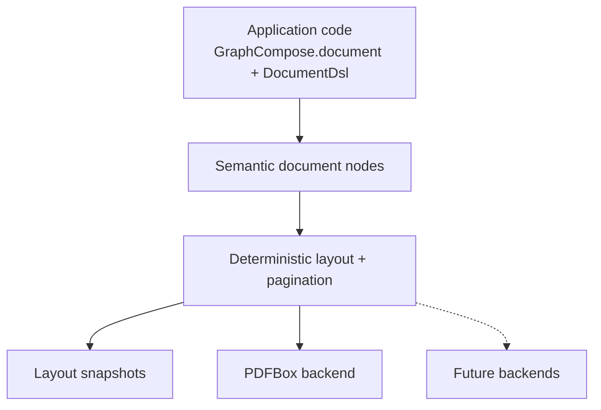

# GraphCompose

<p align="center">
  
</p>

<p align="center">
  <b>Java-first declarative document layout engine for programmatic PDF generation.</b><br/>
  Describe semantic document structure; GraphCompose handles layout, pagination, snapshots, and PDFBox rendering.
</p>

<p align="center">
  
  
  
  <a href="https://jitpack.io/#DemchaAV/GraphCompose">
    
  </a>
</p>

## Why GraphCompose?

Most Java PDF libraries expose low-level drawing commands. GraphCompose gives Java applications a semantic authoring model:

- `GraphCompose.document(...)` is the canonical public entry point
- `DocumentSession` owns lifecycle, layout, snapshots, and rendering
- `DocumentDsl` builds modules, paragraphs, lists, tables, images, dividers, and page breaks
- automatic pagination and deterministic layout snapshots are built into the engine
- PDF rendering is isolated behind a PDFBox backend

The current release is **v1.2.0**, an early stabilization release focused on the canonical Java-first API, lifecycle safety, layout determinism, and cleaner release documentation.

## Visual Preview

<p align="center">
  
</p>

<p align="center">
  
</p>

## Installation

GraphCompose is currently distributed through JitPack.

```xml
<repositories>
    <repository>
        <id>jitpack.io</id>
        <url>https://jitpack.io</url>
    </repository>
</repositories>

<dependency>
    <groupId>com.github.DemchaAV</groupId>
    <artifactId>GraphCompose</artifactId>
    <version>v1.2.0</version>
</dependency>
```

```kotlin
repositories {
    maven("https://jitpack.io")
}

dependencies {
    implementation("com.github.demchaav:GraphCompose:v1.2.0")
}
```

The project POM coordinates are `io.github.demchaav:graphcompose:1.2.0`. JitPack keeps the GitHub repository coordinate with a lowercase owner (`com.github.demchaav:GraphCompose:v1.2.0`) and the `v1.2.0` tag.

## Quick start

```java
import com.demcha.compose.GraphCompose;
import com.demcha.compose.document.api.DocumentPageSize;
import com.demcha.compose.document.api.DocumentSession;

import java.nio.file.Path;

public class QuickStart {
    public static void main(String[] args) throws Exception {
        try (DocumentSession document = GraphCompose.document(Path.of("output.pdf"))
                .pageSize(DocumentPageSize.A4)
                .margin(24, 24, 24, 24)
                .create()) {

            document.pageFlow(page -> page
                    .module("Summary", module -> module.paragraph("Hello GraphCompose")));

            document.buildPdf();
        }
    }
}
```

For HTTP responses, S3 uploads, or in-memory generation:

```java
try (DocumentSession document = GraphCompose.document()
        .pageSize(DocumentPageSize.A4)
        .margin(24, 24, 24, 24)
        .create()) {

    document.pageFlow(page -> page
            .module("Summary", module -> module.paragraph("In-memory PDF")));

    document.writePdf(responseOutputStream);
    byte[] pdfBytes = document.toPdfBytes();
}
```

### Built-in templates (compose-first)

```java
import com.demcha.compose.GraphCompose;
import com.demcha.compose.document.api.DocumentPageSize;
import com.demcha.compose.document.api.DocumentSession;
import com.demcha.compose.document.templates.api.InvoiceTemplate;
import com.demcha.compose.document.templates.builtins.InvoiceTemplateV1;
import com.demcha.compose.document.templates.data.invoice.InvoiceDocumentSpec;

import java.nio.file.Path;

InvoiceDocumentSpec invoice = InvoiceDocumentSpec.builder()
        .invoiceNumber("GC-2026-041")
        .issueDate("02 Apr 2026")
        .dueDate("16 Apr 2026")
        .fromParty(party -> party.name("GraphCompose Studio"))
        .billToParty(party -> party.name("Northwind Systems"))
        .lineItem("Template architecture", "Reusable invoice flow", "2", "GBP 980", "GBP 1,960")
        .totalRow("Total", "GBP 1,960")
        .build();

InvoiceTemplate template = new InvoiceTemplateV1();

try (DocumentSession document = GraphCompose.document(Path.of("invoice.pdf"))
        .pageSize(DocumentPageSize.A4)
        .margin(22, 22, 22, 22)
        .create()) {

    template.compose(document, invoice);
    document.buildPdf();
}
```

The runnable `examples/` module includes CV, cover letter, invoice, proposal, weekly schedule, and module-first documents.

## Core Concepts

### 1. Documents are semantic first

Application code describes modules, paragraphs, lists, rows, tables, images, and dividers. The engine turns those semantic nodes into measured, paginated render fragments.

### 2. Layout and rendering are separate passes

The layout pass resolves geometry first. Rendering consumes already resolved pages and fragments. This is what makes snapshots, pagination, and future backends practical.

### 3. Layout traversal is deterministic

GraphCompose builds stable tree order, parent links, page spans, and coordinates so tests can compare layout snapshots before any PDF bytes are written.

### 4. Containers express structure

Use `document.pageFlow()` for the root flow, `module()` for full-width document blocks, and `section()` for nested grouping. Absolute coordinates stay inside the engine.

### 5. The template layer is optional

Use built-in templates when they fit, or compose your own document directly with `DocumentSession` and the DSL.

## Table component

```java
import com.demcha.compose.document.style.DocumentColor;
import com.demcha.compose.document.style.DocumentInsets;
import com.demcha.compose.document.table.DocumentTableColumn;
import com.demcha.compose.document.table.DocumentTableStyle;

document.pageFlow()
        .name("StatusSection")
        .spacing(12)
        .addTable(table -> table
                .name("StatusTable")
                .columns(
                        DocumentTableColumn.fixed(90),
                        DocumentTableColumn.auto(),
                        DocumentTableColumn.auto())
                .width(520)
                .defaultCellStyle(DocumentTableStyle.builder()
                        .padding(DocumentInsets.of(6))
                        .build())
                .headerStyle(DocumentTableStyle.builder()
                        .fillColor(DocumentColor.LIGHT_GRAY)
                        .padding(DocumentInsets.of(6))
                        .build())
                .header("Role", "Owner", "Status")
                .rows(
                        new String[]{"Engine", "GraphCompose", "Stable"},
                        new String[]{"Feature", "Table Builder", "Canonical"}))
        .build();
```

## Line primitive

```java
import com.demcha.compose.document.style.DocumentColor;

document.pageFlow()
        .name("LinePrimitives")
        .spacing(12)
        .addDivider(divider -> divider
                .name("HorizontalRule")
                .width(220)
                .thickness(3)
                .color(DocumentColor.ROYAL_BLUE))
        .addShape(shape -> shape
                .name("VerticalAccent")
                .size(3, 90)
                .fillColor(DocumentColor.ORANGE))
        .build();
```

## Architecture at a glance



Public authoring lives in `com.demcha.compose`, `document.api`, `document.dsl`, `document.node`, `document.style`, `document.table`, and `font`. Engine internals live under `com.demcha.compose.engine.*` and are not the recommended application API.

## Documentation

- [Getting Started](./docs/getting-started.md)
- [Recipes](./docs/recipes.md)
- [Architecture](./docs/architecture.md)
- [Package Map](./docs/package-map.md)
- [Lifecycle](./docs/lifecycle.md)
- [Production Rendering](./docs/production-rendering.md)
- [Layout Snapshot Testing](./docs/layout-snapshot-testing.md)
- [Benchmarks](./docs/benchmarks.md)
- [Migration v1.1 to v1.2](./docs/migration-v1-1-to-v1-2.md)
- [v1.2 Roadmap](./docs/v1.2-roadmap.md)
- [Release Process](./docs/release-process.md)
- [Changelog](./CHANGELOG.md)

## Roadmap

- [x] Java semantic DSL
- [x] PDFBox rendering
- [x] automatic pagination
- [x] deterministic layout snapshots
- [x] built-in templates
- [x] public API boundary guards
- [ ] Maven Central release
- [ ] DOCX / PPTX backends

## License

MIT. See [LICENSE](./LICENSE).
