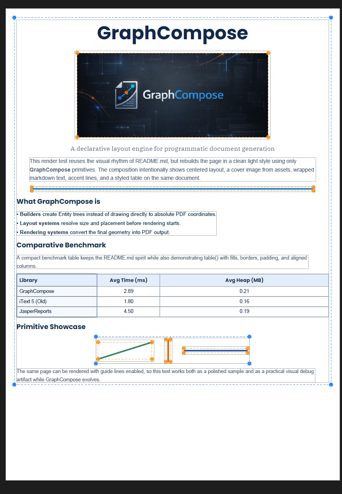
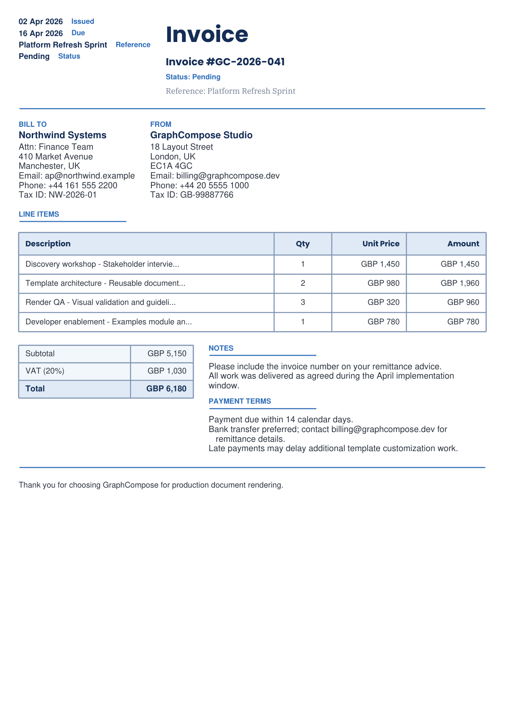
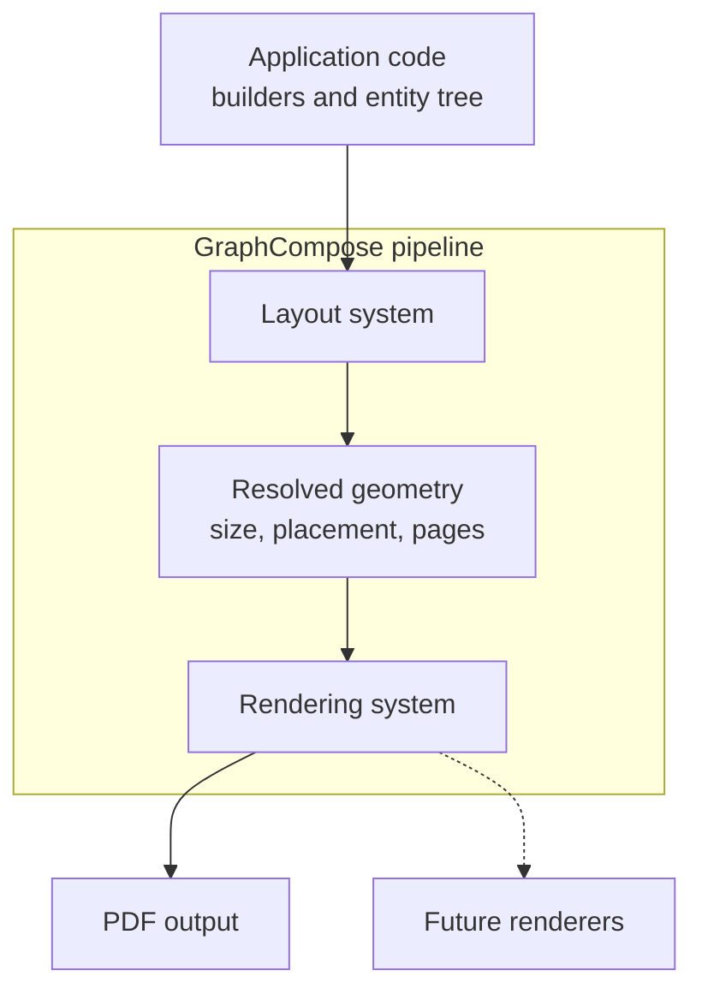

# GraphCompose

<p align="center">
  
</p>

<p align="center">
  
  
  
  
  
  <a href="https://github.com/DemchaAV/GraphCompose/actions/workflows/ci.yml">
    
  </a>
  <a href="https://jitpack.io/#DemchaAV/GraphCompose">
    
  </a>
</p>

<p align="center">
  <b>A declarative, MIT-licensed layout engine for programmatic PDF generation in Java.</b><br/>
  Describe your document structure — GraphCompose handles geometry, text wrapping, pagination, and rendering.
</p>

<p align="center">
  <a href="./docs/architecture.md">Architecture</a>
  ·
  <a href="./docs/implementation-guide.md">Implementation Guide</a>
  ·
  <a href="./docs/benchmarks.md">Benchmarks</a>
  ·
  <a href="./docs/layout-snapshot-testing.md">Layout Snapshot Testing</a>
  ·
  <a href="./CHANGELOG.md">Changelog</a>
  ·
  <a href="./CONTRIBUTING.md">Contributing</a>
</p>

Layout regression tests are supported through the public `DocumentSession.layoutSnapshot()` and `com.demcha.compose.testing.layout` helpers. See [Layout Snapshot Testing](./docs/layout-snapshot-testing.md) for the canonical consumer workflow.

---

## The problem with existing PDF libraries

Most Java PDF libraries are **low-level drawing APIs**. You get a canvas and a coordinate system — and the rest is your problem:

- text wrapping requires manual font measurement
- optional sections break absolute positioning
- pagination becomes hundreds of lines of custom logic
- consistent styling across templates means duplicated boilerplate

**iText 7** solves some of this, but its open-source build is AGPL — meaning any commercial product using it must either open-source itself or purchase a commercial license starting at several hundred dollars per month.

**GraphCompose** is different: it is MIT-licensed and ships a real layout engine. You describe *what* you want; the engine figures out *where* to put it.

---

## What GraphCompose is

GraphCompose is a document generation engine built around an ECS-style (Entity-Component-System) model:

- builders create `Entity` trees
- layout systems calculate size and placement
- rendering systems turn resolved geometry into output bytes

The current production renderer is PDF via Apache PDFBox. The layout and entity model is renderer-agnostic by design — DOCX and PPTX output are on the roadmap.
The shared rendering seam now stops at render-pass lifetime through a backend-neutral `RenderPassSession`: the engine stays free of PDFBox lifecycle code, while the PDF backend is free to reuse page-local resources efficiently.

GraphCompose is a good fit for:

- CV and resume generation
- cover letters and profile documents
- invoices and financial reports
- tabular data summaries with negotiated column widths
- multi-page server-side PDF generation at scale
- reusable document templates built on top of a lower-level layout engine

---

## New in v1.1.0

- compose-first template usage is now the documented default for built-in templates
- backend-neutral `DocumentComposer` and handler-driven rendering make the engine less PDF-centric internally
- the PDF render path now uses page-scoped render sessions, reusing one `PDPageContentStream` per page during a render pass instead of reopening a stream per entity
- layout snapshot testing is now part of the practical regression workflow for pagination and geometry changes
- runnable examples now cover CV, cover letter, invoice, proposal, and weekly schedule generation
- new PDF document features include QR/barcodes, watermarks, headers/footers, bookmarks, metadata, protection, explicit page breaks, and dividers
- architecture guard rails now cover template scene builders in CI, not just the engine layer
- visual showcase tests now make pagination, document chrome, and barcode output easier to inspect
- benchmark tooling now includes coarse PR smoke checks, fuller scheduled/manual current-speed runs, diffable JSON/CSV reports, and repeated median-based local comparisons
- an experimental live preview dev tool is available in test scope for fast template iteration

See [CHANGELOG.md](./CHANGELOG.md) for the release summary.

---

## Visual preview

### Repository showcase render

<p align="center">
  
</p>

### Layout debugging with guide lines

<p align="center">
  
</p>

### Final CV render

<p align="center">
  
</p>

### Barcode and QR showcase

<p align="center">
  
</p>

### Compose-first invoice template

<p align="center">
  
</p>

### Available fonts preview

<p align="center">
  
</p>

---

## Installation

GraphCompose is available through JitPack.

### Maven

```xml
<repositories>
    <repository>
        <id>jitpack.io</id>
        <url>https://jitpack.io</url>
    </repository>
</repositories>

<dependency>
    <groupId>com.github.DemchaAV</groupId>
    <artifactId>GraphCompose</artifactId>
    <version>v1.1.0</version>
</dependency>
```

### Gradle (Kotlin DSL)

```kotlin
repositories {
    maven("https://jitpack.io")
}

dependencies {
    implementation("com.github.DemchaAV:GraphCompose:v1.1.0")
}
```

JitPack consumers can keep using older tagged releases by pinning the tag they want, for example `v1.0.3` or `v1.0.2`.

---

## Quick start

### Write to file

```java
import com.demcha.compose.GraphCompose;
import com.demcha.compose.layout_core.components.content.text.TextStyle;
import com.demcha.compose.layout_core.components.style.Margin;
import com.demcha.compose.document.api.DocumentSession;
import org.apache.pdfbox.pdmodel.common.PDRectangle;

import java.nio.file.Path;

public class QuickStart {
    public static void main(String[] args) throws Exception {
        try (DocumentSession document = GraphCompose.document(Path.of("output.pdf"))
                .pageSize(PDRectangle.A4)
                .margin(24, 24, 24, 24)
                .create()) {

            document.pageFlow()
                    .name("QuickStart")
                    .spacing(8)
                    .margin(Margin.of(8))
                    .addParagraph("Hello GraphCompose", TextStyle.DEFAULT_STYLE)
                    .build();

            document.buildPdf();
        }
    }
}
```

### In-memory output (for HTTP responses, S3 uploads, etc.)

```java
try (DocumentSession document = GraphCompose.document()
        .pageSize(PDRectangle.A4)
        .margin(24, 24, 24, 24)
        .create()) {

    document.pageFlow()
            .name("QuickStartBytes")
            .spacing(8)
            .margin(Margin.of(8))
            .addText("In-memory PDF", TextStyle.DEFAULT_STYLE)
            .build();

    byte[] pdfBytes = document.toPdfBytes();
}
```

### Built-in templates (compose-first)

```java
import com.demcha.compose.GraphCompose;
import com.demcha.compose.document.api.DocumentSession;
import com.demcha.compose.document.templates.api.InvoiceTemplate;
import com.demcha.compose.document.templates.builtins.InvoiceTemplateV1;
import com.demcha.compose.document.templates.data.InvoiceData;
import org.apache.pdfbox.pdmodel.common.PDRectangle;

import java.nio.file.Path;

InvoiceData invoiceData = ...;
InvoiceTemplate template = new InvoiceTemplateV1();

try (DocumentSession document = GraphCompose.document(Path.of("invoice.pdf"))
        .pageSize(PDRectangle.A4)
        .margin(22, 22, 22, 22)
        .create()) {

    template.compose(document, invoiceData);
    document.buildPdf();
}
```

Canonical docs and examples now compose directly into `DocumentSession`, and built-in template APIs live under `com.demcha.compose.document.templates.*`. The supported authoring workflow is `GraphCompose.document(...)`; lower-level PDF composer internals remain in the repository only for internal tooling, diagnostics, and migration scaffolding.

---

## Testing layout regressions

GraphCompose now supports deterministic post-layout JSON snapshots through the canonical `DocumentSession.layoutSnapshot()` API.

Use them to catch geometry regressions before a developer has to inspect the rendered PDF by eye:

- compare resolved coordinates, page spans, and ordering
- capture state after layout and pagination, before PDF rendering
- keep committed baselines under `src/test/resources/layout-snapshots`
- inspect mismatches under `target/visual-tests/layout-snapshots`
- update expected baselines locally with `-Dgraphcompose.updateSnapshots=true`

Normal production calls to `buildPdf()` and `toPdfBytes()` do not depend on snapshot generation. If application code never calls `layoutSnapshot()`, this feature does not affect the standard PDF pipeline.

The recommended developer flow is:

1. unit tests for isolated geometry rules
2. layout snapshot tests for full-document layout regressions
3. PDF render tests for human-readable visual confirmation

See [Layout Snapshot Testing](./docs/layout-snapshot-testing.md) for the workflow and examples.

If you are adding a new feature or template test, the same guide now includes a short copy-paste recipe for creating a new snapshot baseline and verifying it locally.

For quick manual inspection of pagination, barcodes, QR codes, and document-level PDF chrome, run focused visual smoke tests such as:

```powershell
mvn "-Dtest=FeatureShowcaseRenderTest,RepositoryShowcaseRenderTest,SmartPaginationTest" test
```

Generated PDFs are written under `target/visual-tests/`, including:

- `target/visual-tests/clean/integration/features/`
- `target/visual-tests/guides/integration/features/`

---

## Runnable examples

The repository includes a standalone [`examples/`](./examples) module with compose-first file demos for:

- CV
- cover letter
- invoice
- proposal
- weekly schedule

Each example creates a `DocumentSession`, calls `template.compose(document, ...)`, then finalizes with `document.buildPdf()`.

Typical workflow:

```powershell
mvn -DskipTests install
mvn -f examples/pom.xml exec:java '-Dexec.mainClass=com.demcha.examples.GenerateAllExamples'
```

Generated PDFs are written to `examples/target/generated-pdfs/`.

---

## Experimental live preview

For fast local iteration on a template or test document, the repository includes an experimental live preview workflow in test scope:

- [GraphComposeDevTool.java](./src/test/java/com/demcha/compose/devtool/GraphComposeDevTool.java)
- [LivePreviewProvider.java](./src/test/java/com/demcha/preview/LivePreviewProvider.java)

Recommended usage today:

1. run `GraphComposeDevTool` from your IDE
2. edit `LivePreviewProvider`
3. save the file and let the preview refresh
4. use the built-in buttons to save or open the current PDF

This tool is still under active development, so treat it as a practical dev/test helper rather than a stable public API. It is already useful for visually checking template composition, pagination, spacing, and first-page output while you iterate.

---

## Core concepts

### 1. Everything is an entity

Builders do not draw directly. They create `Entity` instances and attach components the engine understands: renderable markers, content and style, size and placement, parent/child relationships.

### 2. Layout and rendering are separate passes

The layout pass resolves all geometry first. Rendering happens after every size and position is known. This separation is what makes automatic pagination, guide-line debugging, and future alternative renderers possible.

Inside one render pass, the engine now exposes a backend-neutral session seam instead of reopening a fresh page surface per entity. In the PDF backend this means one cached `PDPageContentStream` per page for the lifetime of the pass, which cuts per-entity PDFBox overhead while preserving current layer and z-order traversal.

### 3. Layout traversal is deterministic

Each layout pass now builds one deterministic hierarchy snapshot before pagination and rendering continue:

- parent links come from `ParentComponent`
- sibling order comes from `Entity.children`
- roots, layers, and depth metadata are rebuilt per pass instead of being reused across runs

This keeps layout snapshots, page breaking, and future backends aligned on the same tree semantics.

### 4. Containers express structure

Use `document.pageFlow()` for the root flow and nested `section()` blocks for semantic grouping. Absolute coordinates are an implementation detail of the engine, not something you write in the supported public workflow.

### 5. The template layer is optional

`com.demcha.compose.document.templates.*` provides the canonical built-in templates, themes, DTOs, and support helpers for reusable document layouts.

---

## Table component

The `TableBuilder` ships as part of v1 and covers the common server-side document use case: structured tabular data with automatic column sizing and multi-page support.

What it handles:
- fixed-width and auto-width columns with negotiated sizing
- header rows with independent styling
- row-level, column-level, and default cell style scopes (row takes priority)
- row-atomic pagination — a row moves as a unit instead of being split across pages
- page-break-aware separators — the last row on one page keeps its bottom edge, the first row on the next gets its own top edge

Current v1 limits:
- no `rowspan` / `colspan`
- no wrapped multi-line cell content
- no repeated header rows
- no cell-level style override beyond row/column/default scopes

```java
document.pageFlow()
        .name("StatusSection")
        .spacing(12)
        .addTable(table -> table
                .name("StatusTable")
                .columns(
                        TableColumnSpec.fixed(90),
                        TableColumnSpec.auto(),
                        TableColumnSpec.auto()
                )
                .width(520)
                .defaultCellStyle(TableCellStyle.builder()
                        .padding(Padding.of(6))
                        .build())
                .row("Role", "Owner", "Status")
                .row("Engine", "GraphCompose", "Stable")
                .row("Feature", "Table Builder", "Canonical"))
        .build();
```

---

## Line primitive

```java
document.pageFlow()
        .name("LinePrimitives")
        .spacing(12)
        .addDivider(divider -> divider
                .name("HorizontalRule")
                .width(220)
                .thickness(3)
                .color(ComponentColor.ROYAL_BLUE))
        .addShape(shape -> shape
                .name("VerticalAccent")
                .size(3, 90)
                .fillColor(ComponentColor.ORANGE))
        .build();
```

Use `divider()` for common horizontal rules and `shape()` for accent bars or custom line-like blocks in the canonical DSL.

---

## Architecture at a glance



Main packages:

| Package | Contents |
| --- | --- |
| `com.demcha.compose.layout_core.*` | Core engine: entities, builders, geometry, layout, pagination, render systems |
| `com.demcha.compose.font_library.*` | Font registration and PDF font helpers |
| `com.demcha.compose.markdown.*` | Markdown parsing helpers used by text/block text builders |
| `com.demcha.compose.document.*` | Canonical semantic document API, DSL, model, layout, and backend packages |
| `com.demcha.compose.document.templates.*` | Canonical built-in templates, themes, DTOs, registries, and template support helpers |

For the full package map, see [docs/architecture.md](./docs/architecture.md).

---

## Extending GraphCompose

Start with [docs/implementation-guide.md](./docs/implementation-guide.md). The short version:

- extend `EmptyBox<T>` for a leaf entity with no children
- extend `ShapeBuilderBase<T>` for shape-like leaves that need fill/stroke helpers
- extend `ContainerBuilder<T>` for entities that own child entities
- keep fixed leaf renderables (`Image`, `Circle`, `Line`) on the same layout contract: fixed `ContentSize`, padding-aware draw area, non-breakable unless truly needed
- add `Expendable` only when the entity should grow from child content
- add `Breakable` only when the entity itself can continue across pages
- register the new builder as a factory method on `ComponentBuilder`

### Contributor rules for engine changes

When you add or refactor engine features, follow these project rules:

- engine renderables are backend-neutral markers; they implement `Render` and describe intent, but do not draw directly
- PDF drawing belongs in `src/main/java/com/demcha/compose/layout_core/system/implemented_systems/pdf_systems/handlers/*`
- PDF-only helper objects that are not entity render markers belong in `...pdf_systems/helpers/*`
- builders and layout helpers must use `TextMeasurementSystem` for text width and line metrics instead of reaching into renderer internals
- traversal metadata should be materialized once per layout pass through a shared helper such as `LayoutTraversalContext`, not rebuilt ad hoc in unrelated systems
- `ParentComponent` is the authoritative parent relation, while `Entity.children` is the canonical sibling order
- renderer draw ordering belongs in the rendering layer, not inside pagination utilities
- `layout_core/components/*` should stay free of PDFBox and `...pdf_systems` imports
- new render markers should be wired into `PdfRenderingSystemECS` and covered by at least one dispatch-oriented test

### Contributor rules for built-in templates

Built-in templates now follow a compose-first split:

- the canonical public contract lives on `com.demcha.compose.document.templates.api.*Template` through `compose(DocumentSession, ...)`
- each class in `com.demcha.compose.document.templates.builtins` composes through the semantic DSL and the canonical PDF backend
- the actual document composition belongs in a dedicated backend-neutral scene composer under `com.demcha.compose.document.templates.support`
- scene composers should stay free of `PDDocument`, `PDPage`, `PDRectangle`, and low-level PDF composer imports
- built-in template logic lives under `com.demcha.compose.document.templates.*`, with scene composition isolated from PDF-only setup

If you are contributing new engine objects, read [CONTRIBUTING.md](./CONTRIBUTING.md), [docs/architecture.md](./docs/architecture.md), and [docs/implementation-guide.md](./docs/implementation-guide.md) together before coding.

---

## Performance and benchmarks

The repository ships a benchmark harness for both feature work and regression checking. All benchmark runs use a dedicated quiet logging config (`logback-benchmark.xml`) so the numbers reflect document generation work, not debug I/O.

For the full benchmark pipeline, artifact layout, profile rules, and troubleshooting notes, see [docs/benchmarks.md](./docs/benchmarks.md).

Treat local numbers as relative signals, not absolute promises. For meaningful comparisons:

- compare runs from the same benchmark profile only
- expect small local shifts on Windows and busy developer machines
- prefer repeated runs with median aggregation when making decisions from local results
- use CI smoke thresholds only as coarse regression guards, not as precision performance measurements

### Current benchmark workflow

`CurrentSpeedBenchmark` now supports two profiles:

- `smoke`: bounded latency-only checks meant for pull requests and coarse local spot-checks
- `full`: wider warmup/measurement windows plus throughput checks for scheduled runs and local investigation

The repository uses that split in two places:

- PR CI runs targeted architecture/layout/render tests plus a coarse performance smoke check
- scheduled/manual CI runs the fuller current-speed benchmark, uploads JSON/CSV artifacts, and diffs the newest compatible reports

Local benchmark artifacts are written under:

- `target/benchmarks/current-speed/`
- `target/benchmarks/comparative/`
- `target/benchmarks/diffs/`
- `target/benchmarks/aggregates/`

For the easiest full local run, use the PowerShell wrapper:

```powershell
powershell -ExecutionPolicy Bypass -File .\scripts\run-benchmarks.ps1
```

That single command:

- builds the test classpath once
- runs `CurrentSpeedBenchmark`, `ComparativeBenchmark`, `GraphComposeBenchmark`, `FullCvBenchmark`, `ScalabilityBenchmark`, and `GraphComposeStressTest`
- writes per-benchmark logs under `target/benchmark-runs/<timestamp>/logs/`
- writes a run summary to `target/benchmark-runs/<timestamp>/SUMMARY.md`
- refreshes JSON/CSV artifacts in `target/benchmarks/`
- mirrors each step log back to the console after the step finishes
- runs benchmark diffs automatically when at least two compatible prior reports exist

For `current-speed`, compatibility means matching the profile of the latest run. A `smoke` run is never diffed against a `full` run.

Useful options:

- `-CurrentSpeedProfile smoke` to run the bounded current-speed profile
- `-CurrentSpeedProfile full` to run the fuller current-speed profile explicitly
- `-Repeat 3` or `-Repeat 5` to rerun `current-speed` and `comparative` several times, aggregate medians, and diff median-vs-median on later runs

Optional flags:

```powershell
powershell -ExecutionPolicy Bypass -File .\scripts\run-benchmarks.ps1 -IncludeEndurance
powershell -ExecutionPolicy Bypass -File .\scripts\run-benchmarks.ps1 -OpenResults
powershell -ExecutionPolicy Bypass -File .\scripts\run-benchmarks.ps1 -CurrentSpeedProfile smoke
powershell -ExecutionPolicy Bypass -File .\scripts\run-benchmarks.ps1 -Repeat 3
powershell -ExecutionPolicy Bypass -File .\scripts\run-benchmarks.ps1 -Warmup 20 -Iterations 80 -DocsPerThread 20 -Threads 1,2,4,8
```

For fresh local numbers against the current checkout, run the manual suite in `src/test/java/com/demcha/compose/CurrentSpeedBenchmark.java`:

```powershell
mvn --% -B -ntp -DskipTests test-compile dependency:build-classpath -DincludeScope=test -Dmdep.outputFile=target/benchmark.classpath
$cp = (Get-Content 'target/benchmark.classpath' -Raw).Trim()
java -cp "target\test-classes;target\classes;$cp" com.demcha.compose.CurrentSpeedBenchmark
```

To run the bounded smoke profile directly:

```powershell
java -Dgraphcompose.benchmark.profile=smoke -cp "target\test-classes;target\classes;$cp" com.demcha.compose.CurrentSpeedBenchmark
```

To compare GraphCompose against iText 5 and JasperReports with the same test classpath:

```powershell
$cp = (Get-Content 'target/benchmark.classpath' -Raw).Trim()
java -cp "target\test-classes;target\classes;$cp" com.demcha.compose.ComparativeBenchmark
```

Both suites now persist timestamped JSON/CSV artifacts plus `latest-*` copies under:

- `target/benchmarks/current-speed/`
- `target/benchmarks/comparative/`

Repeated local runs can also be aggregated into median reports under:

- `target/benchmarks/aggregates/current-speed/<profile>/`
- `target/benchmarks/aggregates/comparative/`

To compare the two newest runs for a suite:

```powershell
$cp = (Get-Content 'target/benchmark.classpath' -Raw).Trim()
java -cp "target\test-classes;target\classes;$cp" com.demcha.compose.BenchmarkDiffTool current-speed
java -cp "target\test-classes;target\classes;$cp" com.demcha.compose.BenchmarkDiffTool comparative
```

Or diff two explicit report files:

```powershell
java -cp "target\test-classes;target\classes;$cp" com.demcha.compose.BenchmarkDiffTool `
  target/benchmarks/current-speed/run-20260414-191839.json `
  target/benchmarks/current-speed/run-20260414-192900.json
```

Diff artifacts are saved under `target/benchmarks/diffs/`.

When you care about local decision-making more than raw speed of execution, prefer the wrapper with `-Repeat` over ad-hoc one-off diffs. It reduces “lucky” and “unlucky” local runs and makes the README-level numbers easier to trust.

### Benchmark suites in the repository

The repository keeps several benchmark entry points because a single number is not enough to reason about regressions:

- `CurrentSpeedBenchmark`: scenario-oriented latency checks across representative templates and engine-heavy examples
- `GraphComposeBenchmark`: core engine latency guard for a compact document composition path
- `ScalabilityBenchmark`: throughput scaling across thread counts
- `ComparativeBenchmark`: low-level comparison against iText 5 and JasperReports
- `FullCvBenchmark`: a larger compose-first document path
- `GraphComposeStressTest`: concurrent stability and failure-rate guard
- `EnduranceTest`: long-running allocation and heap-behavior guard

When quoting benchmark numbers in public docs or release notes, prefer rerunning the relevant suite on the current checkout instead of reusing historical tables.

---

## Tech stack

| Technology | Version | Role |
| --- | --- | --- |
| Java | 21 | Primary language |
| Kotlin | 2.2 | Build/runtime compatibility; no production `.kt` sources today |
| Apache PDFBox | 3.0.5 | PDF rendering backend |
| Flexmark | 0.64.8 | Markdown parsing |
| SnakeYAML | 2.4 | Config/template data |
| Lombok | 1.18.38 | Boilerplate reduction |
| Logback | 1.5.18 | Logging |
| JUnit 5 | 5.12.2 | Testing |
| Mockito | 5.20.0 | Mocking |

---

## Roadmap

- [x] PDF rendering
- [x] VContainer / HContainer layout system
- [x] Auto-pagination
- [x] Markdown support
- [x] Shared font registration
- [x] Concurrent rendering support
- [x] Table component with negotiated column widths
- [ ] Maven Central release
- [ ] DOCX renderer
- [ ] PPTX renderer
- [ ] XLSX renderer
- [ ] Stable release pipeline

---

## Contributing

See [CONTRIBUTING.md](./CONTRIBUTING.md) for the current workflow and contributor rules, and [docs/implementation-guide.md](./docs/implementation-guide.md) for extension-oriented guidance.

---

## License

MIT. See [LICENSE](./LICENSE).
