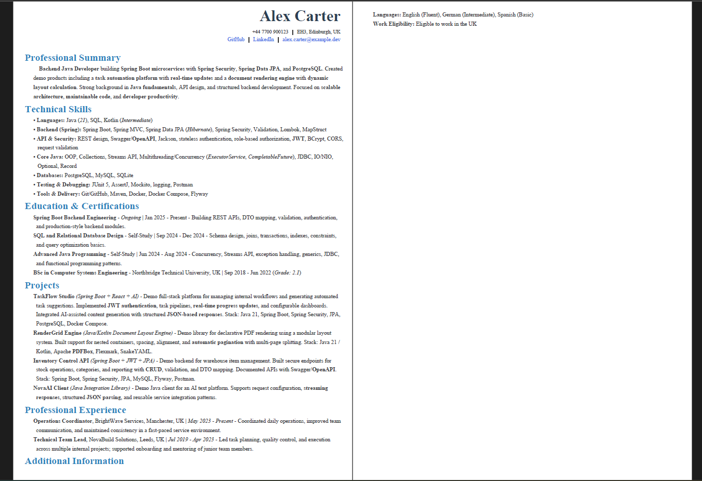
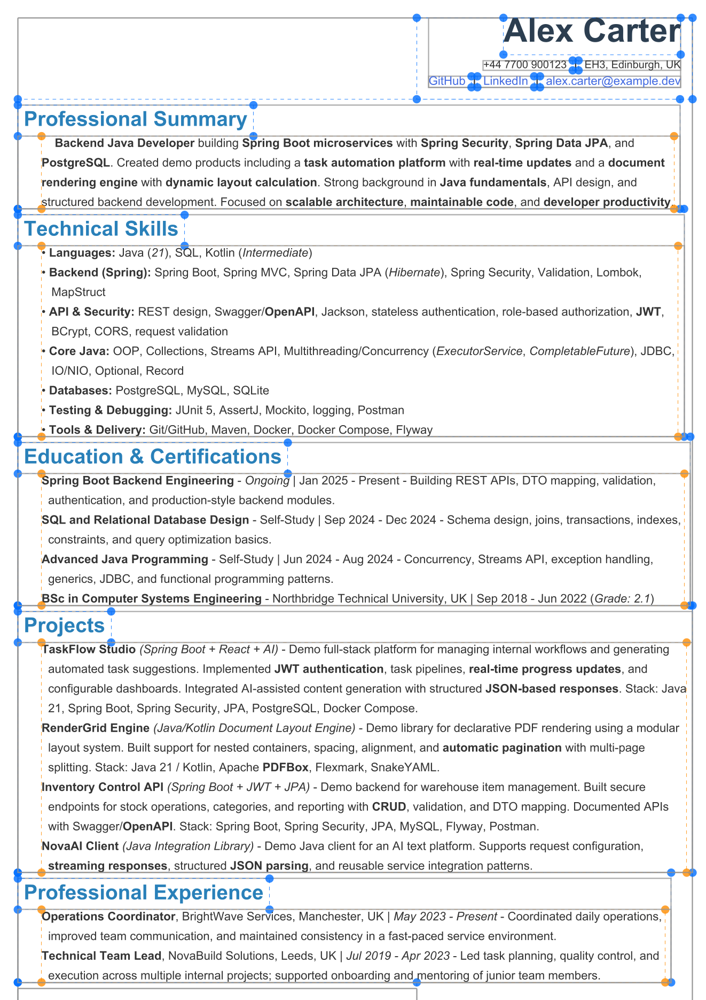
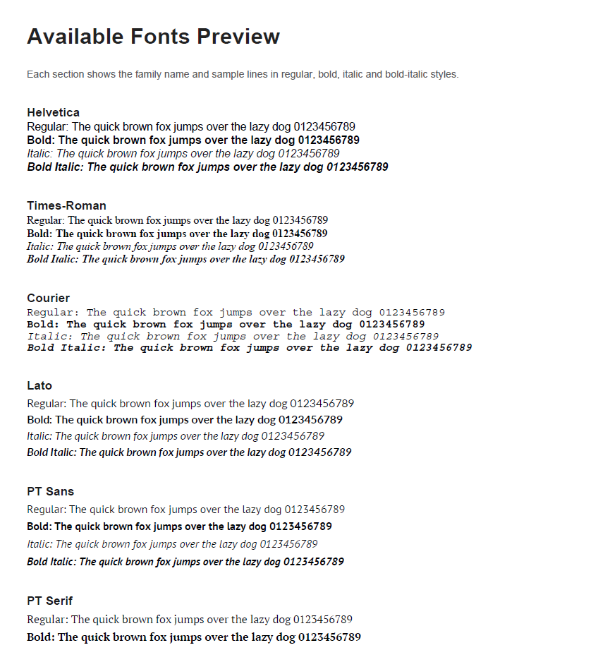
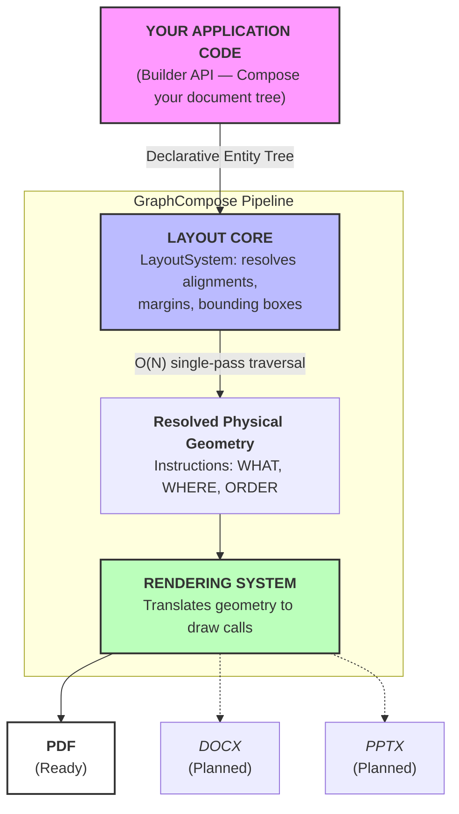

# GraphCompose

<p align="center">
  
  
  
  
  
</p>

<p align="center">
  <b>A declarative layout engine for programmatic document generation in Java & Kotlin.</b><br/>
  Build documents the way you build UIs — with components, containers, and constraints. Not with coordinates.
</p>

---

## Table of Contents

* [What is GraphCompose?](#-what-is-graphcompose)
* [Why GraphCompose?](#-why-graphcompose)
* [Visual Preview](#-visual-preview)
* [Features](#-features)
* [Architecture](#-architecture)
* [Installation](#-installation)
* [Quick Start](#-quick-start)
* [Core Concepts](#-core-concepts)
* [Performance & Benchmarks](#-performance--benchmarks)
* [Tech Stack](#-tech-stack)
* [Roadmap](#-roadmap)
* [Contributing](#-contributing)
* [License](#-license)

---

## 🚀 What is GraphCompose?

GraphCompose is a **Java/Kotlin document generation engine** built around an **ECS (Entity Component System)** architecture and a reusable **layout system**.

Instead of drawing text and shapes with manual X/Y coordinates, you define a document as a **tree of components**. GraphCompose resolves alignment, spacing, wrapping, and page flow for you.

Think of it as **Jetpack Compose or Flexbox for server-side document generation**.

> **Core idea:** define a layout once, feed it data many times, and generate consistent documents with predictable structure.

---

## 🎯 Why GraphCompose?

### The problem with raw PDF libraries

Working directly with **Apache PDFBox** usually means manual coordinate math for every text block, divider, and container. That approach becomes difficult to maintain when:

* content length changes,
* sections become optional,
* layouts span multiple pages,
* fonts and spacing must stay consistent.

### Where GraphCompose helps

GraphCompose adds a higher-level layout layer on top of PDF rendering, so application code can focus on **document structure** instead of low-level positioning.

| Pain Point                    | GraphCompose Approach                                       |
| ----------------------------- | ----------------------------------------------------------- |
| Manual coordinate math        | Declarative layout via containers, anchors, margin, padding |
| Dynamic content breaks layout | Layout is resolved from content and container rules         |
| Multi-page documents          | Automatic page flow and pagination support                  |
| Repeated font setup           | Centralized font registration and reusable text styles      |
| Tight renderer coupling       | Layout and rendering are separated by design                |

### Typical use cases

GraphCompose is a good fit for:

* CV and resume generation
* invoices and reports
* contracts and internal documents
* REST APIs that stream PDFs from memory
* applications that need reusable document templates

---

## 🖼 Visual Preview

GraphCompose is designed for reusable layouts, automatic pagination, and structured document rendering.

### 1. Final Output

<p align="center">
  
</p>

<p align="center">
  <em>Example of a clean final document generated from declarative layout components.</em>
</p>

### 2. Layout Debugging

<p align="center">
  
</p>

<p align="center">
  <em>Debug overlay showing resolved container boundaries, text regions, and spacing behavior.</em>
</p>

### 3. Font Rendering

<p align="center">
  
</p>

<p align="center">
  <em>Preview of available font families and style variants.</em>
</p>

---

## ✨ Features

| Feature                  | Description                                                                 |
| ------------------------ | --------------------------------------------------------------------------- |
| **ECS Architecture**     | Flexible document composition with entities and components                  |
| **Layout System**        | `VContainer` and `HContainer` with alignment, spacing, and size constraints |
| **Anchor System**        | Declarative positioning through `Anchor`, `Margin`, and `Padding`           |
| **Rich Content**         | Text, links, shapes, and Markdown-based blocks                              |
| **Auto-Pagination**      | Multi-page layout flow with preserved spacing and styling                   |
| **Unified Font Library** | Register fonts once and reuse them across documents                         |
| **In-Memory Rendering**  | Render to `byte[]` for streaming from REST APIs without disk I/O            |
| **Concurrent Usage**     | Designed for multi-threaded server-side rendering workloads                 |
| **Markdown Support**     | Rich-text block generation through Flexmark                                 |
| **Renderer Separation**  | Layout and rendering are separated, making future renderers easier to add   |

---

## 🏗 Architecture

GraphCompose follows a unidirectional pipeline:

### Project modules

| Module         | Responsibility                                                 |
| -------------- | -------------------------------------------------------------- |
| `layout_core`  | Core geometry, styles, components, and base entity definitions |
| `system`       | Layout resolution and rendering pipeline                       |
| `markdown`     | Markdown parsing and conversion into document entities         |
| `font_library` | Font registration, variant management, and metric caching      |

### Mental model

`Builder API -> entity tree -> layout resolution -> render output`

This separation helps keep layout logic reusable and rendering concerns isolated.

---

## 🔧 Installation

GraphCompose can be published through **JitPack**.

### Maven

```xml
<repositories>
    <repository>
        <id>jitpack.io</id>
        <url>https://jitpack.io</url>
    </repository>
</repositories>

<dependency>
    <groupId>com.github.DemchaAV</groupId>
    <artifactId>GraphCompose</artifactId>
    <version>v1.0.0</version>
</dependency>
```

### Gradle (Kotlin DSL)

```kotlin
repositories {
    maven("https://jitpack.io")
}

dependencies {
    implementation("com.github.DemchaAV:GraphCompose:v1.0.0")
}
```

> Update the repository slug and version tag if your published JitPack coordinates differ.

---

## ⚡ Quick Start

Document creation follows three stages:

1. initialize the composer
2. build the entity tree
3. render the document

```java
import com.demcha.compose.GraphCompose;
import com.demcha.compose.layout_core.components.content.text.TextStyle;
import com.demcha.compose.layout_core.components.core.Entity;
import com.demcha.compose.layout_core.components.layout.Align;
import com.demcha.compose.layout_core.components.layout.Anchor;
import com.demcha.compose.layout_core.components.style.Margin;
import com.demcha.compose.layout_core.components.style.Padding;
import org.apache.pdfbox.pdmodel.common.PDRectangle;

import java.nio.file.Path;

public class QuickStart {

    public static void main(String[] args) throws Exception {
        try (var composer = GraphCompose.pdf(Path.of("output.pdf"))
                .pageSize(PDRectangle.A4)
                .margin(24, 24, 24, 24)
                .create()) {

            Entity title = composer.componentBuilder()
                    .text()
                    .textWithAutoSize("Hello from GraphCompose!")
                    .margin(Margin.of(10))
                    .padding(Padding.of(5))
                    .textStyle(TextStyle.DEFAULT_STYLE)
                    .anchor(Anchor.center())
                    .build();

            Entity subtitle = composer.componentBuilder()
                    .text()
                    .textWithAutoSize("Declarative layouts for Java 21")
                    .margin(Margin.of(5))
                    .textStyle(TextStyle.DEFAULT_STYLE)
                    .anchor(Anchor.center())
                    .build();

            composer.componentBuilder()
                    .vContainer(Align.middle(10))
                    .anchor(Anchor.topCenter())
                    .margin(Margin.of(40))
                    .addChild(title)
                    .addChild(subtitle)
                    .build();

            composer.build();
        }
    }
}
```

### In-memory rendering

```java
try (var composer = GraphCompose.pdf().pageSize(PDRectangle.A4).create()) {
    // build the document tree
    byte[] pdfBytes = composer.toBytes();
}
```

This is useful for Spring Boot endpoints that return a generated PDF directly.

---

## 📚 Core Concepts

### 1. Declarative layout instead of coordinate math

#### Raw PDF-style approach

```java
float width = 500;
float startX = 50;
float startY = 700;
String[] words = text.split(" ");
StringBuilder line = new StringBuilder();
for (String word : words) {
    if (font.getStringWidth(line + word) / 1000 * fontSize > width) {
        contentStream.beginText();
        contentStream.newLineAtOffset(startX, startY);
        contentStream.showText(line.toString().trim());
        contentStream.endText();
        startY -= leading;
        line = new StringBuilder();
    }
    line.append(word).append(" ");
}
```

#### GraphCompose-style approach

```java
template.moduleBuilder("Profile", canvas)
        .addChild(template.blockText("Some long text...", width))
        .build();
```

The goal is to spend less time on manual layout plumbing and more time on document structure.

### 2. Containers

```java
composer.componentBuilder()
        .vContainer(Align.middle(8))
        .anchor(Anchor.topLeft())
        .addChild(header)
        .addChild(body)
        .build();

composer.componentBuilder()
        .hContainer(Align.middle(16))
        .anchor(Anchor.topLeft())
        .addChild(leftColumn)
        .addChild(rightColumn)
        .build();
```

### 3. Fonts

```java
FontLibrary library = FontLibrary.getInstance();
library.register("Inter", Path.of("fonts/Inter-Regular.ttf"), FontVariant.REGULAR);
library.register("Inter", Path.of("fonts/Inter-Bold.ttf"), FontVariant.BOLD);

TextStyle style = TextStyle.builder()
        .fontFamily("Inter")
        .variant(FontVariant.BOLD)
        .size(14)
        .color(Color.BLACK)
        .build();
```

### 4. Markdown blocks

```java
try (PdfComposer composer = GraphCompose.pdf(outputFile)
        .pageSize(PDRectangle.A4)
        .margin(15, 10, 15, 15)
        .markdown(true)
        .create()) {

    // composer elements
}
```

---

## 📊 Performance & Benchmarks

GraphCompose is designed for server-side rendering workloads, and early benchmarks show promising results.

### Comparative benchmark

Generating a standard **invoice** document after JVM warmup.

| Library          | Avg Time    | Heap Allocated | License |
| :--------------- | :---------- | :------------- | :------ |
| **GraphCompose** | **2.70 ms** | **0.29 MB**    | **MIT** |
| iText 5          | 1.28 ms     | 0.16 MB        | AGPL    |
| JasperReports    | 3.47 ms     | 0.18 MB        | LGPL    |

### Full CV benchmark

Rendering a multi-section CV after warmup.

| Metric | Latency  |
| :----- | :------- |
| Min    | 6.28 ms  |
| Avg    | 8.44 ms  |
| p50    | 8.34 ms  |
| p95    | 10.81 ms |
| p99    | 13.06 ms |
| Max    | 14.07 ms |

### Core engine benchmark

Isolated layout + render without template overhead.

| Metric | Latency |
| :----- | :------ |
| Min    | 0.99 ms |
| Avg    | 1.83 ms |
| p50    | 1.58 ms |
| p95    | 3.60 ms |
| p99    | 4.26 ms |
| Max    | 7.18 ms |

### Concurrency scaling

| Threads | Docs/sec | Scaling Factor |
| :------ | :------- | :------------- |
| 1       | 355      | 1.0x           |
| 2       | 751      | 2.1x           |
| 4       | 2,158    | 6.1x           |
| 8       | 3,937    | 11.1x          |
| 16      | 6,171    | 17.4x          |

### Endurance test

| Parameter           | Value                                  |
| :------------------ | :------------------------------------- |
| Documents generated | 100,000                                |
| Total time          | 44,553 ms                              |
| Heap behavior       | Normal GC oscillation, no leak noticed |
| Result              | Completed without OOM or GC thrashing  |

### Concurrent stress test

| Parameter        | Value      |
| :--------------- | :--------- |
| Thread pool size | 50 threads |
| Tasks submitted  | 5,000      |
| Successful       | 5,000      |
| Errors           | 0          |
| Total time       | 4,581 ms   |

> These numbers should be treated as project benchmarks, not yet as formal independent benchmarks. Publishing benchmark code, fixtures, and hardware details is recommended for full reproducibility.

---

## 🛠 Tech Stack

| Technology    | Version | Role                            |
| ------------- | ------- | ------------------------------- |
| Java          | 21      | Primary language                |
| Kotlin        | 2.2     | Alternative API / internal DSL  |
| Apache PDFBox | 3.0.5   | Low-level PDF rendering engine  |
| Flexmark      | 0.64.8  | Markdown parsing                |
| SnakeYAML     | 2.4     | Configuration and template data |
| Lombok        | 1.18.38 | Boilerplate reduction           |
| Logback       | 1.5.18  | Logging                         |
| JUnit 5       | 5.12.2  | Testing                         |
| Mockito       | 5.20.0  | Mocking                         |

---

## 🗺 Roadmap

* [x] PDF rendering via Apache PDFBox
* [x] VContainer / HContainer layout system
* [x] Auto-pagination with border and padding preservation
* [x] In-memory font metric caching
* [x] Markdown support
* [x] Concurrent rendering support
* [ ] DOCX renderer
* [ ] PPTX renderer
* [ ] XLSX renderer
* [ ] Image component with aspect-ratio constraints
* [ ] Table component with column width negotiation
* [ ] Spring Boot starter (`graphcompose-spring-boot-starter`)
* [ ] Stable release pipeline

---

## 🤝 Contributing

Contributions are welcome.

If you find a bug, have a feature request, or want to add a renderer:

1. Fork the repository
2. Create a branch: `git checkout -b feature/docx-renderer`
3. Commit your changes with clear messages
4. Open a Pull Request with a short explanation of what changed and why

Please include tests or benchmark coverage where appropriate.

---

## 📄 License

```text
MIT License

Copyright (c) 2025 Artem Demchyshyn

Permission is hereby granted, free of charge, to any person obtaining a copy
of this software and associated documentation files (the "Software"), to deal
in the Software without restriction, including without limitation the rights
to use, copy, modify, merge, publish, distribute, sublicense, and/or sell
copies of the Software, and to permit persons to whom the Software is
furnished to do so, subject to the following conditions:

The above copyright notice and this permission notice shall be included in all
copies or substantial portions of the Software.

THE SOFTWARE IS PROVIDED "AS IS", WITHOUT WARRANTY OF ANY KIND, EXPRESS OR
IMPLIED, INCLUDING BUT NOT LIMITED TO THE WARRANTIES OF MERCHANTABILITY,
FITNESS FOR A PARTICULAR PURPOSE AND NONINFRINGEMENT. IN NO EVENT SHALL THE
AUTHORS OR COPYRIGHT HOLDERS BE LIABLE FOR ANY CLAIM, DAMAGES OR OTHER
LIABILITY, WHETHER IN AN ACTION OF CONTRACT, TORT OR OTHERWISE, ARISING FROM,
OUT OF OR IN CONNECTION WITH THE SOFTWARE OR THE USE OR OTHER DEALINGS IN THE
SOFTWARE.
```

---

<p align="center">
  Built with ❤️ by <a href="https://github.com/DemchaAV">Artem Demchyshyn</a>
</p>
