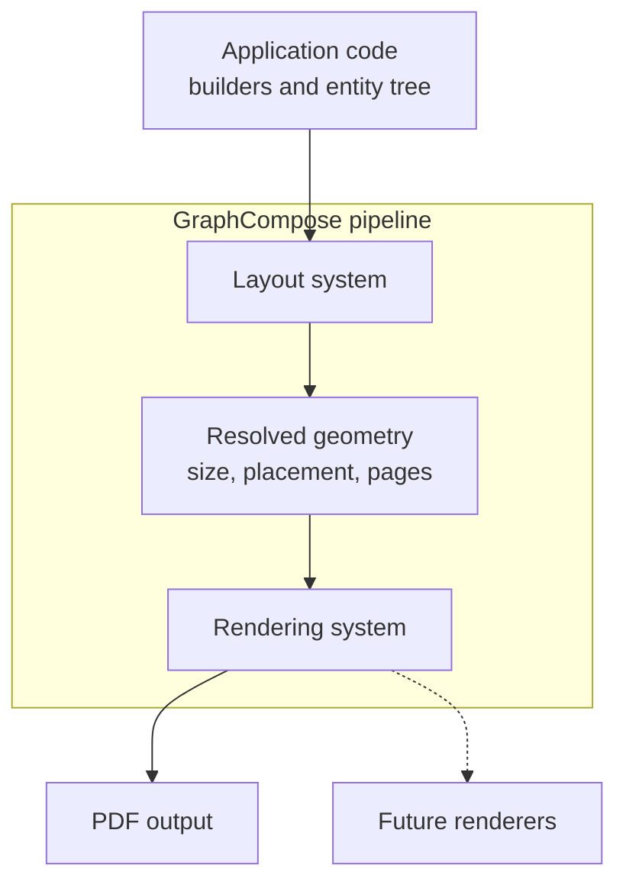

# GraphCompose

<p align="center">
  
</p>

<p align="center">
  
  
  <a href="https://github.com/DemchaAV/GraphCompose/actions/workflows/ci.yml">
    
  </a>
  
  
  
  <a href="https://jitpack.io/#DemchaAV/GraphCompose">
    
  </a>
</p>

<p align="center">
  <b>A declarative, MIT-licensed layout engine for programmatic PDF generation in Java.</b><br/>
  Describe your document structure — GraphCompose handles geometry, text wrapping, pagination, and rendering.
</p>

<p align="center">
  <a href="./docs/architecture.md">Architecture</a>
  ·
  <a href="./docs/implementation-guide.md">Implementation Guide</a>
  ·
  <a href="./CONTRIBUTING.md">Contributing</a>
</p>

---

## The problem with existing PDF libraries

Most Java PDF libraries are **low-level drawing APIs**. You get a canvas and a coordinate system — and the rest is your problem:

- text wrapping requires manual font measurement
- optional sections break absolute positioning
- pagination becomes hundreds of lines of custom logic
- consistent styling across templates means duplicated boilerplate

**iText 7** solves some of this, but its open-source build is AGPL — meaning any commercial product using it must either open-source itself or purchase a commercial license starting at several hundred dollars per month.

**GraphCompose** is different: it is MIT-licensed and ships a real layout engine. You describe *what* you want; the engine figures out *where* to put it.

---

## What GraphCompose is

GraphCompose is a document generation engine built around an ECS-style (Entity-Component-System) model:

- builders create `Entity` trees
- layout systems calculate size and placement
- rendering systems turn resolved geometry into output bytes

The current production renderer is PDF via Apache PDFBox. The layout and entity model is renderer-agnostic by design — DOCX and PPTX output are on the roadmap.

GraphCompose is a good fit for:

- CV and resume generation
- cover letters and profile documents
- invoices and financial reports
- tabular data summaries with negotiated column widths
- multi-page server-side PDF generation at scale
- reusable document templates built on top of a lower-level layout engine

---

## Visual preview

### Repository showcase render

<p align="center">
  
</p>

### Layout debugging with guide lines

<p align="center">
  
</p>

### Final CV render

<p align="center">
  
</p>

### Available fonts preview

<p align="center">
  
</p>

---

## Installation

GraphCompose is available through JitPack.

### Maven

```xml
<repositories>
    <repository>
        <id>jitpack.io</id>
        <url>https://jitpack.io</url>
    </repository>
</repositories>

<dependency>
    <groupId>com.github.DemchaAV</groupId>
    <artifactId>GraphCompose</artifactId>
    <version>v1.0.0</version>
</dependency>
```

### Gradle (Kotlin DSL)

```kotlin
repositories {
    maven("https://jitpack.io")
}

dependencies {
    implementation("com.github.DemchaAV:GraphCompose:v1.0.0")
}
```

---

## Quick start

### Write to file

```java
import com.demcha.compose.GraphCompose;
import com.demcha.compose.layout_core.components.components_builders.ComponentBuilder;
import com.demcha.compose.layout_core.components.content.text.TextStyle;
import com.demcha.compose.layout_core.components.layout.Align;
import com.demcha.compose.layout_core.components.layout.Anchor;
import com.demcha.compose.layout_core.components.style.Margin;
import com.demcha.compose.layout_core.core.PdfComposer;
import org.apache.pdfbox.pdmodel.common.PDRectangle;

import java.nio.file.Path;

public class QuickStart {
    public static void main(String[] args) throws Exception {
        try (PdfComposer composer = GraphCompose.pdf(Path.of("output.pdf"))
                .pageSize(PDRectangle.A4)
                .margin(24, 24, 24, 24)
                .markdown(true)
                .create()) {

            ComponentBuilder cb = composer.componentBuilder();

            cb.vContainer(Align.middle(8))
                    .anchor(Anchor.topLeft())
                    .margin(Margin.of(8))
                    .addChild(cb.text()
                            .textWithAutoSize("Hello GraphCompose")
                            .textStyle(TextStyle.DEFAULT_STYLE)
                            .anchor(Anchor.topLeft())
                            .build())
                    .build();

            composer.build();
        }
    }
}
```

### In-memory output (for HTTP responses, S3 uploads, etc.)

```java
try (PdfComposer composer = GraphCompose.pdf()
        .pageSize(PDRectangle.A4)
        .margin(24, 24, 24, 24)
        .create()) {

    ComponentBuilder cb = composer.componentBuilder();

    cb.vContainer(Align.middle(8))
            .anchor(Anchor.topLeft())
            .margin(Margin.of(8))
            .addChild(cb.text()
                    .textWithAutoSize("In-memory PDF")
                    .textStyle(TextStyle.DEFAULT_STYLE)
                    .anchor(Anchor.topLeft())
                    .build())
            .build();

    byte[] pdfBytes = composer.toBytes();
}
```

### Template layer

```java
import com.demcha.templates.CvTheme;
import com.demcha.templates.TemplateBuilder;

try (PdfComposer composer = GraphCompose.pdf()
        .pageSize(PDRectangle.A4)
        .margin(24, 24, 24, 24)
        .create()) {

    TemplateBuilder template = TemplateBuilder.from(
            composer.componentBuilder(),
            CvTheme.defaultTheme());

    template.moduleBuilder("Profile", composer.canvas())
            .addChild(template.blockText(
                    "Analytical engineer focused on reliable platform design.",
                    composer.canvas().innerWidth()))
            .build();

    byte[] pdfBytes = composer.toBytes();
}
```

---

## Core concepts

### 1. Everything is an entity

Builders do not draw directly. They create `Entity` instances and attach components the engine understands: renderable markers, content and style, size and placement, parent/child relationships.

### 2. Layout and rendering are separate passes

The layout pass resolves all geometry first. Rendering happens after every size and position is known. This separation is what makes automatic pagination, guide-line debugging, and future alternative renderers possible.

### 3. Containers express structure

Use `vContainer(...)`, `hContainer(...)`, and `moduleBuilder(...)` to describe document flow. Absolute coordinates are an implementation detail of the engine, not something you write.

### 4. The template layer is optional

`TemplateBuilder`, `CvTheme`, and the classes under `com.demcha.templates.builtins` are a convenience layer for reusable document layouts. You can use the raw engine directly for one-off documents and opt into templates when you need repeatability.

---

## Table component

The `TableBuilder` ships as part of v1 and covers the common server-side document use case: structured tabular data with automatic column sizing and multi-page support.

What it handles:
- fixed-width and auto-width columns with negotiated sizing
- header rows with independent styling
- row-level, column-level, and default cell style scopes (row takes priority)
- row-atomic pagination — a row moves as a unit instead of being split across pages
- page-break-aware separators — the last row on one page keeps its bottom edge, the first row on the next gets its own top edge

Current v1 limits:
- no `rowspan` / `colspan`
- no wrapped multi-line cell content
- no repeated header rows
- no cell-level style override beyond row/column/default scopes

```java
Entity table = composer.componentBuilder()
        .table()
        .entityName("StatusTable")
        .columns(
                TableColumnSpec.fixed(90),
                TableColumnSpec.auto(),
                TableColumnSpec.auto()
        )
        .width(520)
        .defaultCellStyle(TableCellStyle.builder()
                .padding(Padding.of(6))
                .build())
        .row("Role", "Owner", "Status")
        .row("Engine", "GraphCompose", "Stable")
        .row("Feature", "Table Builder", "In progress")
        .build();
```

---

## Line primitive

```java
Entity line = composer.componentBuilder()
        .line()
        .horizontal()
        .size(220, 16)
        .padding(Padding.of(6))
        .stroke(new Stroke(ComponentColor.ROYAL_BLUE, 3))
        .build();
```

Available path helpers: `horizontal()`, `vertical()`, `diagonalAscending()`, `diagonalDescending()`, and `path(x0, y0, x1, y1)` for custom normalized coordinates.

---

## Architecture at a glance



Main packages:

| Package | Contents |
| --- | --- |
| `com.demcha.compose.layout_core.*` | Core engine: entities, builders, geometry, layout, pagination, render systems |
| `com.demcha.compose.font_library.*` | Font registration and PDF font helpers |
| `com.demcha.compose.markdown.*` | Markdown parsing helpers used by text/block text builders |
| `com.demcha.templates.*` | Higher-level templates, themes, DTOs, and template contracts |

For the full package map, see [docs/architecture.md](./docs/architecture.md).

---

## Extending GraphCompose

Start with [docs/implementation-guide.md](./docs/implementation-guide.md). The short version:

- extend `EmptyBox<T>` for a leaf entity with no children
- extend `ShapeBuilderBase<T>` for shape-like leaves that need fill/stroke helpers
- extend `ContainerBuilder<T>` for entities that own child entities
- keep fixed leaf renderables (`Image`, `Circle`, `Line`) on the same layout contract: fixed `ContentSize`, padding-aware draw area, non-breakable unless truly needed
- add `Expendable` only when the entity should grow from child content
- add `Breakable` only when the entity itself can continue across pages
- register the new builder as a factory method on `ComponentBuilder`

---

## Performance and benchmarks

Benchmarks were run locally on March 27, 2026 against the current repository state after the `TableBuilder v1` implementation and pagination-border fixes. All numbers use a dedicated quiet logging config (`logback-benchmark.xml`) so they reflect document generation work, not debug I/O.

These are project benchmarks measured on one machine — treat them as relative indicators, not absolute guarantees.

### Comparative benchmark

> **Context:** iText 5 is included as a low-level drawing baseline — it has no layout engine, so generating the same document with iText 5 requires manual coordinate math, font measurement, and pagination logic that GraphCompose handles automatically. The ~1 ms difference is the cost of that automatic layout resolution. iText 5 is also no longer maintained and its successor, iText 7, requires a commercial license for production use.

Source: `src/test/java/com/demcha/compose/ComparativeBenchmark.java`

| Library | Avg Time (ms) | Avg Heap (MB) | License |
| --- | ---: | ---: | --- |
| GraphCompose | 2.89 | 0.21 | **MIT** |
| iText 5 (EOL) | 1.80 | 0.16 | AGPL |
| JasperReports | 4.50 | 0.19 | LGPL |

### Core engine benchmark

Source: `src/test/java/com/demcha/compose/GraphComposeBenchmark.java`

| Metric | Latency |
| --- | ---: |
| Min | 1.02 ms |
| Avg | 1.94 ms |
| p50 | 1.77 ms |
| p95 | 3.42 ms |
| p99 | 4.44 ms |
| Max | 5.08 ms |

### Full CV benchmark

A complete multi-section CV document with text, layout columns, and theme styling.

Source: `src/test/java/com/demcha/compose/FullCvBenchmark.java`

| Metric | Latency |
| --- | ---: |
| Min | 4.94 ms |
| Avg | 8.20 ms |
| p50 | 7.77 ms |
| p95 | 12.35 ms |
| p99 | 15.29 ms |
| Max | 18.64 ms |

### Scalability benchmark

Near-linear throughput scaling across threads with zero shared mutable state.

Source: `src/test/java/com/demcha/compose/ScalabilityBenchmark.java`

| Threads | Total Docs | Throughput |
| ---: | ---: | ---: |
| 1 | 100 | 395 docs/sec |
| 2 | 200 | 961 docs/sec |
| 4 | 400 | 2016 docs/sec |
| 8 | 800 | 3747 docs/sec |
| 16 | 1600 | 5608 docs/sec |

### Stress test

Source: `src/test/java/com/demcha/compose/GraphComposeStressTest.java`

| Parameter | Value |
| --- | --- |
| Thread pool size | 50 |
| Tasks submitted | 5,000 |
| Successful | 5,000 |
| Errors | 0 |
| Total time | 4,029 ms |

### Endurance run

Source: `src/test/java/com/demcha/compose/EnduranceTest.java`

| Parameter | Value |
| --- | --- |
| Documents generated | 100,000 |
| Total time | 41,635 ms |
| Heap behavior | Repeated GC drops observed — no growth trend |
| Result | Completed successfully |

> Note: the endurance run was executed without an explicit `-Xmx` flag. To verify behavior under a constrained heap, rerun with a specific limit such as `-Xmx64m`.

---

## Tech stack

| Technology | Version | Role |
| --- | --- | --- |
| Java | 21 | Primary language |
| Kotlin | 2.2 | Build/runtime compatibility; no production `.kt` sources today |
| Apache PDFBox | 3.0.5 | PDF rendering backend |
| Flexmark | 0.64.8 | Markdown parsing |
| SnakeYAML | 2.4 | Config/template data |
| Lombok | 1.18.38 | Boilerplate reduction |
| Logback | 1.5.18 | Logging |
| JUnit 5 | 5.12.2 | Testing |
| Mockito | 5.20.0 | Mocking |

---

## Roadmap

- [x] PDF rendering
- [x] VContainer / HContainer layout system
- [x] Auto-pagination
- [x] Markdown support
- [x] Shared font registration
- [x] Concurrent rendering support
- [x] Table component with negotiated column widths
- [ ] Maven Central release
- [ ] DOCX renderer
- [ ] PPTX renderer
- [ ] XLSX renderer
- [ ] Stable release pipeline

---

## Contributing

See [CONTRIBUTING.md](./CONTRIBUTING.md) for the current workflow and [docs/implementation-guide.md](./docs/implementation-guide.md) for extension-oriented guidance.

---

## License

MIT. See [LICENSE](./LICENSE).
