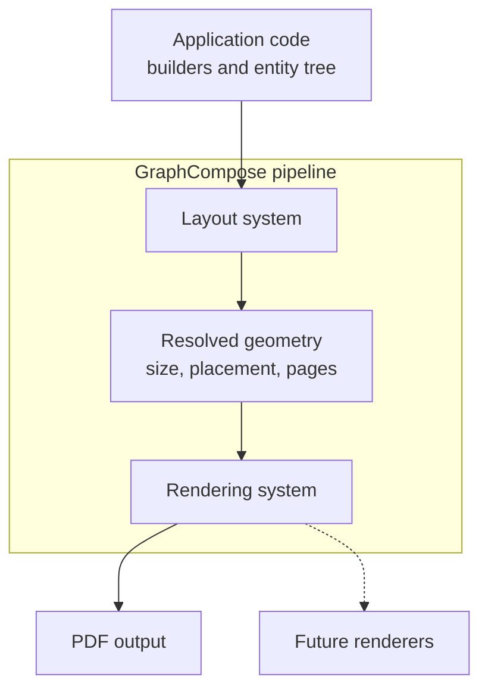

# GraphCompose

<p align="center">
  
</p>

<p align="center">
  
  
  
  
  
</p>

<p align="center">
  <b>A declarative layout engine for programmatic document generation, implemented primarily in Java.</b><br/>
  Build documents through entities, builders, layout rules, and renderers instead of hand-written PDF coordinates.
</p>

<p align="center">
  <a href="./docs/architecture.md">Architecture</a>
  ·
  <a href="./docs/implementation-guide.md">Implementation Guide</a>
  ·
  <a href="./CONTRIBUTING.md">Contributing</a>
</p>

---

## What GraphCompose is

GraphCompose is a document generation engine built around an ECS-style model:

- builders create `Entity` trees;
- layout systems calculate size and placement;
- rendering systems turn resolved geometry into output bytes.

The current production path is PDF output via Apache PDFBox. The source tree also contains early Word-related classes, but the PDF path is the supported renderer today.

The library is Java-first today. The build includes Kotlin support, but the repository does not currently contain production `.kt` sources.

GraphCompose is a good fit for:

- CV and resume generation
- cover letters and profile documents
- invoices and reports
- negotiated tables and tabular summaries
- multi-page server-side PDF generation
- reusable document templates on top of a lower-level layout engine

## Why use it

Raw PDF libraries are powerful, but they push layout responsibility into application code:

- text wrapping depends on manual font measurement
- optional sections break absolute positioning
- pagination becomes custom logic
- style consistency becomes repetitive boilerplate

GraphCompose moves those concerns into the engine:

| Problem | GraphCompose approach |
| --- | --- |
| Manual coordinate math | Compose entities with containers, anchors, padding, and margin |
| Dynamic content | Let the layout system measure and place content |
| Multi-page output | Use page-breaking and pagination logic in the engine |
| Repeated styling | Reuse shared text styles, themes, and font registration |
| Hard-to-maintain templates | Build reusable document structures on top of `TemplateBuilder` |

## Visual preview

These screenshots were refreshed from the current repository render outputs on March 27, 2026.

### Final CV render

<p align="center">
  
</p>

### Layout debugging with guide lines

<p align="center">
  
</p>

### Available fonts preview

<p align="center">
  
</p>

## Architecture at a glance



Main layers:

- `com.demcha.compose.layout_core.*`
  Core engine: entities, builders, geometry, layout, pagination, render systems
- `com.demcha.compose.font_library.*`
  Font registration and PDF font helpers
- `com.demcha.compose.markdown.*`
  Markdown parsing helpers used by text/block text builders
- `com.demcha.templates.*`
  Higher-level templates, themes, DTOs, and template contracts

For the full package map, see [docs/architecture.md](./docs/architecture.md).

## Installation

GraphCompose can be consumed through JitPack.

### Maven

```xml
<repositories>
    <repository>
        <id>jitpack.io</id>
        <url>https://jitpack.io</url>
    </repository>
</repositories>

<dependency>
    <groupId>com.github.DemchaAV</groupId>
    <artifactId>GraphCompose</artifactId>
    <version>v1.0.0</version>
</dependency>
```

### Gradle (Kotlin DSL)

```kotlin
repositories {
    maven("https://jitpack.io")
}

dependencies {
    implementation("com.github.DemchaAV:GraphCompose:v1.0.0")
}
```

## Quick start

The example below matches the current documentation test suite.

```java
import com.demcha.compose.GraphCompose;
import com.demcha.compose.layout_core.components.components_builders.ComponentBuilder;
import com.demcha.compose.layout_core.components.content.text.TextStyle;
import com.demcha.compose.layout_core.components.layout.Align;
import com.demcha.compose.layout_core.components.layout.Anchor;
import com.demcha.compose.layout_core.components.style.Margin;
import com.demcha.compose.layout_core.core.PdfComposer;
import org.apache.pdfbox.pdmodel.common.PDRectangle;

import java.nio.file.Path;

public class QuickStart {
    public static void main(String[] args) throws Exception {
        Path outputFile = Path.of("quick-start.pdf");

        try (PdfComposer composer = GraphCompose.pdf(outputFile)
                .pageSize(PDRectangle.A4)
                .margin(24, 24, 24, 24)
                .markdown(true)
                .create()) {

            ComponentBuilder cb = composer.componentBuilder();

            cb.vContainer(Align.middle(8))
                    .anchor(Anchor.topLeft())
                    .margin(Margin.of(8))
                    .addChild(cb.text()
                            .textWithAutoSize("Hello GraphCompose")
                            .textStyle(TextStyle.DEFAULT_STYLE)
                            .anchor(Anchor.topLeft())
                            .build())
                    .build();

            composer.build();
        }
    }
}
```

### In-memory output

```java
try (PdfComposer composer = GraphCompose.pdf()
        .pageSize(PDRectangle.A4)
        .margin(24, 24, 24, 24)
        .create()) {

    ComponentBuilder cb = composer.componentBuilder();

    cb.vContainer(Align.middle(8))
            .anchor(Anchor.topLeft())
            .margin(Margin.of(8))
            .addChild(cb.text()
                    .textWithAutoSize("In-memory PDF")
                    .textStyle(TextStyle.DEFAULT_STYLE)
                    .anchor(Anchor.topLeft())
                    .build())
            .build();

    byte[] pdfBytes = composer.toBytes();
}
```

### Template layer example

```java
import com.demcha.templates.CvTheme;
import com.demcha.templates.TemplateBuilder;
import com.demcha.compose.GraphCompose;
import com.demcha.compose.layout_core.core.PdfComposer;
import org.apache.pdfbox.pdmodel.common.PDRectangle;

try (PdfComposer composer = GraphCompose.pdf()
        .pageSize(PDRectangle.A4)
        .margin(24, 24, 24, 24)
        .create()) {

    TemplateBuilder template = TemplateBuilder.from(
            composer.componentBuilder(),
            CvTheme.defaultTheme());

    template.moduleBuilder("Profile", composer.canvas())
            .addChild(template.blockText(
                    "Analytical engineer focused on reliable platform design.",
                    composer.canvas().innerWidth()))
            .build();

    byte[] pdfBytes = composer.toBytes();
}
```

## Table Builder v1

The engine now ships a public table builder through `composer.componentBuilder().table()`.

What is implemented:

- fixed and auto column negotiation through `TableColumnSpec.fixed(...)` and `TableColumnSpec.auto()`
- shared default cell styling with row-scoped and column-scoped overrides through `TableCellStyle`
- single-line text cells with padding, fill, stroke, and text alignment support
- row-atomic pagination, so a row is moved as a unit instead of being split across pages
- page-break-aware separators, so the last row on one page keeps its bottom edge and the first row on the next page gets its own top edge

Current v1 limits:

- no `rowspan` / `colspan`
- no wrapped multi-line cell content
- no repeated header rows
- no cell-level override API beyond row/column/default scopes

Minimal example:

```java
Entity table = composer.componentBuilder()
        .table()
        .entityName("StatusTable")
        .columns(
                TableColumnSpec.fixed(90),
                TableColumnSpec.auto(),
                TableColumnSpec.auto()
        )
        .width(520)
        .defaultCellStyle(TableCellStyle.builder()
                .padding(Padding.of(6))
                .build())
        .row("Role", "Owner", "Status")
        .row("Engine", "GraphCompose", "Stable")
        .row("Feature", "Table Builder", "In progress")
        .build();
```

Verification status for this feature:

- unit coverage for width negotiation, style precedence, border ownership, fill insets, and page-fragment separators
- integration coverage for layout, styling, and multi-page pagination
- visual outputs generated under `target/visual-tests/clean/integration`

## Line primitive

The engine now ships a public line builder through `composer.componentBuilder().line()`.

Implementation notes:

- `Line` is a fixed leaf renderable, so it plugs into the existing ECS/layout/render pipeline like `Circle` and `Image`
- the line occupies a normal `ContentSize` box, then draws its path inside the padding-aware inner area
- pagination stays leaf-like and non-breakable: a line moves as a unit to the next page when needed
- the default path is horizontal, with helpers for vertical and diagonal variants

Minimal example:

```java
Entity line = composer.componentBuilder()
        .line()
        .horizontal()
        .size(220, 16)
        .padding(Padding.of(6))
        .stroke(new Stroke(ComponentColor.ROYAL_BLUE, 3))
        .build();
```

Available path helpers:

- `horizontal()`
- `vertical()`
- `diagonalAscending()`
- `diagonalDescending()`
- `path(startX, startY, endX, endY)` for custom normalized coordinates inside the draw box

## Core concepts

### 1. Everything becomes an entity with components

Builders do not draw directly. They create `Entity` instances and attach the components needed by the engine:

- renderable marker component
- content/style components
- size and placement-related components
- parent/child relationships for containers

### 2. Layout and rendering are separate stages

The layout pass calculates geometry first. Rendering happens after placement is resolved. That separation is what makes pagination, guide lines, and alternative renderers possible.

### 3. Containers express structure

Use container builders such as `vContainer(...)`, `hContainer(...)`, and `moduleBuilder(...)` to express document flow instead of absolute coordinates.

### 4. The template layer sits on top of the engine

`TemplateBuilder`, `CvTheme`, and the classes under `com.demcha.templates.builtins` are convenience layers for reusable personal-document layouts. They are not required for one-off PDFs, but they simplify repeatable template design.

## Extending GraphCompose

If you want to add a new object type, builder, or renderer integration, start with [docs/implementation-guide.md](./docs/implementation-guide.md).

The short version:

- extend `EmptyBox<T>` for a leaf entity that does not manage children
- extend `ShapeBuilderBase<T>` for shape-like leaf objects that need fill/stroke helpers
- extend `ContainerBuilder<T>` for entities that own child entities
- keep fixed leaf renderables such as `Image`, `Circle`, and `Line` on the same layout contract: fixed `ContentSize`, padding-aware draw area, and no `Expendable`/`Breakable` unless they truly need it
- add `Expendable` only when the entity should grow because of child content
- add `Breakable` only when the entity itself can continue across pages
- add a factory method to `ComponentBuilder` if the new object should be available from `composer.componentBuilder()`
- make sure the built entity receives the components the layout system and renderer expect
- if the object needs custom drawing, add a renderable component that implements the appropriate render contract

The guide includes:

- what to inherit for different cases
- what `Expendable` and `Breakable` mean in the engine
- which components are required for sizing, layout, parenting, and rendering
- where to add builder wiring
- how the layout and rendering systems pick the object up

## Performance and benchmarks

The comparative, core-engine, full-CV, and scalability numbers below were rerun locally on March 27, 2026 against the current repository state after the `TableBuilder v1` implementation and pagination-border fixes. They are environment-dependent and should be treated as project benchmarks, not cross-machine guarantees.

The benchmark entry points now boot with a dedicated quiet logging config from `src/test/resources/logback-benchmark.xml`, so the numbers reflect document generation work instead of debug layout tracing and file-appender I/O.

The stress and endurance entries further below are retained as the latest long-run verification records; they were not rerun as part of this documentation refresh.

### Comparative benchmark

Source: `src/test/java/com/demcha/compose/ComparativeBenchmark.java`

| Library | Avg Time (ms) | Avg Heap (MB) | License |
| --- | ---: | ---: | --- |
| GraphCompose | 2.89 | 0.21 | MIT |
| iText 5 (Old) | 1.80 | 0.16 | AGPL |
| JasperReports | 4.50 | 0.19 | LGPL |

### Core engine benchmark

Source: `src/test/java/com/demcha/compose/GraphComposeBenchmark.java`

| Metric | Latency |
| --- | ---: |
| Min | 1.02 ms |
| Avg | 1.94 ms |
| p50 | 1.77 ms |
| p95 | 3.42 ms |
| p99 | 4.44 ms |
| Max | 5.08 ms |

### Full CV benchmark

Source: `src/test/java/com/demcha/compose/FullCvBenchmark.java`

| Metric | Latency |
| --- | ---: |
| Min | 4.94 ms |
| Avg | 8.20 ms |
| p50 | 7.77 ms |
| p95 | 12.35 ms |
| p99 | 15.29 ms |
| Max | 18.64 ms |

### Scalability benchmark

Source: `src/test/java/com/demcha/compose/ScalabilityBenchmark.java`

| Threads | Total Docs | Throughput |
| ---: | ---: | ---: |
| 1 | 100 | 395.33 docs/sec |
| 2 | 200 | 961.26 docs/sec |
| 4 | 400 | 2016.51 docs/sec |
| 8 | 800 | 3746.97 docs/sec |
| 16 | 1600 | 5607.87 docs/sec |

### Stress test

Source: `src/test/java/com/demcha/compose/GraphComposeStressTest.java`

| Parameter | Value |
| --- | --- |
| Thread pool size | 50 |
| Tasks submitted | 5,000 |
| Successful | 5,000 |
| Errors | 0 |
| Total time | 4,029 ms |

### Endurance run

Source: `src/test/java/com/demcha/compose/EnduranceTest.java`

| Parameter | Value |
| --- | --- |
| Documents generated | 100,000 |
| Total time | 41,635 ms |
| Heap behavior | Repeated GC drops observed during the run |
| Result | Completed successfully |

Note: the endurance run above was executed without a forced low-heap JVM flag. If you want a constrained-memory proof, rerun the same class with an explicit `-Xmx` limit.

## Tech stack

| Technology | Version | Role |
| --- | --- | --- |
| Java | 21 | Primary language |
| Kotlin | 2.2 | Build/runtime compatibility layer; no production `.kt` sources in the repository today |
| Apache PDFBox | 3.0.5 | PDF rendering backend |
| Flexmark | 0.64.8 | Markdown parsing |
| SnakeYAML | 2.4 | Config/template data |
| Lombok | 1.18.38 | Boilerplate reduction |
| Logback | 1.5.18 | Logging |
| JUnit 5 | 5.12.2 | Testing |
| Mockito | 5.20.0 | Mocking |

## Roadmap

- [x] PDF rendering
- [x] VContainer / HContainer layout system
- [x] Auto-pagination
- [x] Markdown support
- [x] Shared font registration
- [x] Concurrent rendering support
- [x] Table component with negotiated column widths
- [ ] DOCX renderer
- [ ] PPTX renderer
- [ ] XLSX renderer
- [ ] Stable release pipeline

## Contributing

See [CONTRIBUTING.md](./CONTRIBUTING.md) for the current workflow and [docs/implementation-guide.md](./docs/implementation-guide.md) for extension-oriented guidance.

## License

MIT. See [LICENSE](./LICENSE).
