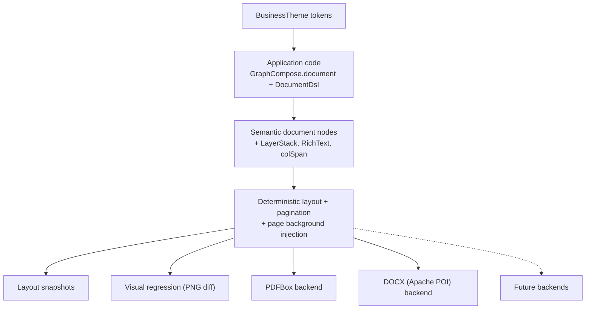

# GraphCompose

<p align="center">
  
</p>

<p align="center">
  <b>Java-first declarative document layout engine for cinematic PDFs.</b><br/>
  Describe semantic document structure; GraphCompose handles layout, pagination, snapshots, and PDFBox rendering &mdash; with a designer-grade visual layer on top.
</p>

<p align="center">
  
  
  
  <a href="https://jitpack.io/#DemchaAV/GraphCompose">
    
  </a>
</p>

## Why GraphCompose?

Most Java PDF libraries hand you low-level drawing commands. GraphCompose gives Java applications a **semantic authoring model** &mdash; you describe modules, paragraphs, tables, rows, layers, and themes; the engine measures, paginates, and renders.

What you get out of the box:

- **Author intent, not coordinates.** `GraphCompose.document(...) -> DocumentSession -> DocumentDsl` is a fluent builder for sections, modules, paragraphs, lists, tables, images, dividers, page-breaks, and (since v1.4) layer stacks.
- **Deterministic layout.** Two passes &mdash; layout resolves geometry, render consumes resolved fragments. Snapshots are stable across runs and machines, so you can regression-test layout before any PDF byte is written.
- **Atomic pagination, no manual paging.** Tables split row-by-row, rows are atomic, layer stacks are atomic, and the paginator keeps owner placement and page spans coherent.
- **Designer-grade output.** Page backgrounds, section bands, soft panels, accent strips, column spans, layered hero blocks, fluent rich text, and a tokenised `BusinessTheme` are all first-class &mdash; not workarounds.
- **PDFBox rendering, isolated.** PDF backend lives behind a single backend interface. The DOCX semantic backend (Apache POI) is ready for callers who need an editable file.
- **Tested at every layer.** 647 green tests on `develop` (525 → 647 across v1.5), including cinematic-feature tests, shape-as-container clip-path invariants, transform CTM checks, table row-span / zebra / repeated-header tests, public-API leak guards, semantic-vs-engine isolation guards, and the `PdfVisualRegression` harness for screenshot-level checks.

The current release is **v1.4.1** &mdash; the "cinematic" release. v1.3 stabilised the core (rows, per-side borders, auto-size text, DOCX export); v1.4 lands the visual-design layer that turns "tidy PDF" into "designed document".

## Visual preview

<p align="center">
  
</p>

<p align="center">
  
</p>

The proposal screenshot above is built by [`CinematicProposalFileExample`](./examples/src/main/java/com/demcha/examples/CinematicProposalFileExample.java) in the runnable `examples/` module &mdash; a single Java file, no XML, no template engine.

### v1.5 sample renders (PDF)

These PDFs are the actual output of the v1.5 cinematic stack — open
them to see what the new templates and primitives look like before
running anything locally:

- [Invoice — cinematic V2](./assets/readme/v1.5/invoice-cinematic-v2.pdf) (`InvoiceTemplateV2 + BusinessTheme.modern()`)
- [Invoice — Studio Emerald custom theme](./assets/readme/v1.5/invoice-custom-theme-studio-emerald.pdf) (`CustomBusinessThemeExample`)
- [Proposal — cinematic V2](./assets/readme/v1.5/proposal-cinematic-v2.pdf) (`ProposalTemplateV2 + BusinessTheme.modern()`)
- [Shape-as-container](./assets/readme/v1.5/shape-container.pdf) (`addCircle / addEllipse / addContainer` with `ClipPolicy.CLIP_PATH`)
- [Transforms + z-index](./assets/readme/v1.5/transforms.pdf) (rotate, scale, layer restack)
- [Tables — row span / zebra / totals / repeated header](./assets/readme/v1.5/table-advanced.pdf)

Each PDF is regenerated by [`GenerateAllExamples`](./examples/src/main/java/com/demcha/examples/GenerateAllExamples.java); the assets here are committed snapshots so the README links work without running anything.

## Installation

GraphCompose is currently distributed through JitPack.

```xml
<repositories>
    <repository>
        <id>jitpack.io</id>
        <url>https://jitpack.io</url>
    </repository>
</repositories>

<dependency>
    <groupId>com.github.DemchaAV</groupId>
    <artifactId>GraphCompose</artifactId>
    <version>v1.4.1</version>
</dependency>
```

```kotlin
repositories {
    maven("https://jitpack.io")
}

dependencies {
    implementation("com.github.demchaav:GraphCompose:v1.4.1")
}
```

The project POM coordinates are `io.github.demchaav:graphcompose:1.4.1`. JitPack keeps the GitHub repository coordinate with a lowercase owner (`com.github.demchaav:GraphCompose:v1.4.1`) and the `v1.4.1` tag. The DOCX backend depends on `org.apache.poi:poi-ooxml`, declared as `optional` &mdash; add it explicitly when you call `session.export(new DocxSemanticBackend())`.

## Quick start

The fastest path to a designed PDF is the v1.5 cinematic stack: pick a
`BusinessTheme`, drop a `softPanel` + `accentLeft` hero block on the
page, and let the theme drive every colour, font, and table style.

```java
import com.demcha.compose.GraphCompose;
import com.demcha.compose.document.api.DocumentPageSize;
import com.demcha.compose.document.api.DocumentSession;
import com.demcha.compose.document.theme.BusinessTheme;

import java.nio.file.Path;

public class QuickStart {
    public static void main(String[] args) throws Exception {
        BusinessTheme theme = BusinessTheme.modern();   // cream paper + teal/gold

        try (DocumentSession document = GraphCompose.document(Path.of("output.pdf"))
                .pageSize(DocumentPageSize.A4)
                .pageBackground(theme.pageBackground())
                .margin(28, 28, 28, 28)
                .create()) {

            document.pageFlow(page -> page
                    .addSection("Hero", section -> section
                            .softPanel(theme.palette().surfaceMuted(), 10, 14)
                            .accentLeft(theme.palette().accent(), 4)
                            .addParagraph(p -> p
                                    .text("GraphCompose")
                                    .textStyle(theme.text().h1()))
                            .addParagraph(p -> p
                                    .text("A theme-driven hero, one page, no manual coordinates.")
                                    .textStyle(theme.text().body()))));

            document.buildPdf();
        }
    }
}
```

Need plain text and no theme? Drop straight into the DSL:

```java
try (DocumentSession document = GraphCompose.document(Path.of("output.pdf"))
        .pageSize(DocumentPageSize.A4)
        .margin(24, 24, 24, 24)
        .create()) {
    document.pageFlow(page -> page
            .module("Summary", module -> module.paragraph("Hello GraphCompose")));
    document.buildPdf();
}
```

For HTTP responses, S3 uploads, or in-memory generation:

```java
try (DocumentSession document = GraphCompose.document()
        .pageSize(DocumentPageSize.A4)
        .margin(24, 24, 24, 24)
        .create()) {

    document.pageFlow(page -> page
            .module("Summary", module -> module.paragraph("In-memory PDF")));

    document.writePdf(responseOutputStream);
    byte[] pdfBytes = document.toPdfBytes();
}
```

### Built-in templates (compose-first)

`InvoiceTemplateV2` and `ProposalTemplateV2` (v1.5) take a
`BusinessTheme` in their constructor, so the same data renders
through any of `classic` / `modern` / `executive` (or your own
custom theme) without touching the call site.

```java
import com.demcha.compose.GraphCompose;
import com.demcha.compose.document.api.DocumentPageSize;
import com.demcha.compose.document.api.DocumentSession;
import com.demcha.compose.document.templates.builtins.InvoiceTemplateV2;
import com.demcha.compose.document.templates.data.invoice.InvoiceDocumentSpec;
import com.demcha.compose.document.theme.BusinessTheme;

import java.nio.file.Path;

InvoiceDocumentSpec invoice = InvoiceDocumentSpec.builder()
        .invoiceNumber("GC-2026-041")
        .issueDate("02 Apr 2026")
        .dueDate("16 Apr 2026")
        .fromParty(party -> party.name("GraphCompose Studio"))
        .billToParty(party -> party.name("Northwind Systems"))
        .lineItem("Template architecture", "Reusable invoice flow", "2", "GBP 980", "GBP 1,960")
        .totalRow("Total", "GBP 1,960")
        .build();

BusinessTheme theme = BusinessTheme.modern();
InvoiceTemplateV2 template = new InvoiceTemplateV2(theme);

try (DocumentSession document = GraphCompose.document(Path.of("invoice.pdf"))
        .pageSize(DocumentPageSize.A4)
        .pageBackground(theme.pageBackground())
        .margin(28, 28, 28, 28)
        .create()) {

    template.compose(document, invoice);
    document.buildPdf();
}
```

`InvoiceTemplateV1` ships side-by-side for callers who want the
hard-coded default theme. To brand the output for your own product,
hand `InvoiceTemplateV2` a custom `BusinessTheme` instead — see
[`CustomBusinessThemeExample`](./examples/src/main/java/com/demcha/examples/CustomBusinessThemeExample.java).

The runnable `examples/` module ships fifteen examples covering CV,
cover letter, invoice (V1 + cinematic V2), proposal (V1 + V2),
schedule, plus six v1.5-specific showcases:

- [`ShapeContainerExample`](./examples/src/main/java/com/demcha/examples/ShapeContainerExample.java) — circles, ellipses, rounded cards with clipped layers
- [`TransformsExample`](./examples/src/main/java/com/demcha/examples/TransformsExample.java) — rotate, scale, and z-index swap
- [`TableAdvancedExample`](./examples/src/main/java/com/demcha/examples/TableAdvancedExample.java) — row span, zebra, totals, repeating header
- [`CustomBusinessThemeExample`](./examples/src/main/java/com/demcha/examples/CustomBusinessThemeExample.java) — hand-built `BusinessTheme` driving `InvoiceTemplateV2`
- [`HttpStreamingExample`](./examples/src/main/java/com/demcha/examples/HttpStreamingExample.java) — `writePdf(OutputStream)` for Servlet / S3 paths
- [`LayoutSnapshotRegressionExample`](./examples/src/main/java/com/demcha/examples/LayoutSnapshotRegressionExample.java) — deterministic layout snapshots for regression tests

Run the whole gallery in one shot:

```bash
./mvnw -f examples/pom.xml clean package
./mvnw -f examples/pom.xml exec:java -Dexec.mainClass=com.demcha.examples.GenerateAllExamples
```

Each example writes a PDF to `examples/target/generated-pdfs/`.

## Core concepts

### 1. Documents are semantic first

Application code describes modules, paragraphs, lists, rows, tables, images, dividers, page-breaks, and (v1.4) layer stacks. The engine turns those semantic nodes into measured, paginated render fragments.

### 2. Layout and rendering are separate passes

`DocumentSession.layoutGraph()` resolves geometry first. Rendering consumes already resolved pages and fragments. This is what makes snapshots, pagination, and future backends practical.

### 3. Layout traversal is deterministic

GraphCompose builds stable tree order, parent links, page spans, and coordinates so tests can compare layout snapshots before any PDF bytes are written.

### 4. Containers express structure

Use `document.pageFlow()` for the root flow, `module()` for full-width document blocks, `section()` for nested grouping, `addRow(...)` for horizontal columns, and `LayerStackBuilder` (v1.4) for stacked layers. Absolute coordinates stay inside the engine.

### 5. The template layer is optional

Use built-in templates when they fit, or compose your own document directly with `DocumentSession` and the DSL. Templates are themselves authored against the same semantic API.

---

## What's new in v1.5 &mdash; "intuitive"

v1.5 builds on the cinematic primitives from v1.4 and adds three feature pillars:
**shape-as-container** for clipped composites, **transform & z-index** for
rotated and re-stacked layers, and **advanced tables** that cover the most
common rendered-report patterns.

### Shape-as-container with clip path

`addCircle(diameter, fill, inside)` / `addEllipse(w, h, fill, inside)` /
`addContainer(...)` build a `ShapeContainerNode` whose bounding box is
dictated by the outline. Children are clipped to the outline path
(`ClipPolicy.CLIP_PATH` &mdash; the default), to the bounding box
(`CLIP_BOUNDS`), or render unclipped (`OVERFLOW_VISIBLE`).

```java
import com.demcha.compose.document.dsl.ParagraphBuilder;

document.pageFlow(page -> page
        .addCircle(80, brand, circle -> circle
                .name("BrandSeal")
                .center(new ParagraphBuilder().text("M&A").build())));
```

The PDF backend honours every clip policy via graphics-state
`saveGraphicsState() + clip(path)` / `restoreGraphicsState()` markers
emitted by the layout layer. The DOCX backend renders the layers inline
without the outline frame and logs a one-time capability warning, since
Apache POI cannot express path clipping. See
[docs/recipes/shape-as-container.md](docs/recipes/shape-as-container.md).

### Transforms (rotate / scale) and per-layer z-index

`ShapeContainerBuilder` implements a `Transformable<T>` mixin. `rotate`
and `scale` chain naturally and pivot around the outline's geometric
centre.

```java
.addCircle(110, brand, circle -> circle
        .rotate(15)              // clockwise degrees
        .scale(0.9))             // uniform; (sx, sy) overload also exists
```

Per-layer `zIndex` lets a layer declared earlier in source draw on top
of layers declared later when it has a higher z-index. The layout
compiler stable-sorts layers before render; equal z-index keeps source
order. See [docs/recipes/transforms.md](docs/recipes/transforms.md).

### Advanced tables (row span, zebra, totals, repeated header)

Tables now cover the four features most rendered reports need:

```java
addTable(table -> {
    TableBuilder t = table
            .columns(autoColumns(3))
            .defaultCellStyle(bordered)
            .headerRow("Item", "Qty", "Amount")
            .headerStyle(headerStyle)
            .repeatHeader()                       // re-emit on every continuation page
            .zebra(zebraOdd, zebraEven);
    for (int i = 1; i <= 60; i++) {
        t.row("Line item " + i, String.valueOf(i), String.format("$%d.00", i));
    }
    t.totalRow(totalStyle, "Total", String.valueOf(60), "$1830.00");
});
```

`DocumentTableCell.text(...).rowSpan(n)` merges a cell vertically; the
layout layer skips the occupied grid positions when interpreting
subsequent source rows. See [docs/recipes/tables.md](docs/recipes/tables.md).

### Runnable examples

The `examples/` module gains five new runnable showcases that you can
inspect under `examples/target/generated-pdfs/` after running
`GenerateAllExamples.main`:

- `shape-container.pdf` &mdash; circles, ellipses, rounded cards with clipped layers
- `transforms.pdf` &mdash; rotate row, scale row, and a z-swap stage
- `table-advanced.pdf` &mdash; row span, zebra, totals, repeating header

---

## What's new in v1.4 &mdash; "cinematic"

Six designer-grade features lift GraphCompose from a tidy PDF layouter to a cinematic document engine.

### Column spans

A single `DocumentTableCell.colSpan(n)` lets one cell occupy multiple columns &mdash; clean totals rows, header groups, mid-table section dividers.

```java
document.pageFlow().addTable(table -> table
        .columns(
            DocumentTableColumn.fixed(150),
            DocumentTableColumn.fixed(80),
            DocumentTableColumn.fixed(80),
            DocumentTableColumn.fixed(100))
        .header("Item", "Qty", "Unit", "Amount")
        .row("Coffee beans", "12", "$15.00", "$180.00")
        .row("Filters",      "4",  "$5.00",  "$20.00")
        .rowCells(
            DocumentTableCell.text("Total").colSpan(3)
                    .withStyle(DocumentTableStyle.builder()
                            .fillColor(DocumentColor.LIGHT_GRAY)
                            .build()),
            DocumentTableCell.text("$200.00")));
```

`TableLayoutSupport` validates that `sum(colSpan) == columnCount` per row, distributes any extra width to `auto` columns inside the span, and keeps border ownership consistent. Spanned cells emit a single `TableResolvedCell` &mdash; no renderer change needed.

### Layer stacks (overlay primitive)

`LayerStackNode` composes children inside the same bounding box, in source order &mdash; first child behind, last in front. Each layer carries one of nine `LayerAlign` values. Pagination is atomic.

```java
import com.demcha.compose.document.dsl.LayerStackBuilder;
import com.demcha.compose.document.node.LayerAlign;

document.add(new LayerStackBuilder()
        .name("Hero")
        .back(heroBackgroundShape)                // rendered behind, top-left
        .center(heroContent)                      // centered on top
        .layer(badge, LayerAlign.TOP_RIGHT)       // anchored to upper-right corner
        .build());
```

Use cases the engine could not express cleanly before:

- **background panels** under a section
- **watermark blocks** in front of body content
- **hero banners** combining a colored shape and centered headline
- **decorative lines** under text
- **status badges** anchored to the top-right of an invoice

### Page and section backgrounds

Document-wide page tint &mdash; one fluent setter, no template magic:

```java
GraphCompose.document(Path.of("proposal.pdf"))
        .pageSize(DocumentPageSize.A4)
        .pageBackground(new Color(252, 248, 240))  // cream paper for every page
        .create();
```

Internally, `DocumentSession.layoutGraph()` injects a full-canvas `ShapeFragmentPayload` at the start of every page after layout compile &mdash; the existing PDF backend draws it as a normal shape, no backend changes.

For section-scoped designs, `AbstractFlowBuilder` now ships ergonomic preset shortcuts:

```java
section
    .band(navy)                                   // full-width colored band
    .softPanel(palePink)                          // fill + 8pt corner radius + 12pt padding
    .softPanel(slate, 16, 20)                     // custom radius + padding
    .accentLeft(navy, 4)                          // left edge accent strip
    .accentBottom(navy, 2);                       // bottom rule under a header
```

Each shortcut is a thin alias over `fillColor`, `cornerRadius`, `padding`, or `DocumentBorders` &mdash; nothing magic, just better-named.

### Rich-text DSL

Mixed-style runs in a single chained expression &mdash; no need to drop into table cells or split paragraphs to highlight a status keyword.

```java
import com.demcha.compose.document.dsl.RichText;

section.addRich(t -> t
    .plain("Status: ")
    .bold("Pending")
    .plain(" — last review on ")
    .accent("Mar 14", brandBlue));

// Or build a reusable run sequence:
RichText footer = RichText.text("Generated by ").italic("GraphCompose");
pageFlow.addRich(footer);

// Inline links are first-class:
section.addRich(t -> t
    .plain("See ")
    .link("the docs", "https://demcha.io/docs")
    .plain(" for details."));
```

Available run methods: `plain / bold / italic / boldItalic / underline / strikethrough / color / accent / size / style / link / append`.

### Business themes

A single `BusinessTheme` bundles a `DocumentPalette`, `SpacingScale`, `TextScale`, `TablePreset`, and an optional page background, so invoice / proposal / report templates rendered through the same theme look like one product instead of three independently styled documents.

```java
import com.demcha.compose.document.theme.BusinessTheme;

BusinessTheme theme = BusinessTheme.modern();   // cream paper + teal/gold

GraphCompose.document(Path.of("proposal.pdf"))
        .pageBackground(theme.pageBackground())
        .create()
        .pageFlow(page -> page
                .addText("PROJECT PROPOSAL", theme.text().h1())
                .addSection("Overview", s -> s
                        .softPanel(theme.palette().surfaceMuted(),
                                   theme.spacing().sm(),
                                   theme.spacing().md())
                        .addText("Concise delivery plan…", theme.text().body()))
                .addSection("Plan", s -> s
                        .addTable(t -> t
                                .columns(DocumentTableColumn.auto(), DocumentTableColumn.auto(), DocumentTableColumn.auto())
                                .defaultCellStyle(theme.table().defaultCellStyle())
                                .headerStyle(theme.table().headerStyle())
                                .header("Phase", "Duration", "Deliverable")
                                .row("Discovery", "2w", "Scope")
                                .row("Design",    "3w", "Mockups"))));
```

Three built-in presets:

| Preset       | Surface                  | Primary           | Accent            | Heading font |
|--------------|--------------------------|-------------------|-------------------|--------------|
| `classic()`  | white                    | navy              | bright blue       | Helvetica-Bold |
| `modern()`   | cream paper (page tint)  | deep teal         | warm gold         | Helvetica-Bold |
| `executive()`| near-white               | slate             | muted gold        | Times-Roman  |

Tokens are exposed as the canonical document types (`DocumentColor`, `DocumentInsets`, `DocumentTextStyle`, `DocumentTableStyle`) &mdash; you can pull individual ones into existing builder calls without buying into the theme wholesale.

### Visual regression for README assets

A new `PdfVisualRegression` harness renders PDF bytes to one PNG per page via PDFBox `PDFRenderer`, compares each page to a baseline under `src/test/resources/visual-baselines/`, and fails with a side-by-side `actual.png` + `diff.png` when the render drifts.

```java
import com.demcha.testing.visual.PdfVisualRegression;

PdfVisualRegression visual = PdfVisualRegression.standard()
        .perPixelTolerance(6)
        .mismatchedPixelBudget(0);

byte[] pdf = session.toPdfBytes();
visual.assertMatchesBaseline("invoice-overview", pdf);
```

To bless a fresh baseline, set `-Dgraphcompose.visual.approve=true` (or `GRAPHCOMPOSE_VISUAL_APPROVE=true`) on the test command. This is the missing layer above layout-snapshot tests &mdash; it catches "the diff is structurally fine but it just looks ugly".

---

## Table component

```java
import com.demcha.compose.document.style.DocumentColor;
import com.demcha.compose.document.style.DocumentInsets;
import com.demcha.compose.document.table.DocumentTableColumn;
import com.demcha.compose.document.table.DocumentTableStyle;

document.pageFlow()
        .name("StatusSection")
        .spacing(12)
        .addTable(table -> table
                .name("StatusTable")
                .columns(
                        DocumentTableColumn.fixed(90),
                        DocumentTableColumn.auto(),
                        DocumentTableColumn.auto())
                .width(520)
                .defaultCellStyle(DocumentTableStyle.builder()
                        .padding(DocumentInsets.of(6))
                        .build())
                .headerStyle(DocumentTableStyle.builder()
                        .fillColor(DocumentColor.LIGHT_GRAY)
                        .padding(DocumentInsets.of(6))
                        .build())
                .header("Role", "Owner", "Status")
                .rows(
                        new String[]{"Engine", "GraphCompose", "Stable"},
                        new String[]{"Feature", "Table Builder", "Canonical"}))
        .build();
```

For totals rows, header groupings, and full-width section dividers, combine the snippet above with `DocumentTableCell.text(...).colSpan(n)` &mdash; see [Column spans](#column-spans).

## Line primitive

```java
import com.demcha.compose.document.style.DocumentColor;

document.pageFlow()
        .name("LinePrimitives")
        .spacing(12)
        .addDivider(divider -> divider
                .name("HorizontalRule")
                .width(220)
                .thickness(3)
                .color(DocumentColor.ROYAL_BLUE))
        .addShape(shape -> shape
                .name("VerticalAccent")
                .size(3, 90)
                .fillColor(DocumentColor.ORANGE))
        .build();
```

## Architecture at a glance



Public authoring lives in `com.demcha.compose`, `document.api`, `document.dsl`, `document.node`, `document.style`, `document.table`, `document.theme` (v1.4), and `font`. Engine internals live under `com.demcha.compose.engine.*` and are not the recommended application API; they are guarded by `PublicApiNoEngineLeakTest`.

## Extending GraphCompose

GraphCompose is built around explicit seams &mdash; you do not have to fork the library to add a new node, a new backend, or a new template family.

- **Add a new semantic node.** Implement `DocumentNode`, register a `NodeDefinition<MyNode>` with the `NodeRegistry`, and the layout compiler picks it up. The definition controls measurement, pagination policy, splitting, and fragment emission. See [`com.demcha.compose.document.layout.NodeDefinition`](./src/main/java/com/demcha/compose/document/layout/NodeDefinition.java) and the built-ins in `BuiltInNodeDefinitions` for the established pattern.
- **Add a fragment payload.** Reuse `BuiltInNodeDefinitions.ShapeFragmentPayload` / `ParagraphFragmentPayload` / `LineFragmentPayload` / `BarcodeFragmentPayload` / `ImageFragmentPayload` &mdash; or define your own and register a matching `PdfFragmentRenderHandler`. The PDF backend dispatches by payload type.
- **Add a fluent builder.** Extend `AbstractFlowBuilder<T, N>` to inherit `addParagraph / addTable / addRow / addSection / addRich / softPanel / accent*` etc. for free.
- **Add a backend.** Implement `FixedLayoutBackend<R>` (PDF-style) or `SemanticBackend` (DOCX/PPTX-style) and consume the resolved `LayoutGraph`. Page background, layer stacks, spans, and theme tokens are all expressed in canonical fragment types &mdash; no engine internals needed.
- **Test for layout regressions.** Use `LayoutSnapshotAssertions` (graph-level) and `PdfVisualRegression` (pixel-level). Both ship in test scope, both gate at the snapshot/baseline level so you can refactor with confidence.

## Performance (v1.4)

All numbers below come from `scripts/run-benchmarks.ps1` &mdash; the full local benchmark workflow that builds the test classpath once and runs `current-speed`, `comparative`, `core-engine`, `full-cv`, `scalability`, and `stress` suites in sequence. They were captured on a developer laptop; CI machines are typically 1.5&ndash;2&times; slower.

### End-to-end latency (`current-speed` full profile, 12 warmup + 40 measurement)

| Scenario          | Avg ms | p50 ms | p95 ms | Docs/sec |
|-------------------|-------:|-------:|-------:|---------:|
| engine-simple     |   3.00 |   2.73 |   4.86 |   333.83 |
| invoice-template  |  17.74 |  17.44 |  25.13 |    56.38 |
| cv-template       |  10.16 |   9.91 |  14.08 |    98.46 |
| proposal-template |  18.21 |  16.93 |  23.57 |    54.91 |
| feature-rich      |  36.02 |  34.18 |  41.79 |    27.76 |

Per-stage breakdown (median ms per stage):

| Scenario          | Compose | Layout | Render | Total |
|-------------------|--------:|-------:|-------:|------:|
| invoice-template  |   0.33  |  2.55  |  5.76  |  8.63 |
| cv-template       |   0.27  |  2.77  |  1.60  |  4.72 |
| proposal-template |   0.34  |  9.54  |  5.66  | 15.65 |

Render time is dominated by PDFBox serialization (36&ndash;67 % of total), so engine-side optimisations look smaller in the end-to-end avg than they do in the layout column. Page-background injection is a constant 1 fragment per page; column spans, layer stacks, and themes do not change the number of fragments emitted.

### Parallel throughput (invoice template, 12 docs per thread)

| Threads | Total docs | Throughput | Avg doc ms |
|--------:|-----------:|-----------:|-----------:|
| 1       |        12  |    89.56/s |     11.17  |
| 2       |        24  |   143.53/s |      6.97  |
| 4       |        48  |   245.26/s |      4.08  |
| 8       |        96  |   328.78/s |      3.04  |

Near-linear scaling through 4 cores, ~2.7&times; throughput by 8 threads on a hyper-threaded CPU.

### Linear scalability (`scalability` suite, simple docs)

| Threads | Total docs | Throughput   |
|--------:|-----------:|-------------:|
| 1       |       100  |     807.41/s |
| 2       |       200  |   1,960.75/s |
| 4       |       400  |   3,839.64/s |
| 8       |       800  |   7,394.56/s |
| 16      |     1,600  |  11,164.76/s |

13.8&times; throughput at 16 threads &mdash; the engine has no global synchronisation in the hot path.

### Stress test

50-thread pool, 5,000 documents, single run:

```
Successful: 5000
Errors:     0
Time:       2499 ms
```

~2,000 docs/sec sustained under contention, **zero failures**.

### Comparative benchmark (simple invoice-class document, 100 measurement iterations)

| Library                | Avg ms | Avg heap MB | Notes                       |
|------------------------|-------:|------------:|-----------------------------|
| iText 5                |   1.57 |        0.16 | low-level page primitives   |
| **GraphCompose v1.4**  |   2.45 |        0.16 | **semantic DSL + pagination** |
| JasperReports          |   4.45 |        0.19 | XML-template based engine   |

GraphCompose sits between low-level PDF generators (iText 5) and template engines (JasperReports): close to iText latency on a per-doc basis while exposing a fully semantic Java DSL with deterministic snapshots.

### Engine-only timings

`GraphComposeBenchmark` (engine-only, no PDF render): avg **1.04 ms**, p50 **0.97 ms**, p95 **1.64 ms**.<br/>
`FullCvBenchmark` (full CV template, including render): avg **4.14 ms**, p50 **3.80 ms**, p95 **6.37 ms**.

See [docs/benchmarks.md](./docs/benchmarks.md) for the full methodology, profiles, GC stabilization, percentile rule, and how to compare two benchmark runs locally.

## Documentation

- [Getting Started](./docs/getting-started.md)
- [Recipes](./docs/recipes.md)
- [Architecture](./docs/architecture.md)
- [Package Map](./docs/package-map.md)
- [Lifecycle](./docs/lifecycle.md)
- [Production Rendering](./docs/production-rendering.md)
- [Layout Snapshot Testing](./docs/layout-snapshot-testing.md)
- [Benchmarks](./docs/benchmarks.md)
- [Canonical / Legacy Parity](./docs/canonical-legacy-parity.md)
- [Migration v1.1 to v1.2](./docs/migration-v1-1-to-v1-2.md)
- [v1.2 / v1.3 Roadmap](./docs/v1.2-roadmap.md)
- [Release Process](./docs/release-process.md)
- [Changelog](./CHANGELOG.md)

## Roadmap

- [x] Java semantic DSL
- [x] PDFBox rendering
- [x] automatic pagination
- [x] deterministic layout snapshots
- [x] built-in templates
- [x] public API boundary guards
- [x] horizontal rows + per-side borders + auto-size text (v1.3)
- [x] backend-neutral output options + functional DOCX export (v1.3)
- [x] **table column spans** (v1.4)
- [x] **layer/overlay primitive (`LayerStackNode`)** (v1.4)
- [x] **page background + section presets** (v1.4)
- [x] **rich-text DSL** (v1.4)
- [x] **`BusinessTheme` design tokens** (v1.4)
- [x] **`PdfVisualRegression` harness** (v1.4)
- [ ] table row spans
- [ ] header repeat on page break + zebra rows + total row presets in `TablePreset`
- [ ] anchored overlay positions (e.g. `position(x, y)` inside a layer)
- [ ] Maven Central release
- [ ] real PPTX export (v1.3 ships a manifest skeleton)

## License

MIT. See [LICENSE](./LICENSE).
