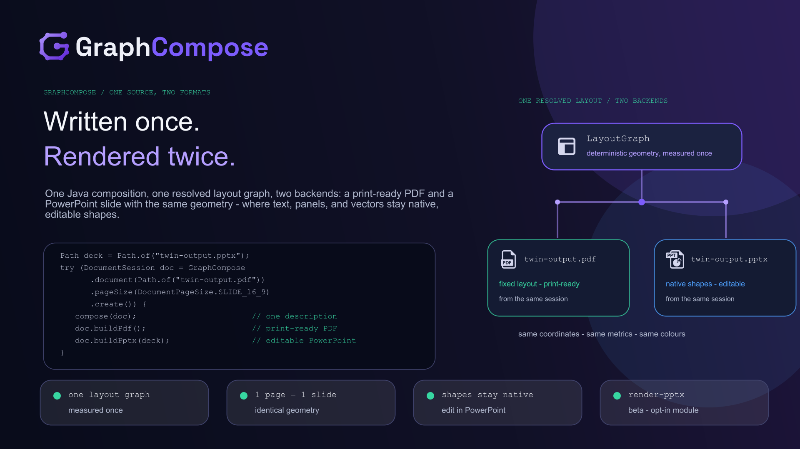
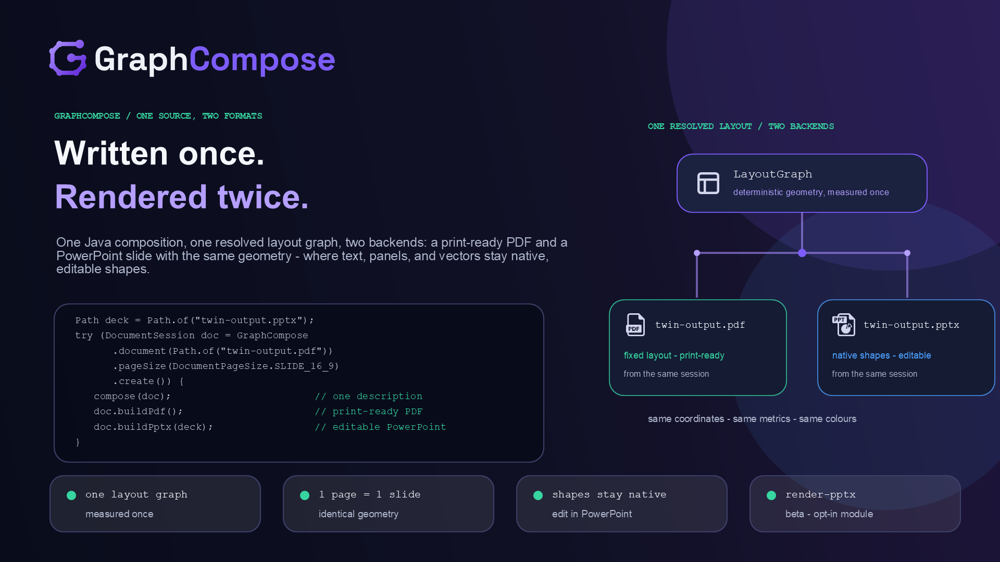
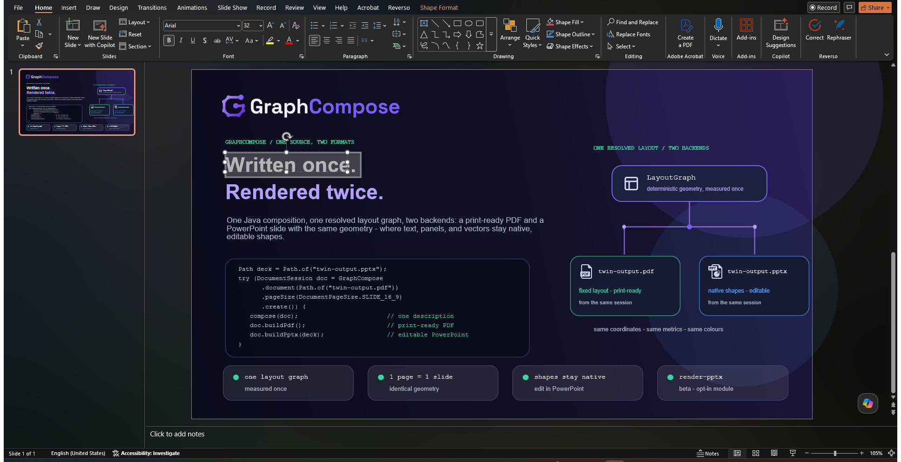
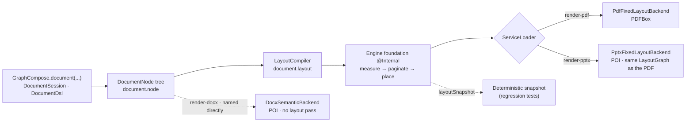

# GraphCompose

<p align="center">
  
</p>

<p align="center">
  <b>Declarative Java DSL for structured business documents.</b><br/>
  Describe what the document <i>says</i>; the engine resolves layout, pagination, themes, and backend rendering &mdash; print-ready PDF first, an editable PowerPoint deck from the same source. <b>Cinematic by default.</b>
</p>

<p align="center">
  <a href="https://github.com/DemchaAV/GraphCompose/actions/workflows/ci.yml?query=branch%3Amain"></a>
  <a href="https://github.com/DemchaAV/GraphCompose/releases/latest"></a>
  <a href="https://central.sonatype.com/artifact/io.github.demchaav/graph-compose"></a>
  <a href="#installation"></a>
  <a href="./docs/architecture/backend-capability-matrix.md"></a>
  <a href="./docs/architecture/backend-capability-matrix.md"></a>
  <a href="./LICENSE"></a>
</p>

> **Release status** &mdash;
> 🟢 **Latest stable**: [v2.2.2](https://github.com/DemchaAV/GraphCompose/releases/tag/v2.2.2) &mdash; the layout snapshot can now say **what the text became**: opt-in typography diagnostics report the font a paragraph was actually set in, the face its decoration selected, and where every line landed &mdash; without changing a byte of the snapshot your baselines already hold. See [CHANGELOG.md](./CHANGELOG.md).
> &nbsp;·&nbsp; 🟡 **In development**: v2.2.3 on `develop` &mdash; see [CHANGELOG.md](./CHANGELOG.md).

<p align="center">
  <a href="https://demchaav.github.io/GraphCompose/"><b>Live Showcase</b></a>
  &nbsp;·&nbsp;
  <a href="./examples/README.md"><b>Examples Gallery</b></a>
  &nbsp;·&nbsp;
  <a href="./docs/README.md"><b>Docs</b></a>
  &nbsp;·&nbsp;
  <a href="./CHANGELOG.md"><b>Changelog</b></a>
</p>

<p align="center">
  
</p>

<p align="center">
  <sub>☝ This banner is itself a GraphCompose document — <a href="./assets/readme/examples/maven-banner.pdf"><b>read all five pages (PDF)</b></a>, rendered by <a href="./examples/src/main/java/com/demcha/examples/flagships/MavenBannerPptxExample.java"><code>MavenBannerPptxExample</code></a>: how a document is authored, how it measures against the field, how it scales, and Hebrew and Arabic running right to left. The charts are native vector output, and the same file exports as an editable PowerPoint deck. It renders its own marketing.</sub>
</p>

## Why GraphCompose

- **Author intent, not coordinates.** Fluent DSL for sections, paragraphs, tables, lists, layer stacks, themes &mdash; the engine handles measurement, pagination, and rendering.
- **Deterministic by design.** Two-pass layout. Snapshots are stable across machines, so layout regressions are catchable in tests before any byte ships.
- **Cinematic by default.** Soft panels, accent strips, transforms, native vector charts, and gradients are first-class primitives, not workarounds.
- **Lean core, pluggable backends.** The `graph-compose-core` engine carries no PDFBox or POI; render backends are separate modules discovered via `ServiceLoader` &mdash; PDF is one dependency away (or already included in `graph-compose`), DOCX/PPTX are opt-in &mdash; see [support matrix](#output-support).
- **Writes in more than one direction.** Hebrew and Arabic lay out through the Unicode Bidirectional Algorithm, Arabic is shaped into its joined forms, and a paragraph or a table cell says which way it runs with `direction(RTL)` &mdash; or `AUTO`, read off the text. The same document does it in **all three formats**: the PDF is painted, so the engine resolves the line itself; Word and PowerPoint have bidirectional engines of their own and are told what each needs instead. Five script families ship in `graph-compose-fonts` &mdash; Arabic, Hebrew, Georgian, Armenian, Korean &mdash; so a mixed page renders with no font hunting ([preview](assets/readme/examples/world-scripts.pdf)).

Sits between **iText** (low-level page primitives) and **JasperReports** (XML-template-driven layout): a Java DSL describes the document semantically, the engine renders.

## Installation

**Requires Java 17+** (enforced by the build).

```xml
<dependency>
    <groupId>io.github.demchaav</groupId>
    <artifactId>graph-compose</artifactId>
    <version>2.2.2</version>
</dependency>
```

```kotlin
dependencies { implementation("io.github.demchaav:graph-compose:2.2.2") }
```

That coordinate renders PDF out of the box: it aggregates the lean `graph-compose-core`
engine plus the `graph-compose-render-pdf` backend, so existing 1.x callers upgrade with
**no code change**.

> ⬆️ **Upgrading from 1.x?** `graph-compose` stays a drop-in for PDF with no code change; see the [2.0 modules migration guide](./docs/migration/v2.0.0-modules.md).
> &nbsp;·&nbsp; See [API stability policy](./docs/api-stability.md) for tier definitions.

<details>
<summary><b>Which artifact?</b> &mdash; the 2.0 module split, when you want to take less or more</summary>

| Goal | Depend on |
|---|---|
| **PDF — the 1.x default** | `graph-compose` |
| **Batteries-included** (PDF + templates + fonts + emoji) | `graph-compose-bundle` |
| **Lean core, bring your own backend** | `graph-compose-core` |
| **Built-in CV / cover-letter / invoice / proposal templates** | add `graph-compose-templates` |
| **PowerPoint deck, geometry-identical to the PDF** | add `graph-compose-render-pptx` |
| **DOCX export (semantic)** | add `graph-compose-render-docx` |

Every 2.0 coordinate shares the `graph-compose` version (the fonts and emoji companions
keep their own lines). A bare `graph-compose-core` renders nothing until a backend is on
the classpath — opening a session (`create()`) throws `MissingBackendException`, which
names the artifact to add (`graph-compose-render-pdf`, already included in
`graph-compose`).

</details>

<details>
<summary><b>Bundled fonts &amp; colour emoji</b> &mdash; optional companions</summary>

Two opt-in companions carry their own version lines (they change on their own cadence, so
an engine upgrade never re-downloads them):

- `graph-compose-fonts:1.1.0` &mdash; the curated Google font families (~20&nbsp;MB).
  Pure-text and standard-14 documents need nothing extra; details in the
  [fonts migration note](./docs/migration/v1.8.0-fonts.md).
- `graph-compose-emoji:1.0.0` &mdash; inline colour emoji for `RichText.emoji(":star:", size)`.
  An unknown shortcode falls back to its literal text, so documents without emoji render unchanged.

Both are already included in `graph-compose-bundle`.

</details>

<details>
<summary><b>Distribution</b> &mdash; Maven Central, hosted Javadocs, legacy JitPack</summary>

Maven Central is the canonical channel from **v1.6.6** onwards
(`io.github.demchaav:graph-compose:<version>`). Hosted Javadocs for the engine API
publish to
[javadoc.io/doc/io.github.demchaav/graph-compose](https://javadoc.io/doc/io.github.demchaav/graph-compose)
shortly after each Central release, from **v2.1.1** onwards — the 2.0 and 2.1.0
releases of that coordinate shipped no javadoc artifact, so the page there still
renders the 1.9.1 API until the next release lands. The legacy JitPack URL
(`com.github.DemchaAV:GraphCompose:v<version>`) remains resolvable for callers
pinned to v1.6.5 and earlier but is no longer the documented install option.

</details>

## Hello world

<!-- doc-example: id=readme-root-minimal mode=members -->
```java
import com.demcha.compose.GraphCompose;
import com.demcha.compose.document.api.DocumentPageSize;
import com.demcha.compose.document.api.DocumentSession;

import java.nio.file.Path;

class Hello {
    public static void main(String[] args) throws Exception {
        try (DocumentSession document = GraphCompose.document(Path.of("hello.pdf"))
                .pageSize(DocumentPageSize.A4)
                .margin(24, 24, 24, 24)
                .create()) {

            document.pageFlow(page -> page
                    .module("Summary", module -> module.paragraph("Hello GraphCompose")));

            document.buildPdf();
        }
    }
}
```

Save it as `Hello.java` and run it — that is the whole file. `create()` opens the session,
`pageFlow` describes the page, `buildPdf()` writes it: no coordinates, no page-break
arithmetic.

### Make it cinematic

The same page with the engine's visual primitives: a page background, a soft panel, an
accent strip and two text styles. Nothing here is a workaround — panels and accents are
nodes, and the engine places them. [`SectionPresetsExample`](./examples/src/main/java/com/demcha/examples/features/text/SectionPresetsExample.java)
renders the whole family; its output is committed as
[section-presets.pdf](./assets/readme/examples/section-presets.pdf).

<!-- doc-example: id=readme-root-hello-world mode=members -->
```java
import com.demcha.compose.GraphCompose;
import com.demcha.compose.document.api.DocumentPageSize;
import com.demcha.compose.document.api.DocumentSession;
import com.demcha.compose.document.style.DocumentColor;
import com.demcha.compose.document.style.DocumentTextDecoration;
import com.demcha.compose.document.style.DocumentTextStyle;
import com.demcha.compose.font.FontName;

import java.nio.file.Path;

class Hello {
    public static void main(String[] args) throws Exception {
        // A small inline palette — swap these for your own brand colours.
        DocumentColor cream = DocumentColor.rgb(252, 248, 240);
        DocumentColor panel = DocumentColor.rgb(244, 238, 228);
        DocumentColor accent = DocumentColor.rgb(196, 153, 76);
        DocumentTextStyle h1 = DocumentTextStyle.builder()
                .fontName(FontName.HELVETICA).size(28)
                .decoration(DocumentTextDecoration.BOLD)
                .color(DocumentColor.rgb(20, 60, 75)).build();
        DocumentTextStyle body = DocumentTextStyle.builder()
                .fontName(FontName.HELVETICA).size(11)
                .color(DocumentColor.rgb(34, 38, 50)).build();

        try (DocumentSession document = GraphCompose.document(Path.of("hello.pdf"))
                .pageSize(DocumentPageSize.A4)
                .pageBackground(cream)
                .margin(28, 28, 28, 28)
                .create()) {

            document.pageFlow(page -> page
                    .addSection("Hero", section -> section
                            .softPanel(panel, 10, 14)
                            .accentLeft(accent, 4)
                            .addParagraph(p -> p.text("GraphCompose").textStyle(h1))
                            .addParagraph(p -> p.text("A cinematic hero, no manual coordinates.")
                                    .textStyle(body))));

            document.buildPdf();
        }
    }
}
```

For a Spring Boot `@RestController` streaming the PDF straight to the response, see [`HttpStreamingExample`](./examples/src/main/java/com/demcha/examples/features/streaming/HttpStreamingExample.java).

### Next steps

- [**Your first document**](./docs/first-document.md) &mdash; the five-minute path from an empty project to a rendered PDF.
- [**Getting started**](./docs/getting-started.md) &mdash; DSL or templates, and how to choose; the first-render walk-through.
- [**Examples gallery**](./examples/README.md) &mdash; every runnable example, with a PDF you can preview without building anything.

## One source → a PDF <i>and</i> an editable PowerPoint deck

The same `DocumentSession` emits both. The PDF backend prints the resolved layout; the PPTX backend (**beta**) rebuilds it as slides. Both consume the same resolved layout graph, so page and slide frames and every positioned element share the same geometry — text, panels, tables, and vectors arrive in PowerPoint as **native, editable shapes**, not screenshots (the page below lands as 69 native shapes; only its clip-masked logo art is a picture). Glyphs are rasterised by the viewer, so the exact text rendering depends on the fonts installed on the viewing machine; see the [backend capability matrix](docs/architecture/backend-capability-matrix.md) for per-feature fidelity.

PowerPoint output needs `graph-compose-render-pptx` on the classpath in addition to `graph-compose`; without it `buildPptx` fails with a `MissingBackendException` naming the artifact. See [Which artifact?](#installation) above.

<!-- doc-example: id=readme-root-one-model-two-outputs mode=method imports=com.demcha.compose.GraphCompose,com.demcha.compose.document.api.DocumentSession,com.demcha.compose.document.api.DocumentPageSize,java.nio.file.Path -->
```java
Path deck = Path.of("twin-output.pptx");
try (DocumentSession doc = GraphCompose.document(Path.of("twin-output.pdf"))
        .pageSize(DocumentPageSize.SLIDE_16_9)
        .create()) {
    // … describe the page (see Hello world above)
    doc.buildPdf();      // print-ready PDF
    doc.buildPptx(deck); // editable PowerPoint
}
```

<table>
<tr>
<td width="50%" align="center"><sub><b>twin-output.pdf</b> — rendered by the PDF backend</sub></td>
<td width="50%" align="center"><sub><b>twin-output.pptx</b> — the same page, as <b>PowerPoint itself</b> renders it</sub></td>
</tr>
<tr>
<td></td>
<td></td>
</tr>
</table>

<p align="center">
  
</p>
<p align="center">
  <sub>☝ The generated deck open in PowerPoint — the headline is a selected, editable text frame, and the ribbon is live because the slide is built from native shapes. Artifacts: <a href="./assets/readme/examples/twin-output.pdf"><b>PDF</b></a> · <a href="./assets/readme/examples/twin-output.pptx"><b>PPTX</b></a> · <a href="./examples/src/main/java/com/demcha/examples/flagships/TwinOutputExample.java"><b>source</b></a> (<code>TwinOutputExample</code>, one page, source included).</sub>
</p>

## What's new in 2.0

The **module-first** release: the single jar became a family of per-concern artifacts, so you install exactly what you render, and `graph-compose` stayed a drop-in for PDF callers. Everything the 1.9 line added ships unchanged.

Full detail in [`CHANGELOG.md`](./CHANGELOG.md); every removed API and its replacement in the [2.0 modules migration guide](./docs/migration/v2.0.0-modules.md).

## Vector primitives in 30 lines

Three snippets from the vector surfaces. Full runnable versions live in the [examples gallery](./examples/README.md).

**Native chart** &mdash; categories + series in, native vector bars out (no rasterization).

<!-- doc-example-ignore: the surrounding session and its variables are described in the prose above -->
```java
ChartData revenue = ChartData.builder()
    .categories("Q1", "Q2", "Q3", "Q4")
    .series("2024", 12.4, 15.1, 9.8, 14.2)
    .series("2025", 14.0, 18.2, 11.3, 16.9)
    .build();
section.chart(ChartSpec.bar().data(revenue)
    .legend(LegendPosition.BOTTOM)
    .size(ChartSize.aspectRatio(16, 7))
    .build());
```

**Overshoot-free line** &mdash; a smooth curve constrained to never overshoot the data range.

<!-- doc-example-ignore: the surrounding session and its variables are described in the prose above -->
```java
section.chart(ChartSpec.line().data(series)
    .interpolation(LineInterpolation.MONOTONE)
    .build());
```

**SVG import + alignment** &mdash; parse SVG to native geometry, seat any fixed node across the width.

<!-- doc-example-ignore: the surrounding session and its variables are described in the prose above -->
```java
SvgIcon globe = SvgIcon.parse(svgMarkup);
flow.addSvgIcon(globe, 48, HorizontalAlign.CENTER);
flow.addAligned(HorizontalAlign.RIGHT, anyFixedNode);
```

## Architecture

GraphCompose splits into a **public canonical surface** you author against (`com.demcha.compose.document.*`) and an **internal shared engine foundation** (`com.demcha.compose.engine.*`, marked `@Internal`) that resolves geometry, pagination, and rendering behind it. Since 2.0 that boundary is also a **packaging** boundary: the surface and engine ship in `graph-compose-core`, and each render backend is a separate module. The **fixed-layout** backends (PDF, PPTX) register through a `ServiceLoader` seam and consume the same resolved `LayoutGraph`, which is why a deck matches the PDF geometrically. The **semantic** DOCX exporter registers nothing — you name it directly, and it walks the node tree without a layout pass. You author intent; the engine resolves the rest.


```mermaid
flowchart LR
    A["GraphCompose.document(...)<br/>DocumentSession · DocumentDsl"] --> B["DocumentNode tree<br/>document.node"]
    B --> C["LayoutCompiler<br/>document.layout"]
    C --> D["Engine foundation @Internal<br/>measure → paginate → place"]
    D --> E{ServiceLoader}
    E -->|render-pdf| F["PdfFixedLayoutBackend<br/>PDFBox"]
    E -->|render-pptx| G["PptxFixedLayoutBackend<br/>POI · same LayoutGraph as the PDF"]
    B -.->|render-docx · named directly| I["DocxSemanticBackend<br/>POI · no layout pass"]
    D -.->|layoutSnapshot| H["Deterministic snapshot<br/>(regression tests)"]
```

Full detail: [architecture overview](./docs/architecture/overview.md) &middot; [package map](./docs/architecture/package-map.md) &middot; [lifecycle](./docs/architecture/lifecycle.md).

### Modules

The repository is a Maven multi-module reactor: the root `pom.xml` is the build aggregator, so `./mvnw clean verify` at the root builds and tests **every** module (scope to one with `-pl :<artifactId>`; the lean engine lives in `core/`).

- **Published to Maven Central** &mdash; each links to its own README (what it is, when to depend on it, smallest complete example)
  - [`graph-compose-core`](./core/README.md) (`core/`) &mdash; the lean document engine
  - [`graph-compose-render-pdf`](./render-pdf/README.md) · [`-render-docx`](./render-docx/README.md) · [`-render-pptx`](./render-pptx/README.md) &mdash; render backends
  - [`graph-compose-templates`](./templates/README.md) &mdash; built-in CV / cover-letter / invoice / proposal presets
  - [`graph-compose-testing`](./testing/README.md) &mdash; snapshot &amp; visual-regression test helpers
  - [`graph-compose`](./wrapper/README.md) (`wrapper/`) &mdash; the drop-in wrapper (core + PDF); [`graph-compose-bundle`](./bundle/README.md) &mdash; batteries-included (adds templates + fonts + emoji)
- **Companion artifacts** (independent version lines) &mdash; [`graph-compose-fonts`](./fonts/README.md), [`graph-compose-emoji`](./emoji/README.md)
- **Development only** (never published) &mdash; `qa` (architecture guards + visual regression), `coverage` (aggregate JaCoCo), `examples`, `benchmarks`

See [CONTRIBUTING](./CONTRIBUTING.md) for the branch-routing table and the full build / verify flow.

## Scope and comparison

### Output support

| Format | Status | Notes |
|---|---|---|
| PDF | Production | Fixed-layout backend on PDFBox 3.0. Full DSL coverage. |
| DOCX | Partial | Semantic export via Apache POI &mdash; paragraphs, lists, block images, tables and metadata. Word owns the flow, so drawing nodes (`shape`, `line`, `ellipse`, `barcode`) are dropped, one logged warning per kind. Tables keep their `colSpan`/`rowSpan`, their fill and their borders, and images their fit mode; **hyperlinks, bookmarks and headers/footers are not implemented** &mdash; see [render-docx](./render-docx/README.md#what-it-maps-and-what-it-does-not). |
| PPTX | Beta | Fixed-layout export via Apache POI from the same resolved layout &mdash; one page per editable slide with native shapes and text frames; clipped regions land as pixel-exact pictures. First shipped in 2.1, marked `@Beta` while the API shape settles. |

### Text &amp; internationalization

- Paragraphs and table cells support **right-to-left text**: `ParagraphBuilder.direction(RTL)` and `DocumentTableStyle.direction(RTL)` (or `AUTO`) reorder lines with the Unicode Bidirectional Algorithm, and Arabic is shaped into its joined contextual forms &mdash; Amiri and David Libre ship in `graph-compose-fonts`. One limit remains: **Indic reordering** is not performed.
- **Five bundled script families**, each carrying its own script plus Latin: Arabic (`AMIRI`), Hebrew (`DAVID_LIBRE`), Georgian (`NOTO_SANS_GEORGIAN`), Armenian (`NOTO_SANS_ARMENIAN`), Korean (`GOTHIC_A1`). Chinese and Japanese have none: the official static Noto CJK faces use CFF outlines a PDF cannot embed, and the variable ones draw at their default weight, which is Thin &mdash; register your own with `FontFamilyDefinition`. See the [world-scripts example](examples/src/main/java/com/demcha/examples/features/text/WorldScriptsExample.java) ([preview](assets/readme/examples/world-scripts.pdf)).
- **The direction reaches every backend, each on its own terms.** A PDF is painted, so the engine resolves the line and draws it reordered. Word and PowerPoint order the text themselves, so they are told what they need instead &mdash; `w:bidi` plus `w:rtl` for Word, a declared direction per frame for PowerPoint &mdash; and receive the text as written. What each one does, and where it deviates, is in the [backend capability matrix](docs/architecture/backend-capability-matrix.md).
- A glyph the active font does not cover renders as `?` (with a warning logged); load a font that covers the script you need.

### When to use GraphCompose

- **Server-side PDF generation in Java** &mdash; invoices, CVs, reports, proposals, statements, schedules.
- **Templated documents from data** &mdash; themed presets (`ModernProfessional`, `ModernInvoice`, &hellip;) you parameterise instead of re-styling every time.
- **Regression-tested layouts** &mdash; `DocumentSession#layoutSnapshot()` makes layout changes visible in PRs before any byte ships; `PdfVisualRegression` adds a pixel-level gate for font and colour fidelity.
- **Streaming PDFs from web backends** &mdash; Spring Boot `@RestController` writing straight to the response ([`HttpStreamingExample`](./examples/src/main/java/com/demcha/examples/features/streaming/HttpStreamingExample.java)).
- **Higher-level than PDFBox, lighter than JasperReports** &mdash; Java DSL describes semantics; no XML templates, no manual coordinates.

### What GraphCompose is not

- Not a hosted PDF rendering service &mdash; it is a library you embed.
- Not a WYSIWYG editor &mdash; the DSL is code, not drag-and-drop.
- Not a reporting engine like JasperReports &mdash; no datasource bindings, no XML templates, no compiled `.jasper` files.
- Not a browser / HTML-to-PDF renderer &mdash; the engine has its own layout pipeline; HTML/CSS input is not supported.

### Compared with similar Java libraries

| Library | API style | Layout | License | Best for |
|---|---|---|---|---|
| **GraphCompose** | Java DSL, semantic nodes | Two-pass, deterministic, snapshot-testable | MIT | Code-first business documents with layout regression tests |
| **PDFBox** | Low-level text / path primitives | Manual coordinates | Apache 2.0 | Direct PDF manipulation, parsing, extraction |
| **iText 7** | Object/layout API + low-level canvas | Automatic layout with direct-positioning options | AGPL / commercial | When AGPL is acceptable or you have a commercial licence |
| **OpenPDF** | iText 4 fork | Manual + helpers | LGPL / MPL | Legacy iText 4 codebases |
| **JasperReports** | XML templates compiled to `.jasper` | Template-driven | LGPL | Tabular reports with datasource bindings |

GraphCompose uses PDFBox under the hood as the rendering backend &mdash; the comparison is about authoring surface, not the renderer.

### Which API should I use?

| You want to&hellip; | Surface | Entry point |
|---|---|---|
| Generate a one-off PDF programmatically | DSL | `GraphCompose.document(...).pageFlow(...)` &mdash; see [Hello world](#hello-world) above |
| Generate a CV / cover letter from data | Layered templates | `ModernProfessional.create().compose(session, cvDocument)` &mdash; see [layered templates](./docs/templates/v2-layered/README.md) |
| Add a custom visual primitive | Engine extension | `NodeDefinition` + a fragment handler per fixed-layout backend (`PdfFragmentRenderHandler`, `PptxFragmentRenderHandler`) &mdash; see [extension guide](./docs/contributing/extension-guide.md) |
| Regression-test generated layouts | Layout snapshots | `DocumentSession#layoutSnapshot()` &mdash; quickstart at [Testing your document](./docs/operations/test-your-document.md); full reference at [snapshot testing](./docs/operations/layout-snapshot-testing.md) |
| Pixel-test the rendered PDF (fonts, colours, anti-aliasing) | Visual regression | `PdfVisualRegression.standard()&hellip;assertMatchesBaseline(...)` &mdash; see [visual regression testing](./docs/operations/visual-regression-testing.md) |
| See the live gallery | Static showcase site | [Showcase](https://DemchaAV.github.io/GraphCompose/) &mdash; source under [`web/`](./web), deployed to GitHub Pages via the [Pages workflow](./.github/workflows/deploy-web.yml) |

> **Templates in 2.0** &mdash; there is one template surface: the layered preset families in `graph-compose-templates`, themed through `BrandTheme`. Arriving from a pre-2.0 surface (classic presets, the built-in `*Template` classes)? **[Which template system should I use?](./docs/templates/which-template-system.md)** maps every retired name to its layered replacement.

## Documentation

📚 **[Full docs index](./docs/README.md)** &mdash; categorised map of every doc, ADR, and recipe. Start there to navigate the documentation.

The index routes by what you are doing — first document, using or authoring a
template, extending the engine, running in production. The entry points most
people want directly:

- **Capabilities** — [the feature map](./docs/capabilities.md): every capability with its stability tier and the guide that covers it
- **Templates** — [layered architecture](./docs/templates/v2-layered/README.md) (CV, cover letter, invoice, proposal on `BrandTheme`) · [which template system?](./docs/templates/which-template-system.md) for callers arriving from a pre-2.0 surface
- **Recipes** — [the cookbook](./docs/recipes.md): tables, themes, shapes, transforms, page backgrounds, streaming, extending
- **Operations** — [production rendering](./docs/operations/production-rendering.md) · [layout snapshot testing](./docs/operations/layout-snapshot-testing.md) · [troubleshooting](./docs/troubleshooting.md)
- **Project** — [Contributing](./CONTRIBUTING.md) · [Roadmap](./ROADMAP.md) · [Support](./SUPPORT.md) · [Security policy](./SECURITY.md) · [API stability](./docs/api-stability.md) · [Migration to 2.0](./docs/migration/v2.0.0-modules.md)

## Companion projects

- [**graph-compose-markdown**](https://central.sonatype.com/artifact/io.github.demchaav/graph-compose-markdown) &mdash; a Markdown &rarr; PDF path built on the GraphCompose engine. Hand it a Markdown document and it renders through the same layout, theme, and PDFBox pipeline as the Java DSL &mdash; a companion **input surface** for teams who would rather author in Markdown than call the DSL directly. Published on Maven Central as `io.github.demchaav:graph-compose-markdown`; independent lifecycle, consumes the engine as a dependency.
- [**graphcompose-ai-flow**](https://github.com/DemchaAV/graphcompose-ai-flow) &mdash; experimental sister project exploring an AI-assisted authoring flow on top of GraphCompose. Independent codebase, separate lifecycle &mdash; nothing in this repo depends on it. Track it if you are interested in agentic document composition driven by the same semantic node model.

## Sponsorship

GraphCompose is MIT-licensed and solo-maintained. If it saves your team work,
[GitHub Sponsors](https://github.com/sponsors/DemchaAV) funds the unglamorous
half of keeping it alive &mdash; release engineering, dependency upgrades, the
visual-regression suite, and issue triage.

Recurring or one-off. No tier gates a feature, nothing here is or will be
paywalled, and sponsorship buys no queue position: issues stay best-effort for
everyone alike &mdash; see [SUPPORT.md](./SUPPORT.md) for which channel fits
which question.

## License

MIT &mdash; see [`LICENSE`](./LICENSE).
