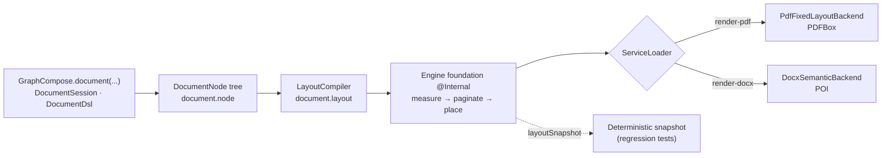

# GraphCompose

<p align="center">
  
</p>

<p align="center">
  <b>Declarative Java DSL for structured business documents.</b><br/>
  Describe what the document <i>says</i>; the engine resolves layout, pagination, themes, and backend rendering &mdash; print-ready PDF first, an editable PowerPoint deck from the same source. <b>Cinematic by default.</b>
</p>

<p align="center">
  <a href="https://github.com/DemchaAV/GraphCompose/actions/workflows/ci.yml?query=branch%3Amain"></a>
  <a href="https://github.com/DemchaAV/GraphCompose/releases/latest"></a>
  <a href="https://central.sonatype.com/artifact/io.github.demchaav/graph-compose"></a>
  
  
  
</p>

> **Release status** &mdash;
> 🟢 **Latest stable**: [v2.1.0](https://github.com/DemchaAV/GraphCompose/releases/tag/v2.1.0) &mdash; the **PowerPoint** release: `graph-compose-render-pptx` turns the same resolved layout into an editable deck &mdash; one page per slide, geometry-identical to the PDF, text and panels as native shapes. Ships as `@Beta`. **[What each backend supports &darr;](docs/architecture/backend-capability-matrix.md)**

> &nbsp;·&nbsp; ⬆️ **Upgrading from 1.x?** `graph-compose` stays a drop-in for PDF with no code change; see the [2.0 modules migration guide](./docs/migration/v2.0.0-modules.md)
> &nbsp;·&nbsp; See [API stability policy](./docs/api-stability.md) for tier definitions.

<p align="center">
  <a href="https://demchaav.github.io/GraphCompose/"><b>Live Showcase</b></a>
  &nbsp;·&nbsp;
  <a href="./examples/README.md"><b>Examples Gallery</b></a>
  &nbsp;·&nbsp;
  <a href="./docs/README.md"><b>Docs</b></a>
  &nbsp;·&nbsp;
  <a href="./CHANGELOG.md"><b>Changelog</b></a>
</p>

<p align="center">
  
</p>

<p align="center">
  <sub>☝ This banner is itself a GraphCompose document — <a href="./assets/readme/examples/engine-deck-v2.pdf"><b>view the full module-first deck (PDF)</b></a>, rendered by <a href="./examples/src/main/java/com/demcha/examples/flagships/EngineDeckV2Example.java"><code>EngineDeckV2Example</code></a>: the 2.0 module graph, native vector charts, and real comparative benchmarks, all drawn by the engine. It renders its own marketing.</sub>
</p>

## One source → a PDF <i>and</i> an editable PowerPoint deck

The same `DocumentSession` emits both. The PDF backend prints the resolved layout; the PPTX backend (**beta**) rebuilds it as slides. Both consume the same resolved layout graph, so page and slide frames and every positioned element share the same geometry — text, panels, tables, and vectors arrive in PowerPoint as **native, editable shapes**, not screenshots (the page below lands as 69 native shapes; only its clip-masked logo art is a picture). Glyphs are rasterised by the viewer, so the exact text rendering depends on the fonts installed on the viewing machine; see the [backend capability matrix](docs/architecture/backend-capability-matrix.md) for per-feature fidelity.

```java
Path deck = Path.of("twin-output.pptx");
try (DocumentSession doc = GraphCompose.document(Path.of("twin-output.pdf"))
        .pageSize(DocumentPageSize.SLIDE_16_9)
        .create()) {
    compose(doc);        // one description
    doc.buildPdf();      // print-ready PDF
    doc.buildPptx(deck); // editable PowerPoint
}
```

<table>
<tr>
<td width="50%" align="center"><sub><b>twin-output.pdf</b> — rendered by the PDF backend</sub></td>
<td width="50%" align="center"><sub><b>twin-output.pptx</b> — the same page, as <b>PowerPoint itself</b> renders it</sub></td>
</tr>
<tr>
<td></td>
<td></td>
</tr>
</table>

<p align="center">
  
</p>
<p align="center">
  <sub>☝ The generated deck open in PowerPoint — the headline is a selected, editable text frame, and the ribbon is live because the slide is built from native shapes. Artifacts: <a href="./assets/readme/examples/twin-output.pdf"><b>PDF</b></a> · <a href="./assets/readme/examples/twin-output.pptx"><b>PPTX</b></a> · <a href="./examples/src/main/java/com/demcha/examples/flagships/TwinOutputExample.java"><b>source</b></a> (<code>TwinOutputExample</code>, ~370 lines, page included).</sub>
</p>

## Why GraphCompose

- **Author intent, not coordinates.** Fluent DSL for sections, paragraphs, tables, lists, layer stacks, themes &mdash; the engine handles measurement, pagination, and rendering.
- **Deterministic by design.** Two-pass layout. Snapshots are stable across machines, so layout regressions are catchable in tests before any byte ships.
- **Cinematic by default.** Soft panels, accent strips, transforms, native vector charts, and gradients are first-class primitives, not workarounds.
- **Lean core, pluggable backends.** The `graph-compose-core` engine carries no PDFBox or POI; render backends are separate modules discovered via `ServiceLoader` &mdash; PDF is one dependency away (or already included in `graph-compose`), DOCX/PPTX are opt-in &mdash; see [support matrix](#output-support).

Sits between **iText** (low-level page primitives) and **JasperReports** (XML-template-driven layout): a Java DSL describes the document semantically, the engine renders.

## What's new in 2.0

The **module-first** release &mdash; the single jar becomes a family of per-concern artifacts, so you install exactly what you render.

- **Lean engine** &mdash; `graph-compose-core` is the document model, DSL, themes, and deterministic layout with **no PDFBox, POI, or template code** on its dependency tree. Backends plug in through a `ServiceLoader` seam; a core-only classpath asked to render throws `MissingBackendException` naming the artifact to add.
- **Opt-in render backends** &mdash; `graph-compose-render-pdf` (PDFBox 3.0, full DSL coverage), `graph-compose-render-pptx` (Apache POI, geometry-identical PowerPoint decks from the same resolved layout — one page per editable slide; clipped regions land as pixel-exact pictures; ships as **beta** in its first release), `graph-compose-render-docx` (Apache POI, semantic export).
- **`graph-compose` stays a drop-in** &mdash; the 1.x coordinate is now a thin wrapper over core + the PDF backend, so existing callers upgrade with **no code and no dependency change**.
- **Templates are their own artifact** &mdash; the CV / cover-letter / invoice / proposal preset families moved to `graph-compose-templates` (imports unchanged). This is the [one dependency-level break](./docs/migration/v2.0.0-modules.md#the-one-break-templates) of the split.
- **`graph-compose-bundle`** &mdash; one batteries-included coordinate: PDF stack + templates + fonts + colour emoji.
- **Retired surface** &mdash; the APIs deprecated across 1.6&ndash;1.9 are removed, the layered template packages dropped their `.v2` suffix, and `BusinessTheme` plus the classic pre-layered presets are gone &mdash; each removal has a named replacement in the [migration guide](./docs/migration/v2.0.0-modules.md).

Everything the 1.9 line added &mdash; in-document navigation, native TOC and page references, bookmarks, multi-section documents, inline chips / SVG icons / colour emoji, render-to-image &mdash; ships unchanged in 2.0. Full history in [`CHANGELOG.md`](./CHANGELOG.md).

## Installation

**Requires Java 17+** (enforced by the build).

```xml
<dependency>
    <groupId>io.github.demchaav</groupId>
    <artifactId>graph-compose</artifactId>
    <version>2.0.0</version>
</dependency>
```

```kotlin
dependencies { implementation("io.github.demchaav:graph-compose:2.0.0") }
```

> **Which artifact? (2.0 module split).** `graph-compose` above is the drop-in default —
> it renders PDF out of the box because it aggregates the lean `graph-compose-core` engine
> plus the `graph-compose-render-pdf` backend, so existing 1.x callers upgrade with **no
> code change**. Reach for a different coordinate only to take less or more:
>
> | Goal | Depend on |
> |---|---|
> | **PDF — the 1.x default** | `graph-compose` |
> | **Batteries-included** (PDF + templates + fonts + emoji) | `graph-compose-bundle` |
> | **Lean core, bring your own backend** | `graph-compose-core` |
> | **Built-in CV / cover-letter / invoice / proposal templates** | add `graph-compose-templates` |
> | **PowerPoint deck, geometry-identical to the PDF** | add `graph-compose-render-pptx` |
> | **DOCX export (semantic)** | add `graph-compose-render-docx` |
>
> Every 2.0 coordinate shares the `graph-compose` version (the fonts and emoji companions
> keep their own lines). A bare `graph-compose-core` renders nothing until a backend is on
> the classpath — asking it to build a PDF throws `MissingBackendException`, which names the
> artifact to add (`graph-compose-render-pdf`, already included in `graph-compose`).

> **Companion artifacts: fonts &amp; colour emoji.** Two opt-in companions carry
> their own version lines (they change on their own cadence, so an engine upgrade
> never re-downloads them): `graph-compose-fonts:1.0.0` &mdash; the curated Google
> font families (~18&nbsp;MB; pure-text and standard-14 documents need nothing
> extra; details in the [fonts migration note](./docs/migration/v1.8.0-fonts.md)) &mdash;
> and `graph-compose-emoji:1.0.0` &mdash; inline colour emoji for
> `RichText.emoji(":star:", size)` (an unknown shortcode falls back to its literal
> text, so documents without emoji render unchanged). Both are already included in
> `graph-compose-bundle`.

> **Distribution** &mdash; Maven Central is the canonical channel from **v1.6.6** onwards
> (`io.github.demchaav:graph-compose:<version>`). Hosted Javadocs auto-publish to
> [javadoc.io/doc/io.github.demchaav/graph-compose](https://javadoc.io/doc/io.github.demchaav/graph-compose)
> shortly after each Central release. The legacy JitPack URL
> (`com.github.DemchaAV:GraphCompose:v<version>`) remains resolvable for callers
> pinned to v1.6.5 and earlier but is no longer the documented install option.

> **Upgrading from 1.x?** Rendering PDF through `graph-compose` needs no change at all. If you reached the built-in templates through the single 1.x jar, add `graph-compose-templates` (imports are unchanged) &mdash; the [2.0 migration guide](./docs/migration/v2.0.0-modules.md) walks every case, including the removed deprecated APIs and their replacements.

## Hello world

```java
import com.demcha.compose.GraphCompose;
import com.demcha.compose.document.api.DocumentPageSize;
import com.demcha.compose.document.api.DocumentSession;
import com.demcha.compose.document.style.DocumentColor;
import com.demcha.compose.document.style.DocumentTextDecoration;
import com.demcha.compose.document.style.DocumentTextStyle;
import com.demcha.compose.font.FontName;

import java.nio.file.Path;

class Hello {
    public static void main(String[] args) throws Exception {
        // A small inline palette — swap these for your own brand colours.
        DocumentColor cream = DocumentColor.rgb(252, 248, 240);
        DocumentColor panel = DocumentColor.rgb(244, 238, 228);
        DocumentColor accent = DocumentColor.rgb(196, 153, 76);
        DocumentTextStyle h1 = DocumentTextStyle.builder()
                .fontName(FontName.HELVETICA_BOLD).size(28)
                .decoration(DocumentTextDecoration.BOLD)
                .color(DocumentColor.rgb(20, 60, 75)).build();
        DocumentTextStyle body = DocumentTextStyle.builder()
                .fontName(FontName.HELVETICA).size(11)
                .color(DocumentColor.rgb(34, 38, 50)).build();

        try (DocumentSession document = GraphCompose.document(Path.of("hello.pdf"))
                .pageSize(DocumentPageSize.A4)
                .pageBackground(cream)
                .margin(28, 28, 28, 28)
                .create()) {

            document.pageFlow(page -> page
                    .addSection("Hero", section -> section
                            .softPanel(panel, 10, 14)
                            .accentLeft(accent, 4)
                            .addParagraph(p -> p.text("GraphCompose").textStyle(h1))
                            .addParagraph(p -> p.text("A cinematic hero, no manual coordinates.")
                                    .textStyle(body))));

            document.buildPdf();
        }
    }
}
```

For a Spring Boot `@RestController` streaming the PDF straight to the response, see [`HttpStreamingExample`](./examples/src/main/java/com/demcha/examples/features/streaming/HttpStreamingExample.java).

## Scope and comparison

### Output support

| Format | Status | Notes |
|---|---|---|
| PDF | Production | Fixed-layout backend on PDFBox 3.0. Full DSL coverage. |
| DOCX | Partial | Semantic export via Apache POI &mdash; paragraphs, lists, block images, tables and metadata. Word owns the flow, so drawing nodes (`shape`, `line`, `ellipse`, `barcode`) are dropped, one logged warning per kind. **Hyperlinks, bookmarks and headers/footers are not implemented**, table `colSpan`/`rowSpan` is not applied, and image fit modes are ignored &mdash; see [render-docx](./render-docx/README.md#what-it-maps-and-what-it-does-not). |
| PPTX | Beta | Fixed-layout export via Apache POI from the same resolved layout &mdash; one page per editable slide with native shapes and text frames; clipped regions land as pixel-exact pictures. First shipped in 2.1, marked `@Beta` while the API shape settles. |

### Text &amp; internationalization

- Text is laid out **left-to-right**. Bidirectional (RTL) reordering and complex-script shaping &mdash; Arabic contextual joining, Indic reordering &mdash; are **not** performed, so Arabic / Hebrew text renders in logical order without correct visual ordering. Full RTL / bidi support is tracked in [#140](https://github.com/DemchaAV/GraphCompose/issues/140).
- A glyph the active font does not cover renders as `?` (with a warning logged); load a font that covers the script you need.

### When to use GraphCompose

- **Server-side PDF generation in Java** &mdash; invoices, CVs, reports, proposals, statements, schedules.
- **Templated documents from data** &mdash; themed presets (`ModernProfessional`, `ModernInvoice`, &hellip;) you parameterise instead of re-styling every time.
- **Regression-tested layouts** &mdash; `DocumentSession#layoutSnapshot()` makes layout changes visible in PRs before any byte ships; `PdfVisualRegression` adds a pixel-level gate for font and colour fidelity.
- **Streaming PDFs from web backends** &mdash; Spring Boot `@RestController` writing straight to the response ([`HttpStreamingExample`](./examples/src/main/java/com/demcha/examples/features/streaming/HttpStreamingExample.java)).
- **Higher-level than PDFBox, lighter than JasperReports** &mdash; Java DSL describes semantics; no XML templates, no manual coordinates.

### What GraphCompose is not

- Not a hosted PDF rendering service &mdash; it is a library you embed.
- Not a WYSIWYG editor &mdash; the DSL is code, not drag-and-drop.
- Not a reporting engine like JasperReports &mdash; no datasource bindings, no XML templates, no compiled `.jasper` files.
- Not a browser / HTML-to-PDF renderer &mdash; the engine has its own layout pipeline; HTML/CSS input is not supported.

### Compared with similar Java libraries

| Library | API style | Layout | License | Best for |
|---|---|---|---|---|
| **GraphCompose** | Java DSL, semantic nodes | Two-pass, deterministic, snapshot-testable | MIT | Code-first business documents with layout regression tests |
| **PDFBox** | Low-level text / path primitives | Manual coordinates | Apache 2.0 | Direct PDF manipulation, parsing, extraction |
| **iText 7** | Object/layout API + low-level canvas | Automatic layout with direct-positioning options | AGPL / commercial | When AGPL is acceptable or you have a commercial licence |
| **OpenPDF** | iText 4 fork | Manual + helpers | LGPL / MPL | Legacy iText 4 codebases |
| **JasperReports** | XML templates compiled to `.jasper` | Template-driven | LGPL | Tabular reports with datasource bindings |

GraphCompose uses PDFBox under the hood as the rendering backend &mdash; the comparison is about authoring surface, not the renderer.

### Which API should I use?

| You want to&hellip; | Surface | Entry point |
|---|---|---|
| Generate a one-off PDF programmatically | DSL | `GraphCompose.document(...).pageFlow(...)` &mdash; see [Hello world](#hello-world) above |
| Generate a CV / cover letter from data | Layered templates | `ModernProfessional.create().compose(session, cvDocument)` &mdash; see [layered templates](./docs/templates/v2-layered/README.md) |
| Add a custom visual primitive | Engine extension | `NodeDefinition` + `PdfFragmentRenderHandler` &mdash; see [extension guide](./docs/contributing/extension-guide.md) |
| Regression-test generated layouts | Layout snapshots | `DocumentSession#layoutSnapshot()` &mdash; quickstart at [Testing your document](./docs/operations/test-your-document.md); full reference at [snapshot testing](./docs/operations/layout-snapshot-testing.md) |
| Pixel-test the rendered PDF (fonts, colours, anti-aliasing) | Visual regression | `PdfVisualRegression.standard()&hellip;assertMatchesBaseline(...)` &mdash; see [visual regression testing](./docs/operations/visual-regression-testing.md) |
| See the live gallery | Static showcase site | [Showcase](https://DemchaAV.github.io/GraphCompose/) &mdash; source under [`web/`](./web), deployed to GitHub Pages via the [Pages workflow](./.github/workflows/deploy-web.yml) |

> **Templates in 2.0** &mdash; there is one template surface: the layered preset families in `graph-compose-templates`, themed through `BrandTheme`. Arriving from a pre-2.0 surface (classic presets, the built-in `*Template` classes)? **[Which template system should I use?](./docs/templates/which-template-system.md)** maps every retired name to its layered replacement.

## Vector primitives in 30 lines

Three snippets from the vector surfaces. Full runnable versions live in the [examples gallery](./examples/README.md).

**Native chart** &mdash; categories + series in, native vector bars out (no rasterization).

```java
ChartData revenue = ChartData.builder()
    .categories("Q1", "Q2", "Q3", "Q4")
    .series("2024", 12.4, 15.1, 9.8, 14.2)
    .series("2025", 14.0, 18.2, 11.3, 16.9)
    .build();
section.chart(ChartSpec.bar().data(revenue)
    .legend(LegendPosition.BOTTOM)
    .size(ChartSize.aspectRatio(16, 7))
    .build());
```

**Overshoot-free line** &mdash; a smooth curve constrained to never overshoot the data range.

```java
section.chart(ChartSpec.line().data(series)
    .interpolation(LineInterpolation.MONOTONE)
    .build());
```

**SVG import + alignment** &mdash; parse SVG to native geometry, seat any fixed node across the width.

```java
SvgIcon globe = SvgIcon.parse(svgMarkup);
flow.addSvgIcon(globe, 48, HorizontalAlign.CENTER);
flow.addAligned(HorizontalAlign.RIGHT, anyFixedNode);
```

## Architecture

GraphCompose splits into a **public canonical surface** you author against (`com.demcha.compose.document.*`) and an **internal shared engine foundation** (`com.demcha.compose.engine.*`, marked `@Internal`) that resolves geometry, pagination, and rendering behind it. Since 2.0 that boundary is also a **packaging** boundary: the surface and engine ship in `graph-compose-core`, and each render backend is a separate module that registers through a `ServiceLoader` seam. You author intent; the engine resolves the rest.


```mermaid
flowchart LR
    A["GraphCompose.document(...)<br/>DocumentSession · DocumentDsl"] --> B["DocumentNode tree<br/>document.node"]
    B --> C["LayoutCompiler<br/>document.layout"]
    C --> D["Engine foundation @Internal<br/>measure → paginate → place"]
    D --> E{ServiceLoader}
    E -->|render-pdf| F["PdfFixedLayoutBackend<br/>PDFBox"]
    E -->|render-docx| G["DocxSemanticBackend<br/>POI"]
    D -.->|layoutSnapshot| H["Deterministic snapshot<br/>(regression tests)"]
```

Full detail: [architecture overview](./docs/architecture/overview.md) &middot; [package map](./docs/architecture/package-map.md) &middot; [lifecycle](./docs/architecture/lifecycle.md).

### Modules

The repository is a Maven multi-module reactor: the root `pom.xml` is the build aggregator, so `./mvnw clean verify` at the root builds and tests **every** module (scope to one with `-pl :<artifactId>`; the lean engine lives in `core/`).

- **Published to Maven Central**
  - `graph-compose-core` (`core/`) &mdash; the lean document engine
  - `graph-compose-render-pdf` · `-render-docx` · `-render-pptx` &mdash; render backends
  - `graph-compose-templates` &mdash; built-in CV / cover-letter / invoice / proposal presets
  - `graph-compose-testing` &mdash; snapshot &amp; visual-regression test helpers
  - `graph-compose` &mdash; the drop-in wrapper (core + PDF); `graph-compose-bundle` &mdash; batteries-included (adds templates + fonts + emoji)
- **Companion artifacts** (independent version lines) &mdash; `graph-compose-fonts`, `graph-compose-emoji`
- **Development only** (never published) &mdash; `qa` (architecture guards + visual regression), `coverage` (aggregate JaCoCo), `examples`, `benchmarks`

See [CONTRIBUTING](./CONTRIBUTING.md) for the branch-routing table and the full build / verify flow.

## Documentation

📚 **[Full docs index](./docs/README.md)** &mdash; categorised map of every doc, ADR, and recipe. Start there to navigate the documentation.

### Templates
- [**Templates — layered architecture**](./docs/templates/v2-layered/README.md) &mdash; the template surface: CV, cover-letter, invoice, and proposal preset families on `BrandTheme`. Personas: [quickstart](./docs/templates/v2-layered/quickstart.md) · [using templates](./docs/templates/v2-layered/using-templates.md) · [authoring presets](./docs/templates/v2-layered/authoring-presets.md) · [contributing a new family](./docs/templates/v2-layered/contributor-guide.md).
- [Which template system?](./docs/templates/which-template-system.md) &mdash; the template naming history and the migration map for callers arriving from a pre-2.0 surface (classic presets, built-in `*Template` classes, the legacy PDF API). The retired classic docs are archived at [v1-classic](./docs/templates/v1-classic/README.md).

### Architecture & operations
- [Architecture overview](./docs/architecture/overview.md) · [Lifecycle](./docs/architecture/lifecycle.md) · [Production rendering](./docs/operations/production-rendering.md) · [Benchmarks](./docs/operations/benchmarks.md) · [Layout snapshot testing](./docs/operations/layout-snapshot-testing.md) · [Troubleshooting](./docs/troubleshooting.md)

### Recipes & examples
- [Recipes index](./docs/recipes.md) &mdash; [shape-as-container](./docs/recipes/shape-as-container.md) · [shapes](./docs/recipes/shapes.md) · [transforms](./docs/recipes/transforms.md) · [page-backgrounds](./docs/recipes/page-backgrounds.md) · [layered-page-design](./docs/recipes/layered-page-design.md) · [absolute-placement](./docs/recipes/absolute-placement.md) · [tables](./docs/recipes/tables.md) · [themes](./docs/recipes/themes.md) · [streaming](./docs/recipes/streaming.md) · [extending](./docs/recipes/extending.md) · [font-coverage](./docs/font-coverage.md)
- [Examples gallery](./examples/README.md) &mdash; every runnable example with PDF preview

### Contributing & releases
- [Contributing](./CONTRIBUTING.md) · [Code of conduct](./CODE_OF_CONDUCT.md) · [Security policy](./SECURITY.md) · [Release process](./docs/contributing/release-process.md)
- [API stability policy](./docs/api-stability.md) · [Which template system?](./docs/templates/which-template-system.md) · [**Migration to 2.0 (modules)**](./docs/migration/v2.0.0-modules.md) · [older migration notes](./docs/README.md)

## Companion projects

- [**graph-compose-markdown**](https://central.sonatype.com/artifact/io.github.demchaav/graph-compose-markdown) &mdash; a Markdown &rarr; PDF path built on the GraphCompose engine. Hand it a Markdown document and it renders through the same layout, theme, and PDFBox pipeline as the Java DSL &mdash; a companion **input surface** for teams who would rather author in Markdown than call the DSL directly. Published on Maven Central as `io.github.demchaav:graph-compose-markdown`; independent lifecycle, consumes the engine as a dependency.
- [**graphcompose-ai-flow**](https://github.com/DemchaAV/graphcompose-ai-flow) &mdash; experimental sister project exploring an AI-assisted authoring flow on top of GraphCompose. Independent codebase, separate lifecycle &mdash; nothing in this repo depends on it. Track it if you are interested in agentic document composition driven by the same semantic node model.

## License

MIT &mdash; see [`LICENSE`](./LICENSE).

## Star History

<a href="https://www.star-history.com/?repos=DemchaAV%2FGraphCompose&type=date&legend=top-left">
 <picture>
   <source media="(prefers-color-scheme: dark)" srcset="https://api.star-history.com/chart?repos=DemchaAV/GraphCompose&type=date&theme=dark&legend=top-left" />
   <source media="(prefers-color-scheme: light)" srcset="https://api.star-history.com/chart?repos=DemchaAV/GraphCompose&type=date&legend=top-left" />
   
 </picture>
</a>
