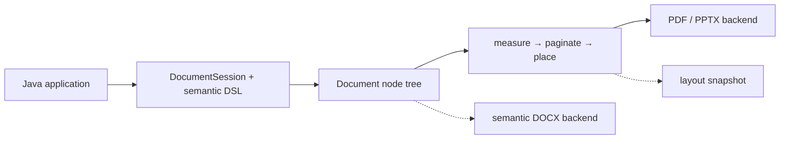

# GraphCompose

<p align="center">
  
</p>

<p align="center">
  <b>Build production PDF documents in Java without calculating coordinates.</b><br/>
  Compose content in reading order, let GraphCompose handle layout and pagination,
  then protect important templates with layout snapshots and visual diffs.
</p>

<p align="center">
  <a href="https://github.com/DemchaAV/GraphCompose/actions/workflows/ci.yml?query=branch%3Amain"></a>
  <a href="https://github.com/DemchaAV/GraphCompose/releases/latest"></a>
  <a href="https://central.sonatype.com/artifact/io.github.demchaav/graph-compose"></a>
  <a href="#installation"></a>
  <a href="./LICENSE"></a>
</p>

> **Release status** &mdash;
> 🟢 **Latest stable**: [v2.4.1](https://github.com/DemchaAV/GraphCompose/releases/tag/v2.4.1) &mdash; **a much larger template line-up**: two new families, **receipt** and **rota**, new invoice, proposal and CV presets, and every CV preset marked ATS-friendly or design-first after three resume parsers read it; plus **real letter spacing** that keeps tracked caps searchable, one continuous timeline rail, and list items with hanging indents and drawn markers. See [CHANGELOG.md](./CHANGELOG.md).
> &nbsp;·&nbsp; 🟡 **In development**: v2.4.2 on `develop` &mdash; see [CHANGELOG.md](./CHANGELOG.md).

<p align="center">
  
</p>

<p align="center">
  <a href="https://demchaav.github.io/GraphCompose/"><b>Live showcase</b></a>
  &nbsp;·&nbsp;
  <a href="./examples/README.md"><b>Examples gallery</b></a>
</p>

## What it is

GraphCompose is a code-first document layout library for Java. You describe the
document — paragraphs, sections, lists, tables, images — and the engine measures,
wraps, places, and paginates it.

- **Higher-level than PDFBox:** no manual `x`/`y` calculations for normal document flow.
- **Lighter than a reporting platform:** typed Java, no XML templates or datasource language.
- **Built for change:** deterministic geometry snapshots and pixel-level PDF diffs can
  catch an invoice, CV, or report drifting before the change reaches production.

Use it for server-side invoices, proposals, CVs, reports, statements, schedules,
and other documents assembled from application data.

### Outputs and templates

- **PDF** — the main production output, included in `graph-compose`.
- **PPTX** — editable fixed-layout export, currently **beta**, provided by the
  separate [`graph-compose-render-pptx`](./render-pptx/README.md) module.
- **DOCX** — semantic export with partial capability coverage, not full PDF parity,
  provided by the separate [`graph-compose-render-docx`](./render-docx/README.md)
  module.
- **Templates** — 58 maintained designs across six document families in the separate
  `graph-compose-templates` module: invoice, proposal, receipt and rota for business
  documents, CV and cover letter for profiles. Start with
  [invoice and proposal](./docs/templates/business-templates.md),
  [CV and cover letter](./docs/templates/v2-layered/quickstart.md), or the
  [templates overview](./docs/templates/README.md) for all six families.

### Choose a starting point

- [Start with a first PDF](#create-your-first-pdf).
- [Use a built-in template](./docs/templates/README.md).
- Export to [PowerPoint](./render-pptx/README.md) or
  [DOCX](./render-docx/README.md).

<a id="installation"></a>
## Create your first PDF

You need one dependency and one Java file. You do not need to understand the engine,
backends, templates, or repository modules first.

### 1. Add GraphCompose

Maven:

```xml
<dependency>
    <groupId>io.github.demchaav</groupId>
    <artifactId>graph-compose</artifactId>
    <version>2.4.1</version>
</dependency>
```

Gradle:

```kotlin
dependencies { implementation("io.github.demchaav:graph-compose:2.4.1") }
```

The `graph-compose` artifact already includes PDF output.

<a id="hello-world"></a>
### 2. Copy this complete file

<!-- doc-example: id=readme-root-minimal mode=members -->
```java
import com.demcha.compose.GraphCompose;
import com.demcha.compose.document.api.DocumentSession;

import java.nio.file.Path;

class Hello {
    public static void main(String[] args) throws Exception {
        try (DocumentSession document = GraphCompose.document(Path.of("hello.pdf"))
                .margin(48, 48, 48, 48)
                .create()) {

            document.pageFlow(page -> page
                    .addParagraph("Hello GraphCompose")
                    .addParagraph("This PDF was created without manual coordinates."));

            document.buildPdf();
        }
    }
}
```

Run `Hello.main()`. The file `hello.pdf` appears in the working directory.

That program contains the whole basic model:

```text
GraphCompose.document(...) → pageFlow(...) → content blocks → buildPdf()
```

- `GraphCompose.document(...)` chooses the output and page settings.
- `pageFlow(...)` is ordinary top-to-bottom content.
- Block methods add content in reading order; the engine handles wrapping and page breaks.
- `buildPdf()` writes the result.

Styling is optional. Introduce `DocumentTextStyle` after the document structure says
what it needs to say.

## Grow it into a real document

A larger document uses the same flow. Group related content into named **content
modules** — `module(...)`, a titled block of the document, not a Maven module — and
feed them your application data; coordinates still do not enter the authoring code.

<!-- doc-example-ignore: uses application variables and the document from the complete example above -->
```java
document.pageFlow(page -> page
        .module("Summary", module -> module.paragraph(summary))
        .module("Skills", module -> module.bullets(skills))
        .module("Projects", module -> module.rows(projects)));
```

The same flow accepts the common building blocks directly. You do not need a new
document model for each feature — a labelled bar chart is one more block in `pageFlow`:

<!-- doc-example: id=readme-first-chart mode=method -->
```java
import com.demcha.compose.GraphCompose;
import com.demcha.compose.document.api.DocumentSession;
import com.demcha.compose.document.chart.ChartData;
import com.demcha.compose.document.chart.ChartSpec;
import com.demcha.compose.document.chart.ValueLabelMode;

import java.nio.file.Path;

ChartData revenue = ChartData.builder()
        .categories("Q1", "Q2", "Q3", "Q4")
        .series("Revenue", 12.4, 15.1, 9.8, 14.2)
        .build();

try (DocumentSession document = GraphCompose.document(Path.of("revenue.pdf")).create()) {
    document.pageFlow(page -> page
            .addParagraph("Quarterly revenue")
            .chart(ChartSpec.bar()
                    .data(revenue)
                    .valueLabels(ValueLabelMode.OUTSIDE)
                    .build()));
    document.buildPdf();
}
```

From there, the [chart recipe](./docs/recipes/charts.md) shows the next questions in
order: value formatting, legends, bar/line shape, colours, grid, labels, background,
and snapshot coverage.

## Keep production documents from drifting

Rendering successfully is the first check. Important documents should also prove that
their layout did not change unexpectedly after a library upgrade or a template edit.

Add the testing artifact at test scope:

```xml
<dependency>
    <groupId>io.github.demchaav</groupId>
    <artifactId>graph-compose-testing</artifactId>
    <version>2.4.1</version>
    <scope>test</scope>
</dependency>
```

Then pin the resolved geometry in a normal JUnit test:

<!-- doc-example: id=readme-layout-snapshot mode=members -->
```java
import com.demcha.compose.GraphCompose;
import com.demcha.compose.document.api.DocumentSession;
import com.demcha.compose.testing.layout.LayoutSnapshotAssertions;
import org.junit.jupiter.api.Test;

class InvoiceLayoutTest {
    @Test
    void layoutDoesNotDrift() throws Exception {
        try (DocumentSession document = GraphCompose.document().create()) {
            document.pageFlow(page -> page
                    .addParagraph("Invoice")
                    .addParagraph("Total: £125.00"));

            LayoutSnapshotAssertions.assertMatches(document, "invoices/standard");
        }
    }
}
```

Create the first JSON baseline intentionally, commit it with the test, and run the test
normally in CI. If a node moves, a page break changes, or content order drifts, the test
fails with a reviewable geometry diff. CI never needs to update the baseline itself.

For flagship templates, add a second, pixel-level gate with `PdfVisualRegression`.
It renders the PDF pages to images and writes `.actual.png` and `.diff.png` artifacts on
mismatch, catching font, colour, glyph, and renderer changes that geometry alone cannot.

Start with [Testing your document](./docs/operations/test-your-document.md). The
[layout snapshot](./docs/operations/layout-snapshot-testing.md) and
[visual regression](./docs/operations/visual-regression-testing.md) pages are the deeper
references when you need custom baseline paths, approval flow, or cross-platform tolerance.

## What to read next

Pick the one row that matches what you are doing. Each is a complete route — you do
not need the others, and you never need the engine internals to author a document.

| I want to… | Go to |
|---|---|
| **Understand the model** behind the example above | [Your first document](./docs/first-document.md) — a guided five-minute build |
| **Add a feature** — table, list, chart, timeline, image, header, footer, barcode, page-break rule | [Recipes](./docs/recipes.md) — the complete task index |
| **Start from a ready-made design** | [Invoice and proposal](./docs/templates/business-templates.md) · [CV and cover letter](./docs/templates/v2-layered/quickstart.md) · [receipt, rota, and all 58 presets](./docs/templates/README.md) |
| **Prove an upgrade did not move my document** | [Testing your document](./docs/operations/test-your-document.md) — layout snapshots and visual diffs |
| **Render from a server** | [Production rendering](./docs/operations/production-rendering.md) — streaming, concurrency, failure handling; the [Spring Boot streaming example](./examples/src/main/java/com/demcha/examples/features/streaming/HttpStreamingExample.java) is a working endpoint |

Contributing to GraphCompose itself is a separate path: start at
[Contributing](./CONTRIBUTING.md). The [documentation index](./docs/README.md) is a
reference catalogue — useful for finding a page, never required reading.

<a id="which-artifact"></a>
<details>
<summary><b>Output formats and optional modules</b></summary>

PDF is the production, fixed-layout output: [`graph-compose`](./wrapper/README.md)
includes the [`graph-compose-render-pdf`](./render-pdf/README.md) backend.

| Need | Add |
|---|---|
| Built-in templates, bundled fonts, and emoji together | [`graph-compose-bundle`](./bundle/README.md) |
| Built-in document templates — invoice, proposal, receipt, rota, CV, cover letter | [`graph-compose-templates`](./templates/README.md) |
| Editable PowerPoint output (**beta**) | [`graph-compose-render-pptx`](./render-pptx/README.md) |
| Semantic DOCX output (**partial**) | [`graph-compose-render-docx`](./render-docx/README.md) |
| Layout snapshots and PDF visual diffs in tests | [`graph-compose-testing`](./testing/README.md) |
| Only the authoring surface and engine | [`graph-compose-core`](./core/README.md) |

`graph-compose-bundle` includes PDF, templates, fonts, and emoji. PPTX and DOCX
are not included in the bundle; add their render modules separately when needed.

Modules use the same GraphCompose version. [Bundled fonts](./fonts/README.md) and
[colour emoji](./emoji/README.md) have their own release lines. Consult the
[module guide](./docs/migration/v2.0.0-modules.md) only when you need to split
dependencies, and the
[backend capability matrix](./docs/architecture/backend-capability-matrix.md) before
relying on a feature outside PDF.

> **Upgrading from 1.x?** Read the [2.0 migration guide](./docs/migration/v2.0.0-modules.md).

</details>

<a id="what-graphcompose-is-not"></a>
<details>
<summary><b>Scope and comparison</b></summary>

GraphCompose uses PDFBox as its PDF renderer. The difference is the authoring layer:
GraphCompose provides semantic document flow and automatic pagination, while PDFBox
provides low-level PDF primitives and direct document manipulation.

GraphCompose is an embedded Java library, not a hosted rendering service, WYSIWYG
editor, HTML/CSS renderer, or datasource-driven reporting engine.

| Library | Authoring model | Best fit |
|---|---|---|
| **GraphCompose** | Typed Java document flow with deterministic layout tests | Code-first business documents |
| **PDFBox** | Low-level text and path primitives | Direct PDF manipulation, parsing, extraction |
| **iText 7** | Object layout API plus low-level canvas | Teams comfortable with AGPL or a commercial licence |
| **JasperReports** | XML templates and datasource bindings | Traditional tabular reporting |

</details>

<a id="architecture"></a>
<details>
<summary><b>Architecture for contributors</b></summary>

Application code authors against `GraphCompose.document(...)`, `DocumentSession`, and
the semantic document DSL. Internally, GraphCompose compiles that node tree into a
deterministic layout, paginates it, and passes the result to a render backend.


```mermaid
flowchart LR
    A["Java application"] --> B["DocumentSession + semantic DSL"]
    B --> C["Document node tree"]
    C --> D["measure → paginate → place"]
    D --> E["PDF / PPTX backend"]
    C -.-> F["semantic DOCX backend"]
    D -.-> G["layout snapshot"]
```

Read the [architecture overview](./docs/architecture/overview.md),
[package map](./docs/architecture/package-map.md), and
[extension guide](./docs/contributing/extension-guide.md) before changing engine or
backend code. The repository module map and build workflow live in
[Contributing](./CONTRIBUTING.md).

</details>

## Project links

[Documentation](./docs/README.md) · [Examples](./examples/README.md) ·
[Roadmap](./ROADMAP.md) · [Changelog](./CHANGELOG.md) · [Support](./SUPPORT.md) ·
[Security](./SECURITY.md) · [API stability](./docs/api-stability.md)

## Companion projects

- [**graph-compose-markdown**](https://central.sonatype.com/artifact/io.github.demchaav/graph-compose-markdown)
  adds a Markdown input path over the same layout and PDF pipeline.
- [**graphcompose-ai-flow**](https://github.com/DemchaAV/graphcompose-ai-flow)
  is an experimental, independently released AI-assisted authoring project.

## Sponsorship

GraphCompose is MIT-licensed and solo-maintained. If it saves your team work,
[GitHub Sponsors](https://github.com/sponsors/DemchaAV) helps fund releases,
dependency updates, visual-regression coverage, and issue triage. Sponsorship does
not gate features or buy support priority; see [Support](./SUPPORT.md).

## License

MIT — see [LICENSE](./LICENSE).
