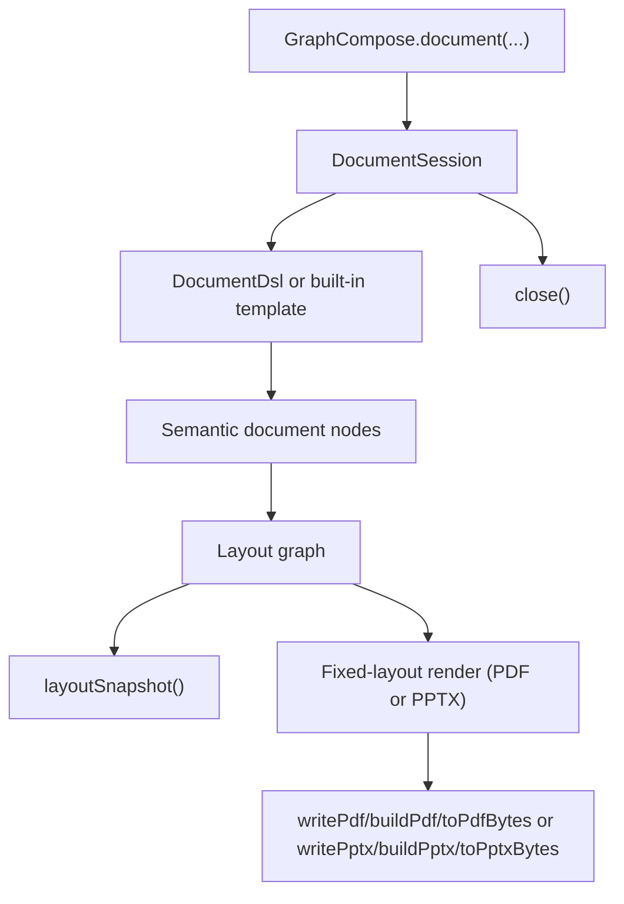

# Canonical Document Lifecycle

GraphCompose follows a session-first lifecycle:

```text
GraphCompose.document(...)
  -> DocumentSession
  -> DocumentDsl / template compose
  -> semantic nodes
  -> layout graph
  -> layout snapshot or fixed backend render
  -> PDF or PPTX stream/bytes/file
```



Application code normally stays in the first two boxes: create a session, then
describe document modules. The engine boxes are internal lifecycle stages used
for layout, pagination, diagnostics, and rendering.

## 1. Session Creation

`GraphCompose.document(...)` creates a `DocumentSession`. The session owns:

- page size and margins
- markdown mode and render-only guide-line mode
- custom font family registrations
- the semantic root nodes added by `DocumentDsl` or templates
- cached layout graphs and layout snapshots
- measurement resources used before rendering

`DocumentSession` is mutable and not thread-safe. Create one session per document/request.

Backend-level tuning is configured through the backend builder —
`PdfFixedLayoutBackend.builder()` for PDF-specific options such as protection,
and `PptxFixedLayoutBackend.builder()` for PPTX-specific ones such as
deterministic output and the clip raster fallback. The backend-neutral chrome
(metadata, watermark, headers/footers) is set on the session itself and reaches
whichever backend renders, subject to the coverage noted in §5.

## 2. Authoring

Application code should describe documents through domain-oriented calls:

```java
document.pageFlow(page -> page
        .module("Professional Summary", module -> module.paragraph(summary))
        .module("Technical Skills", module -> module.bullets(skills))
        .module("Projects", module -> module.rows(projectRows)));
```

Templates follow the same idea. A built-in template receives a domain spec, creates a header if needed, then renders ordered modules through the canonical compose target.

## 3. Layout

`DocumentSession.layoutGraph()` compiles semantic nodes into a deterministic fixed-layout graph:

- node definitions prepare and measure semantic nodes
- composite nodes emit ordered child nodes
- splittable nodes can continue across pages
- the compiler produces placed nodes and placed fragments

`DocumentSession.layoutSnapshot()` extracts test-friendly geometry from the same layout graph. Snapshot tests should use this public method instead of internal engine adapters.

Guide-line mode is not part of layout. Calling `guideLines(true)` changes only
convenience PDF output and does not invalidate a cached layout graph or
snapshot.

## 4. Pagination

Pagination happens during layout. Semantic nodes define whether they are atomic or splittable. Long paragraphs/lists can split into fragments; atomic blocks move to the next page when needed.

Pagination lives entirely in `LayoutCompiler` and the `NodeDefinition` split contracts under `com.demcha.compose.document.layout`. A node opts into keep-together or keep-with-next behaviour through its semantic flags; the compiler resolves the page break and emits the resulting `PlacedFragment` records.

## 5. Render (PDF / PPTX)

`DocumentSession.writePdf(OutputStream)` renders the resolved layout graph through `PdfFixedLayoutBackend` and writes the PDF to a caller-owned stream without closing it. This is the preferred server path because the session does not keep a PDF byte-array cache.

`DocumentSession.toPdfBytes()` is a convenience wrapper for callers that truly need a byte array. `DocumentSession.buildPdf(...)` opens a file stream and uses the same streaming path.

The canonical PDF backend:

- creates the PDF document and pages
- resolves fonts
- opens a page-scoped render session
- dispatches placed fragments to payload handlers
- applies bookmarks, links, guide lines, metadata, watermarks, headers/footers, and protection

`writePptx(OutputStream)`, `toPptxBytes()` and `buildPptx(...)` are the PowerPoint counterparts, resolved through the `"pptx"` provider when `graph-compose-render-pptx` is on the classpath. `PptxFixedLayoutBackend` consumes the **same** resolved layout graph — one page becomes one identically-sized slide, and fragments land at the same coordinates — then emits native POI XSLF shapes rather than a rasterised page.

The chrome options are backend-neutral, but coverage differs. Watermarks and repeating headers/footers apply to both backends; metadata applies to both, mapping onto OPC core properties for PPTX where the producer field has no equivalent. Protection, viewer preferences and the debug guide-line overlays are PDF concepts that the PPTX backend ignores with a one-time warning. See the [backend capability matrix](./backend-capability-matrix.md) for the per-capability breakdown.

## 6. Close

Always close the session, normally with try-with-resources. Closing releases measurement resources and clears request-local text measurement caches. It does not require consumers to manage PDFBox objects directly.

For production server guidance, see [Production Rendering](../operations/production-rendering.md).
