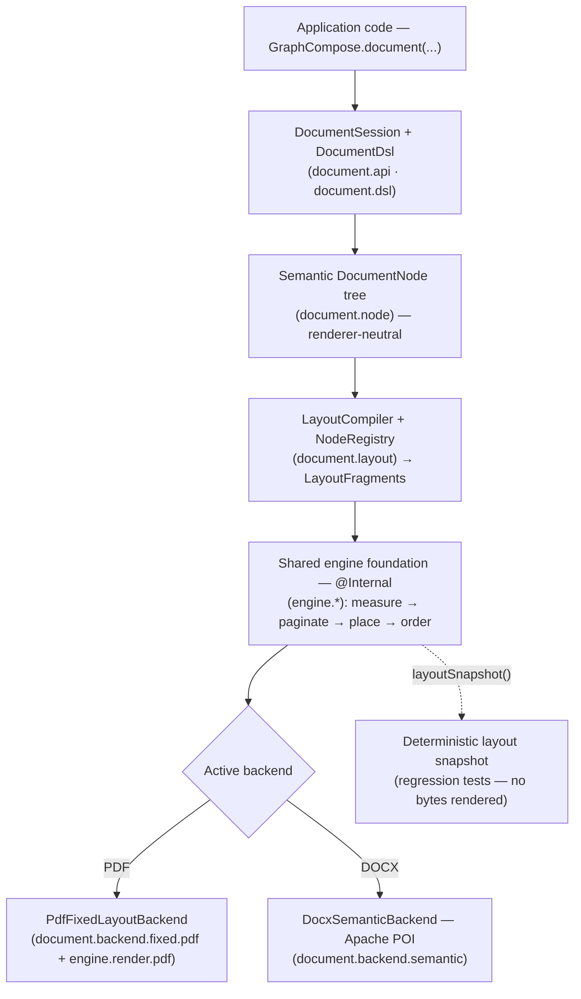

# Architecture

GraphCompose is split into two practical layers: a **canonical authoring
surface** that application code is expected to use, and a **shared engine
foundation** that resolves geometry, pagination, and render ordering
behind that surface. New features land on the canonical surface;
the engine foundation stays an internal detail kept stable enough to
support multiple backends.

## Pipeline overview

The supported runtime pipeline is:

`GraphCompose.document(...) → DocumentSession → DocumentDsl
   → semantic DocumentNode tree → layout fragments
   → pagination + placement → backend render`

The PDF path deliberately spans **two** packages: the canonical backend
`document.backend.fixed.pdf` owns PDFBox lifecycle and option translation,
then dispatches resolved fragments to the engine render handlers under
`engine.render.pdf`. See *Measurement and renderer ownership* below for that
seam; it is the one place where the canonical/engine split is least obvious
from package names alone.

Concretely:

1. application code describes a document through
   `GraphCompose.document(...)`, `DocumentSession`, and `DocumentDsl`.
2. canonical nodes describe semantic intent: modules, sections,
   paragraphs, lists, rows, tables, images, dividers, layer stacks,
   shape containers, and page breaks (every public node lives under
   `com.demcha.compose.document.node`).
3. `document.layout` prepares those nodes into deterministic
   `LayoutFragment` records via `LayoutCompiler` + `NodeRegistry`.
4. the shared engine foundation resolves measurement, pagination,
   placement, and render ordering against those prepared fragments.
5. the active backend turns the resolved `LayoutGraph` /
   `PlacedFragment` stream into output bytes — `PdfFixedLayoutBackend`
   for PDF, `DocxSemanticBackend` for DOCX, future PPTX backend
   skeleton in place.

That separation is the core project concept. Public code describes
document intent, layout resolves geometry, renderers only draw already
resolved output. It also enables layout snapshot regression tests —
test code can inspect the resolved document through
`DocumentSession.layoutSnapshot()` before any byte is rendered.

Semantic nodes are renderer-neutral. Link, bookmark, and barcode
metadata live in `document.node.DocumentLinkOptions`,
`DocumentBookmarkOptions`, and `DocumentBarcodeOptions`; PDF-specific
translation happens inside `document.backend.fixed.pdf`.

## Canonical authoring layer (`com.demcha.compose.document.*`)

This is the supported public surface. Application code should never
need to reach below it.

- **`document.api`** — `DocumentSession` (the lifecycle owner),
  `GraphCompose.DocumentBuilder`, `DocumentPageSize`, and the
  convenience render entry points (`buildPdf`, `writePdf(OutputStream)`,
  `toPdfBytes`).
- **`document.dsl`** — public builders behind `DocumentDsl`:
  `PageFlowBuilder`, `SectionBuilder`, `ModuleBuilder`,
  `ParagraphBuilder`, `RowBuilder`, `TableBuilder`, `ListBuilder`,
  `ShapeBuilder`, `EllipseBuilder`, `LineBuilder`, `ImageBuilder`,
  `BarcodeBuilder`, `LayerStackBuilder`, `ShapeContainerBuilder`,
  `RichText`, plus the `Transformable<T>` mixin. Implementation helpers
  such as semantic-name normalization stay in `document.dsl.internal`
  and are not part of the public API.
- **`document.node`** — semantic node records (`ParagraphNode`,
  `TableNode`, `ShapeContainerNode`, `LayerStackNode`, etc.) plus
  shared option types (`DocumentLinkOptions`, `DocumentBookmarkOptions`,
  `DocumentBarcodeOptions`). All renderer-neutral.
- **`document.style`** — public style values (`DocumentColor`,
  `DocumentInsets`, `DocumentStroke`, `DocumentTextStyle`,
  `DocumentCornerRadius`, `DocumentTransform`, `ClipPolicy`,
  `ShapeOutline`, `Decoration`).
- **`document.table`** — public table types
  (`DocumentTableColumn`, `DocumentTableCell`, `DocumentTableStyle`).
- **`document.image`** — public image types
  (`DocumentImageData`, `DocumentImageFitMode`).
- **`document.theme`** — `BusinessTheme` design tokens
  (`DocumentPalette`, `SpacingScale`, `TextScale`, `TablePreset`). The
  layered CV theme `CvTheme` lives separately under
  `…templates.cv.v2.theme`.
- **`document.output`** — backend-neutral output options
  (`DocumentMetadata`, `DocumentWatermark`, `DocumentProtection`,
  `DocumentHeaderFooter`).
- **`document.snapshot`** — public layout-snapshot DTOs returned by
  `DocumentSession.layoutSnapshot()`.
- **`document.exceptions`** — public exception types raised across the
  authoring surface (`AtomicNodeTooLargeException`, etc.).
- **`document.layout`** — `LayoutCompiler`, `NodeRegistry`,
  `BuiltInNodeDefinitions`, `TableLayoutSupport`, `PreparedNode`,
  `PlacedFragment`, `LayoutGraph`. Public for advanced extension paths
  (custom `NodeDefinition` registration); ordinary application code
  does not need to touch it.
- **`document.backend.fixed.pdf`** — the canonical PDF backend
  (`PdfFixedLayoutBackend`, fragment render handlers, option
  translators). The only place PDFBox imports are allowed outside the
  engine foundation.
- **`document.backend.semantic`** — semantic exporters
  (`DocxSemanticBackend` based on Apache POI; `PptxSemanticBackend`
  manifest skeleton).

## Template layer (`com.demcha.compose.document.templates.*`)

Built-in templates compose against the canonical authoring layer using
the same `DocumentDsl` an application would use directly.

- **`...templates.api`** — template-facing contracts
  (`InvoiceTemplate`, `ProposalTemplate`, `CvTemplate`,
  `CoverLetterTemplate`, `WeeklyScheduleTemplate`,
  `CvTemplateRegistry`). Compose-first: every contract takes a
  `DocumentSession` plus the template-specific data spec.
- **`...templates.builtins`** — concrete built-ins
  (`InvoiceTemplateV1`, `InvoiceTemplateV2`, `ProposalTemplateV1`,
  `ProposalTemplateV2`, `CvTemplateV1`, plus a CV gallery that takes a
  `BusinessTheme` or `CvTheme` in their constructor).
- **`...templates.support`** — backend-neutral scene composers per
  domain (`...support.cv`, `...support.business`, `...support.schedule`)
  plus shared composition primitives in `...support.common`.
- **`...templates.data`** — DTOs (`InvoiceDocumentSpec`,
  `ProposalDocumentSpec`, etc.).

V2 templates (`InvoiceTemplateV2`, `ProposalTemplateV2`) take a
`BusinessTheme` so the same data renders through any of `classic` /
`modern` / `executive` (or a custom theme) without touching the call
site. V1 templates ship side-by-side for callers who want the legacy
hard-coded look.

## Shared engine foundation (`com.demcha.compose.engine.*`) — internal

The engine foundation is the runtime that turns prepared layout
fragments into a placed, paginated, rendered document. It is **not** a
supported application authoring API. It is documented here so engine
contributors and authors of new backends know how to extend it without
breaking the canonical surface.

### Render-pass session

The renderer is fronted by a backend-neutral seam:

- the engine opens one render session for one document render pass
- the session owns page availability and page-local drawing surfaces
- handlers may change graphics or text state while drawing, but they
  must restore that state before returning
- handlers must never close session-owned surfaces directly

For the PDF backend this seam is implemented as a page-scoped session
that reuses one `PDPageContentStream` per page for the lifetime of the
pass. PDFBox lifecycle concerns stay inside the PDF renderer; the
engine stays format-neutral for future backends.

### Pagination order

Pagination relies on a child-first page-breaking order. Fixed leaf
objects are resolved before their parent containers so parent
`ContentSize` reflects child shifts before container placement is
finalized. See [pagination-ordering.md](./pagination-ordering.md) for
the detailed rationale and the failure modes that motivated it.

The engine materializes one deterministic hierarchy snapshot per
layout pass: parent links from `ParentComponent`, sibling order from
`Entity.children`, roots / layers / depth metadata rebuilt every pass.
Layout, pagination, snapshot extraction, and render backends all
agree on the same tree semantics.

### Entity / ECS responsibilities (engine-internal)

`Entity` is intentionally a thin ECS-style identity object. It owns:

- stable identity
- the component map
- canonical child order through `Entity.children`
- a cached render marker reference for fast `hasRender()` checks

Layout-specific math and pagination mutation live in dedicated
helpers — `EntityBounds` for geometry reads,
`ParentContainerUpdater` for parent-container size and page-shift
propagation. Deprecated helper methods on `Entity` are migration
shims, not extension points.

### Semantic modules

Canonical modules represent full-width document sections rather than
plain vertical container aliases. Modules resolve their width from
the parent inner box and keep that width stable; they primarily grow
in height. Page roots should therefore be canonical
`DocumentSession.pageFlow(...)` flows that stack modules.

### Table layout

The current table implementation lives in the canonical layout plus
shared engine layer:

- `DocumentDsl.table(...)` and template table specs create semantic
  table nodes
- `TableLayoutSupport` materializes breakable rows and deterministic
  cell payloads
- rows materialize as atomic leaf entities with precomputed cell
  payload
- row rendering is page-aware so the engine draws both fragment edges
  at page breaks without double-drawing separators inside a page

The unified cell-grid pre-pass in `TableLayoutSupport` lets `colSpan`
and `rowSpan` compose freely (`colSpan(2).rowSpan(3)`). Spanned cells
emit a single `TableResolvedCell` with the merged width and
downward `yOffset` so a spanning cell's rectangle extends through the
rows it merges.

### Measurement and renderer ownership

These rules apply to engine and backend contributors. Application
code should not need any of them.

- engine builders and layout helpers consume an engine-level
  `TextMeasurementSystem` instead of reaching through `LayoutSystem`
  into the active renderer
- render marker components identify *what* needs to be rendered;
  *how* it is drawn lives in renderer-owned handler packages such as
  `...render.pdf.handlers` (with helper objects under
  `...render.pdf.helpers`)
- `RenderStream` acts as a session factory, not as a per-entity
  content-stream opener
- `RenderPassSession` is the shared seam for page lifetime and
  page-surface reuse — it must stay free of PDFBox and backend
  package imports
- the PDF entity path dispatches through registered render handlers;
  there is no backend-specific render fallback path
- `EntityRenderOrder` is the shared render-order helper for resolved
  entities. It precomputes lightweight sort entries per layer before
  sorting so render ordering stays deterministic without repeated
  component lookups inside the comparator hot path

Fixed leaf primitives (`Rectangle`, `Circle`, `Image`, `Line`)
follow the same engine contract: they materialize as regular
entities with render/content/layout components, rely on normal
`ContentSize` / `Padding` / `Margin` / `Placement`, and do not
introduce a separate layout subsystem.

## Current package roots

Canonical-first ordering — public roots come first, internal foundation
last:

- `com.demcha.compose.document.*` — **public canonical surface**.
  Authoring API, layout graph, backends, exceptions, snapshots, and
  built-in templates.
- `com.demcha.compose.font.*` — public font names, backend-neutral
  family descriptors, registration, lookup, and showcase helpers.
- `com.demcha.compose.engine.*` — **internal engine foundation**.
  Measurement, layout resolution, pagination, render-pass session, and
  PDF rendering systems.
- `com.demcha.compose.engine.text.*` — internal text utilities used by
  layout and render hot paths.
- `com.demcha.compose.engine.text.markdown.*` — internal
  markdown-to-text-token parsing helpers used by semantic text
  preparation.
- `com.demcha.compose.engine.render.word.*` — experimental Word render
  path; the supported DOCX export is `DocxSemanticBackend` under
  `com.demcha.compose.document.backend.semantic`.

## Backends and experimental areas

- The PDF backend (`PdfFixedLayoutBackend`) is the main supported
  rendering path.
- The DOCX backend (`DocxSemanticBackend`, Apache POI) is supported
  for paragraph/table/image/section content. Apache POI cannot
  express graphics-state path clipping or transform matrices, so
  `ShapeContainerNode` clip and `DocumentTransform` rotation/scale
  fall back to inline content with a one-time capability warning.
  Authors who need clipped or rotated output must export to PDF.
- The PPTX skeleton lives behind `PptxSemanticBackend`; richer slide
  layout is roadmap for v1.6+.
- New backends should add their own rendering system, render-pass
  session, text measurement system, and handler set without changing
  engine builders such as tables or template data models. The shared
  abstraction stops at render-pass lifetime — PDF text mode, PDF
  annotations, and `PDPageContentStream` state management stay inside
  `...engine.render.pdf`.

## Language status

- Java is the primary implementation language.
- The build currently includes Kotlin runtime/plugin support, but the
  repository does not currently ship production `.kt` sources.
- Public docs treat GraphCompose as a Java-first library with Kotlin
  compatibility in the build setup, not as a full dual-language
  codebase.

## Developer tools

- `dev-tools/` contains local developer helpers and maintenance
  scripts.
- Files in `dev-tools/` are not part of the runtime library API or
  the published Maven artifact.

## Regression testing pyramid

GraphCompose uses a practical three-layer regression strategy:

1. layout math unit tests for isolated calculations
2. layout snapshot tests for deterministic full-document geometry
   checks (`LayoutSnapshotAssertions` plus baselines under
   `src/test/resources/layout-snapshots/`)
3. PDF render tests for visual smoke coverage and artifact
   inspection (`PdfVisualRegression`, `target/visual-tests/`)

See [layout-snapshot-testing.md](../operations/layout-snapshot-testing.md) for the
snapshot workflow and developer conventions.

## Maintenance references

- [package-map.md](./package-map.md) is the source of truth for
  package ownership and extension rules.
- [lifecycle.md](./lifecycle.md) describes the document session,
  layout, pagination, and render lifecycle.
- [logging.md](../operations/logging.md) documents the quiet-by-default lifecycle
  logger categories.
- [canonical-legacy-parity.md](./canonical-legacy-parity.md) tracks
  feature parity between the canonical authoring surface and older
  internal/legacy capabilities.
