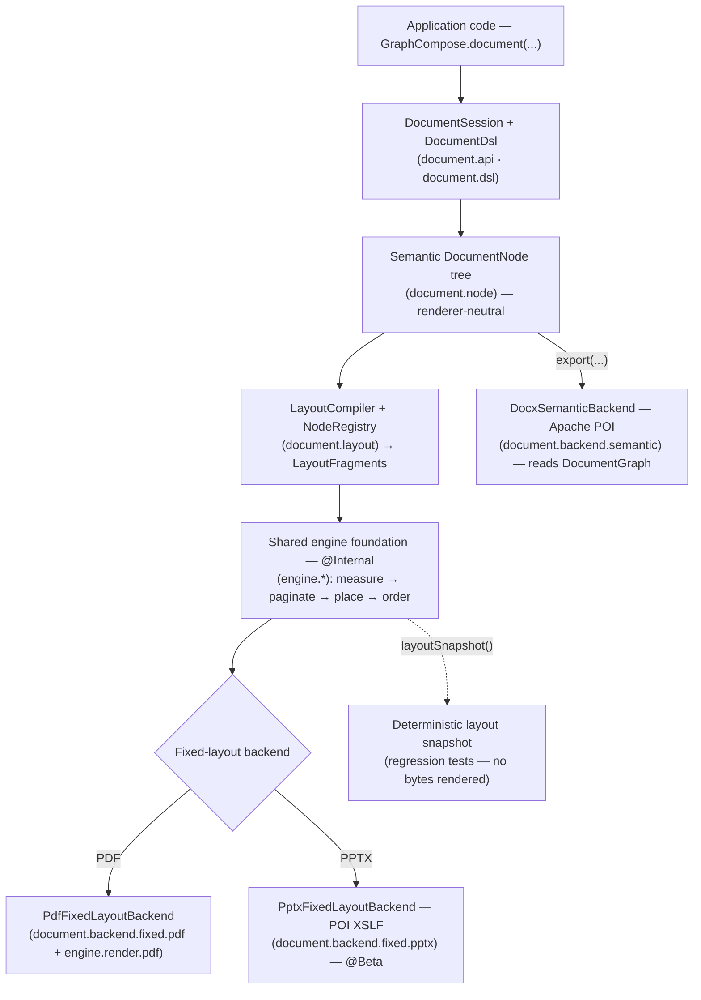

# Architecture

GraphCompose is split into two practical layers: a **canonical authoring
surface** that application code is expected to use, and a **shared engine
foundation** that resolves geometry, pagination, and render ordering
behind that surface. New features land on the canonical surface;
the engine foundation stays an internal detail kept stable enough to
support multiple backends.

## Pipeline overview

The supported runtime pipeline is:

`GraphCompose.document(...) → DocumentSession → DocumentDsl
   → semantic DocumentNode tree → layout fragments
   → pagination + placement → backend render`

```mermaid
flowchart TD
    A["Application code — GraphCompose.document(...)"] --> B["DocumentSession + DocumentDsl<br/>(document.api · document.dsl)"]
    B --> C["Semantic DocumentNode tree<br/>(document.node) — renderer-neutral"]
    C --> D["LayoutCompiler + NodeRegistry<br/>(document.layout) → LayoutFragments"]
    C -->|"export(...)"| H["DocxSemanticBackend — Apache POI<br/>(document.backend.semantic) — reads DocumentGraph"]
    D --> E["Shared engine foundation — @Internal<br/>(engine.*): measure → paginate → place → order"]
    E --> F{"Fixed-layout backend"}
    F -->|PDF| G["PdfFixedLayoutBackend<br/>(document.backend.fixed.pdf + engine.render.pdf)"]
    F -->|PPTX| P["PptxFixedLayoutBackend — POI XSLF<br/>(document.backend.fixed.pptx) — @Beta"]
    E -.->|"layoutSnapshot()"| I["Deterministic layout snapshot<br/>(regression tests — no bytes rendered)"]
```

The two fixed-layout backends branch from the **same** resolved graph, which
is why page and slide geometry match by construction. The semantic DOCX
exporter branches earlier, straight off the `DocumentGraph`: it never sees a
`LayoutGraph`, which is why it cannot reproduce fixed-layout geometry.

The PDF path deliberately spans **two** packages: the canonical backend
`document.backend.fixed.pdf` owns PDFBox lifecycle and option translation,
then dispatches resolved fragments to the engine render handlers under
`engine.render.pdf`. See *Measurement and renderer ownership* below for that
seam; it is the one place where the canonical/engine split is least obvious
from package names alone.

Concretely:

1. application code describes a document through
   `GraphCompose.document(...)`, `DocumentSession`, and `DocumentDsl`.
2. canonical nodes describe semantic intent: modules, sections,
   paragraphs, lists, rows, tables, images, dividers, layer stacks,
   shape containers, and page breaks (every public node lives under
   `com.demcha.compose.document.node`).
3. `document.layout` prepares those nodes into deterministic
   `LayoutFragment` records via `LayoutCompiler` + `NodeRegistry`.
4. the shared engine foundation resolves measurement, pagination,
   placement, and render ordering against those prepared fragments.
5. the active backend turns the resolved `LayoutGraph` /
   `PlacedFragment` stream into output bytes — `PdfFixedLayoutBackend`
   for PDF and `PptxFixedLayoutBackend` for PowerPoint, both consuming
   the same resolved graph, so page and slide geometry match by
   construction. `DocxSemanticBackend` takes the other route: it
   consumes the semantic node tree directly, without the layout graph.

That separation is the core project concept. Public code describes
document intent, layout resolves geometry, renderers only draw already
resolved output. It also enables layout snapshot regression tests —
test code can inspect the resolved document through
`DocumentSession.layoutSnapshot()` before any byte is rendered.

Semantic nodes are renderer-neutral. Link, bookmark, and barcode
metadata live in `document.node.DocumentLinkOptions`,
`DocumentBookmarkOptions`, and `DocumentBarcodeOptions`; PDF-specific
translation happens inside `document.backend.fixed.pdf`.

## Canonical authoring layer (`com.demcha.compose.document.*`)

This is the supported public surface. Application code should never
need to reach below it.

- **`document.api`** — `DocumentSession` (the lifecycle owner),
  `GraphCompose.DocumentBuilder`, `DocumentPageSize`, and the
  convenience render entry points (`buildPdf`, `writePdf(OutputStream)`,
  `toPdfBytes`).
- **`document.dsl`** — public builders behind `DocumentDsl`:
  `PageFlowBuilder`, `SectionBuilder`, `ModuleBuilder`,
  `ParagraphBuilder`, `RowBuilder`, `TableBuilder`, `ListBuilder`,
  `ShapeBuilder`, `EllipseBuilder`, `LineBuilder`, `ImageBuilder`,
  `BarcodeBuilder`, `LayerStackBuilder`, `ShapeContainerBuilder`,
  `RichText`, plus the `Transformable<T>` mixin. Implementation helpers
  such as semantic-name normalization stay in `document.dsl.internal`
  and are not part of the public API.
- **`document.node`** — semantic node records (`ParagraphNode`,
  `TableNode`, `ShapeContainerNode`, `LayerStackNode`, etc.) plus
  shared option types (`DocumentLinkOptions`, `DocumentBookmarkOptions`,
  `DocumentBarcodeOptions`). All renderer-neutral.
- **`document.style`** — public style values (`DocumentColor`,
  `DocumentInsets`, `DocumentStroke`, `DocumentTextStyle`,
  `DocumentCornerRadius`, `DocumentTransform`, `ClipPolicy`,
  `ShapeOutline`, `Decoration`).
- **`document.table`** — public table types
  (`DocumentTableColumn`, `DocumentTableCell`, `DocumentTableStyle`).
- **`document.image`** — public image types
  (`DocumentImageData`, `DocumentImageFitMode`).
- **`document.output`** — backend-neutral output options
  (`DocumentMetadata`, `DocumentWatermark`, `DocumentProtection`,
  `DocumentHeaderFooter`).
- **`document.snapshot`** — public layout-snapshot DTOs returned by
  `DocumentSession.layoutSnapshot()`.
- **`document.exceptions`** — public exception types raised across the
  authoring surface (`AtomicNodeTooLargeException`, etc.).
- **`document.layout`** — `LayoutCompiler`, `NodeRegistry`,
  `BuiltInNodeDefinitions`, `TableLayoutSupport`, `PreparedNode`,
  `PlacedFragment`, `LayoutGraph`. Public for advanced extension paths
  (custom `NodeDefinition` registration); ordinary application code
  does not need to touch it.
- **`document.backend.fixed.pdf`** — the canonical PDF backend
  (`PdfFixedLayoutBackend`, fragment render handlers, option
  translators), shipped in **graph-compose-render-pdf**. The only place
  PDFBox imports are allowed outside the engine foundation.
- **`document.backend.fixed.pptx`** — the fixed-layout PowerPoint
  backend (`PptxFixedLayoutBackend`, `PptxFragmentRenderHandler` and its
  handler set), shipped in **graph-compose-render-pptx**. Consumes the
  same resolved `LayoutGraph` as the PDF backend — one page becomes one
  identically-sized slide. Marked `@Beta` at the package level; see the
  [backend capability matrix](./backend-capability-matrix.md) for
  per-capability fidelity.
- **`document.backend.semantic`** — semantic exporters that bypass the
  layout graph (`DocxSemanticBackend`, Apache POI; and `PptxSemanticBackend`,
  a slide-safe node-graph manifest that predates the fixed-layout backend
  and is not what `buildPptx(...)` uses).

## Template layer (`com.demcha.compose.document.templates.*`)

Templates compose against the canonical authoring layer using the same
`DocumentDsl` an application would use directly.

- **`...templates.api`** — the `DocumentTemplate<S>` contract every
  preset factory returns. Compose-first: `compose(DocumentSession, S)`
  takes an open session plus the template-specific data spec.
- **`...templates.core`** — the shared, family-neutral layer:
  `BrandTheme` tokens (`core.theme`), neutral header bricks
  (`core.identity`), text helpers (`core.text`), and shared widgets
  (`core.widgets`).
- **`...templates.<family>`** — the four preset families (`cv`,
  `coverletter`, `invoice`, `proposal`), each a layered stack
  (`presets` always; family `data` / `components` / `widgets` where
  the family needs them). `ModernInvoice`, `ModernProposal`, and the
  CV / cover-letter preset galleries live here.
- **`...templates.data`** — family-neutral DTOs (`InvoiceDocumentSpec`,
  `ProposalDocumentSpec`, the schedule records).

Every preset takes a `BrandTheme` in its `create(...)` factory, so the
same data renders through any theme without touching the call site.

## Shared engine foundation (`com.demcha.compose.engine.*`) — internal

The engine foundation is the runtime that turns prepared layout
fragments into a placed, paginated, rendered document. It is **not** a
supported application authoring API. It is documented here so engine
contributors and authors of new backends know how to extend it without
breaking the canonical surface.

### Render-pass session

The renderer is fronted by a backend-neutral seam:

- the engine opens one render session for one document render pass
- the session owns page availability and page-local drawing surfaces
- handlers may change graphics or text state while drawing, but they
  must restore that state before returning
- handlers must never close session-owned surfaces directly

For the PDF backend this seam is implemented as a page-scoped session
that reuses one `PDPageContentStream` per page for the lifetime of the
pass. PDFBox lifecycle concerns stay inside the PDF renderer; the
engine stays format-neutral for future backends.

### Pagination order

Pagination relies on a child-first page-breaking order. Fixed leaf
objects are resolved before their parent containers so parent
`ContentSize` reflects child shifts before container placement is
finalized. See [pagination-ordering.md](./pagination-ordering.md) for
the detailed rationale and the failure modes that motivated it.

The compiler materializes one deterministic result per layout pass:
`LayoutCompiler` prepares each semantic node into a `PreparedNode`,
paginates it, and emits `PlacedFragment` records into a `LayoutGraph`.
Layout, pagination, snapshot extraction, and render backends all read
that one resolved graph, so they cannot disagree about geometry.

### Semantic modules

Canonical modules represent full-width document sections rather than
plain vertical container aliases. Modules resolve their width from
the parent inner box and keep that width stable; they primarily grow
in height. Page roots should therefore be canonical
`DocumentSession.pageFlow(...)` flows that stack modules.

### Table layout

The current table implementation lives in the canonical layout plus
shared engine layer:

- `DocumentDsl.table(...)` and template table specs create semantic
  table nodes
- `TableLayoutSupport` materializes breakable rows and deterministic
  cell payloads
- rows materialize as atomic leaf entities with precomputed cell
  payload
- row rendering is page-aware so the engine draws both fragment edges
  at page breaks without double-drawing separators inside a page

The unified cell-grid pre-pass in `TableLayoutSupport` lets `colSpan`
and `rowSpan` compose freely (`colSpan(2).rowSpan(3)`). Spanned cells
emit a single `TableResolvedCell` with the merged width and
downward `yOffset` so a spanning cell's rectangle extends through the
rows it merges.

### Measurement and renderer ownership

These rules apply to engine and backend contributors. Application
code should not need any of them.

- layout helpers consume an engine-level `TextMeasurementSystem`
  instead of reaching through the active renderer, so measurement is
  backend-neutral and the same widths produce the layout graph that
  every backend then draws
- a `PlacedFragment`'s payload identifies *what* needs to be rendered;
  *how* it is drawn lives in renderer-owned handler packages — the
  `PdfFragmentRenderHandler` implementations under
  `document.backend.fixed.pdf.handlers` and the
  `PptxFragmentRenderHandler` set under
  `document.backend.fixed.pptx.handlers`
- each fixed-layout backend owns its own render-pass session and page
  surface lifetime; that seam stays free of backend-library imports so a
  new backend does not have to touch engine code
- fragment dispatch goes through registered handlers only; there is no
  backend-specific render fallback path, and an unhandled payload fails
  with `UnsupportedNodeCapabilityException` rather than drawing nothing

## Current package roots

Canonical-first ordering — public roots come first, internal foundation
last:

- `com.demcha.compose.document.*` — **public canonical surface**.
  Authoring API, layout graph, exceptions, snapshots. The render backends
  (`document.backend.fixed.pdf` in **graph-compose-render-pdf**,
  `document.backend.semantic.*` in the docx / pptx modules) and the built-in
  templates (`document.templates.*` in **graph-compose-templates**) share this
  namespace but ship as separate, opt-in artifacts over `graph-compose-core`.
- `com.demcha.compose.font.*` — public font names, backend-neutral
  family descriptors, registration, lookup, and showcase helpers.
- `com.demcha.compose.engine.*` — **internal engine foundation**.
  Measurement, layout resolution, pagination, and render-pass session in
  `graph-compose-core`; the PDF rendering systems (`engine.render.pdf.*`) ship
  in **graph-compose-render-pdf**.
- `com.demcha.compose.engine.text.*` — internal text utilities used by
  layout and render hot paths.
- `com.demcha.compose.engine.text.markdown.*` — internal
  markdown-to-text-token parsing helpers used by semantic text
  preparation.
- `com.demcha.compose.engine.render.word.*` — experimental Word render
  path; the supported DOCX export is `DocxSemanticBackend` under
  `com.demcha.compose.document.backend.semantic`.

## Backends and experimental areas

- The PDF backend (`PdfFixedLayoutBackend`) is the main supported
  rendering path.
- The DOCX backend (`DocxSemanticBackend`, Apache POI) is supported
  for paragraph/table/image/section content. Apache POI cannot
  express graphics-state path clipping or transform matrices, so
  `ShapeContainerNode` clip and `DocumentTransform` rotation/scale
  fall back to inline content with a one-time capability warning.
  Authors who need clipped or rotated output must export to PDF.
- The PPTX backend (`PptxFixedLayoutBackend`, Apache POI XSLF) renders
  the same resolved `LayoutGraph` as PDF into an editable deck — one
  page per identically-sized slide, native shapes rather than pictures.
  It ships `@Beta` in 2.1.0: usable for production decks, with the API
  shape still open to change in a minor. Clipped composites fall back to
  a rasterised island (switchable via `clipRasterFallback(false)`), and
  `renderToImages` is unsupported — the per-capability breakdown is the
  [backend capability matrix](./backend-capability-matrix.md).
  The older `PptxSemanticBackend` manifest remains in the module but is
  not on the `buildPptx(...)` path.
- New backends should add their own rendering system, render-pass
  session, text measurement system, and handler set without changing
  engine builders such as tables or template data models. The shared
  abstraction stops at render-pass lifetime — PDF text mode, PDF
  annotations, and `PDPageContentStream` state management stay inside
  `...engine.render.pdf`.

## Language status

- Java is the primary implementation language.
- The build currently includes Kotlin runtime/plugin support, but the
  repository does not currently ship production `.kt` sources.
- Public docs treat GraphCompose as a Java-first library with Kotlin
  compatibility in the build setup, not as a full dual-language
  codebase.

## Developer tools

- `dev-tools/` contains local developer helpers and maintenance
  scripts.
- Files in `dev-tools/` are not part of the runtime library API or
  the published Maven artifact.

## Regression testing pyramid

GraphCompose uses a practical three-layer regression strategy:

1. layout math unit tests for isolated calculations
2. layout snapshot tests for deterministic full-document geometry
   checks (`LayoutSnapshotAssertions` plus baselines under
   `core/src/test/resources/layout-snapshots/`)
3. PDF render tests for visual smoke coverage and artifact
   inspection (`PdfVisualRegression`, `target/visual-tests/`)

See [layout-snapshot-testing.md](../operations/layout-snapshot-testing.md) for the
snapshot workflow and developer conventions.

## Maintenance references

- [package-map.md](./package-map.md) is the source of truth for
  package ownership and extension rules.
- [lifecycle.md](./lifecycle.md) describes the document session,
  layout, pagination, and render lifecycle.
- [logging.md](../operations/logging.md) documents the quiet-by-default lifecycle
  logger categories.
- [canonical-legacy-parity.md](./canonical-legacy-parity.md) tracks
  feature parity between the canonical authoring surface and older
  internal/legacy capabilities.
