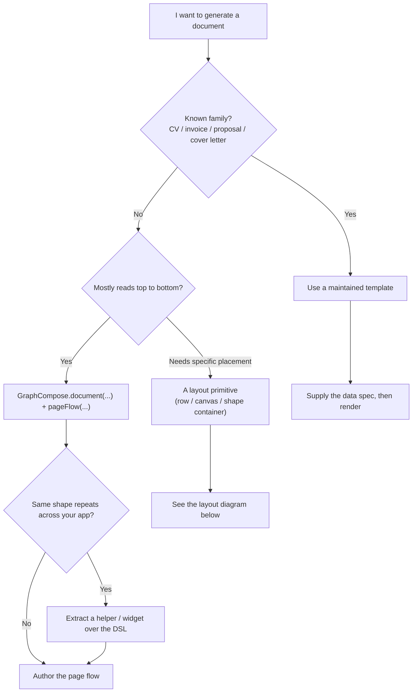
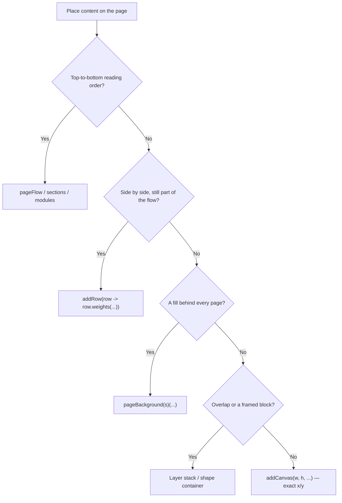
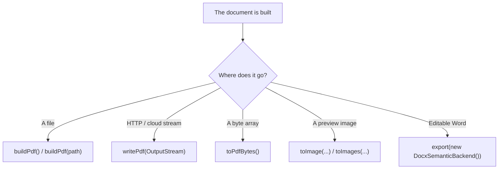
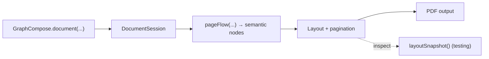

# Decision Diagrams

Visual versions of the "which API do I reach for?" decisions. Each
diagram renders on GitHub (Mermaid). The prose walkthroughs live in
[Getting started](getting-started.md) and
[Your first document](first-document.md).

---

## Choose your authoring path

Start from intent. Most documents are either a maintained template or a
custom page flow; helpers, layout primitives, and extensions come later.

---

## Where does content go on the page?

Flow is the default. Reach for a stronger primitive only when the
content has a specific placement relationship.

---

## Where does the output go?

Choose the output method by destination. Create one `DocumentSession`
per render request.

---

## Document lifecycle

What happens between your code and the PDF.

---

## See also

- [Getting started](getting-started.md) — the prose decision tree and first render.
- [Your first document](first-document.md) — a five-minute walk-through.
- [Which template system should I use?](templates/which-template-system.md) — the template-surface decision.
- [Capabilities](capabilities.md) — what GraphCompose can do, with stability tiers.
