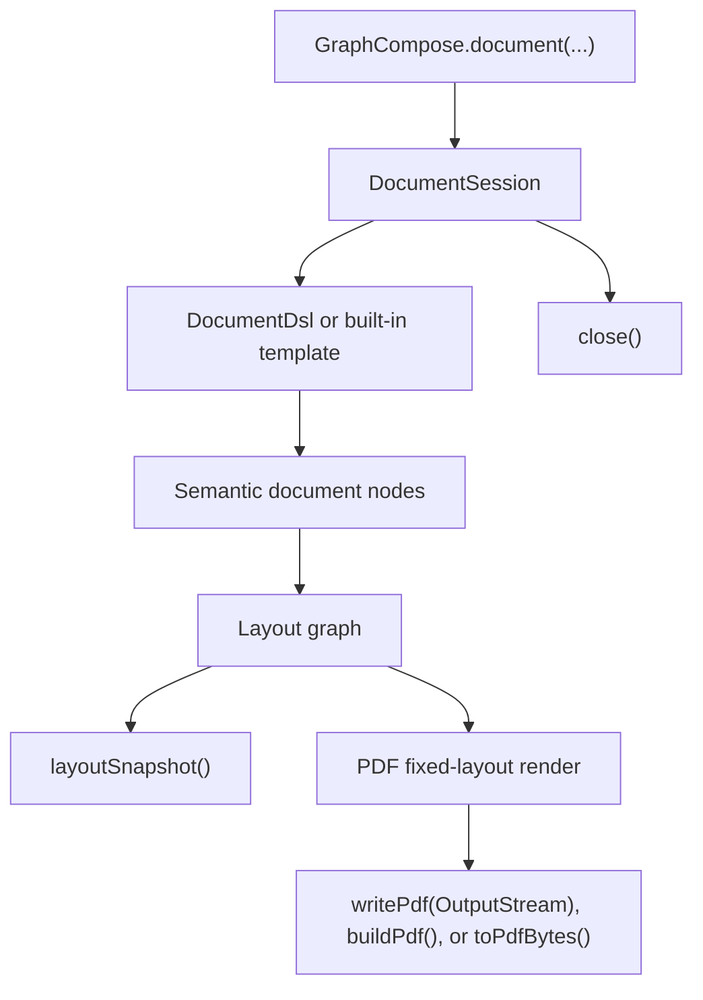

# Canonical Document Lifecycle

GraphCompose V2 follows a simple lifecycle:

```text
GraphCompose.document(...)
  -> DocumentSession
  -> DocumentDsl / template compose
  -> semantic nodes
  -> layout graph
  -> layout snapshot or fixed backend render
  -> PDF stream/bytes/file
```



Application code normally stays in the first two boxes: create a session, then
describe document modules. The engine boxes are internal lifecycle stages used
for layout, pagination, diagnostics, and rendering.

## 1. Session Creation

`GraphCompose.document(...)` creates a `DocumentSession`. The session owns:

- page size, margins, guide-line mode, markdown mode, and public PDF options
- custom font family registrations
- the semantic root nodes added by `DocumentDsl` or templates
- cached layout snapshots
- measurement resources used before rendering

`DocumentSession` is mutable and not thread-safe. Create one session per document/request.

## 2. Authoring

Application code should describe documents through domain-oriented calls:

```java
document.pageFlow(page -> page
        .module("Professional Summary", module -> module.paragraph(summary))
        .module("Technical Skills", module -> module.bullets(skills))
        .module("Projects", module -> module.rows(projectRows)));
```

Templates follow the same idea. A built-in template receives a domain spec, creates a header if needed, then renders ordered modules through the canonical compose target.

## 3. Layout

`DocumentSession.layoutGraph()` compiles semantic nodes into a deterministic fixed-layout graph:

- node definitions prepare and measure semantic nodes
- composite nodes emit ordered child nodes
- splittable nodes can continue across pages
- the compiler produces placed nodes and placed fragments

`DocumentSession.layoutSnapshot()` extracts test-friendly geometry from the same layout graph. Snapshot tests should use this public method instead of internal engine adapters.

## 4. Pagination

Pagination happens during layout. Semantic nodes define whether they are atomic or splittable. Long paragraphs/lists can split into fragments; atomic blocks move to the next page when needed.

The lower-level ECS engine still has pagination helpers under `com.demcha.compose.engine.pagination` for internal tests, diagnostics, and backend/tooling work.

## 5. Render

`DocumentSession.writePdf(OutputStream)` renders the resolved layout graph through `PdfFixedLayoutBackend` and writes the PDF to a caller-owned stream without closing it. This is the preferred server path because the session does not keep a PDF byte-array cache.

`DocumentSession.toPdfBytes()` is a convenience wrapper for callers that truly need a byte array. `DocumentSession.buildPdf(...)` opens a file stream and uses the same streaming path.

The canonical PDF backend:

- creates the PDF document and pages
- resolves fonts
- opens a page-scoped render session
- dispatches placed fragments to payload handlers
- applies bookmarks, links, guide lines, metadata, watermarks, headers/footers, and protection

## 6. Close

Always close the session, normally with try-with-resources. Closing releases measurement resources and clears request-local text measurement caches. It does not require consumers to manage PDFBox objects directly.

For production server guidance, see [Production Rendering](./production-rendering.md).
