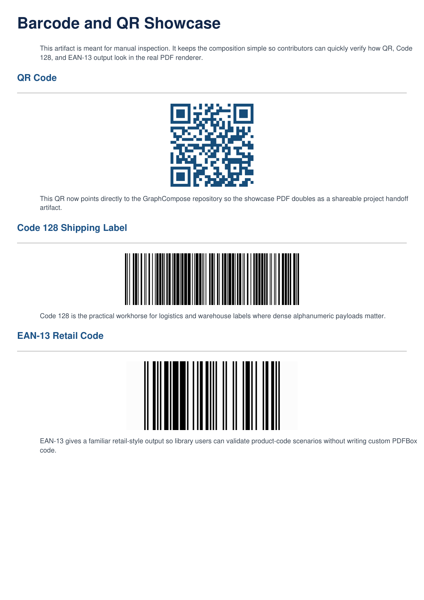
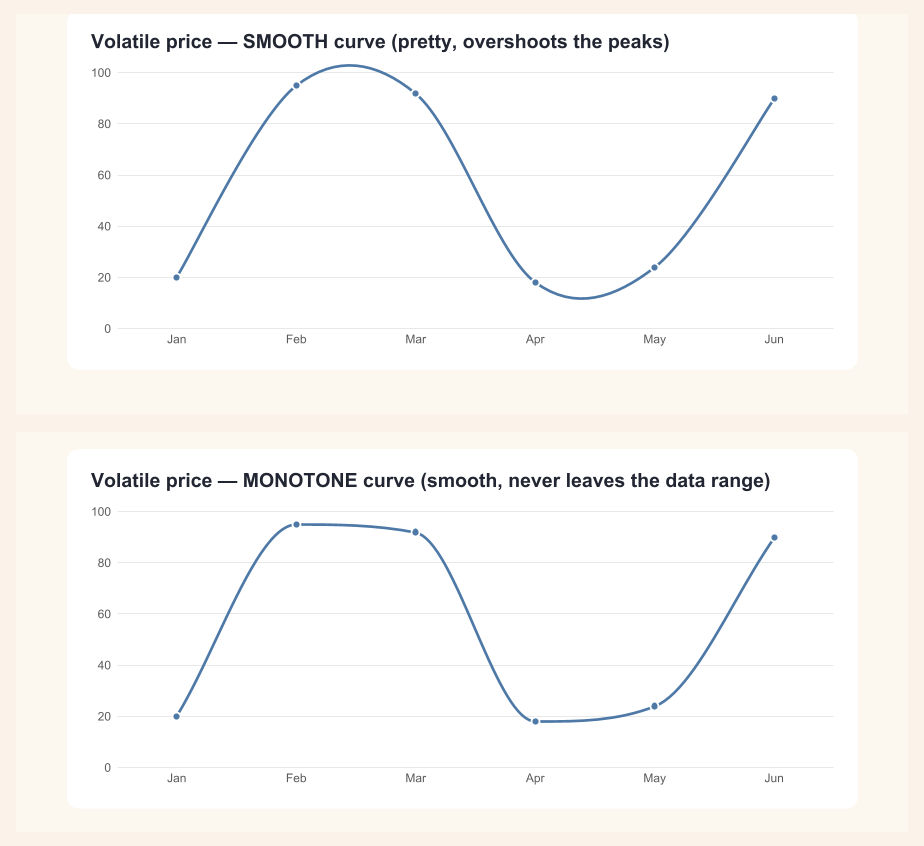

# GraphCompose Examples

A runnable, single-file Java example for every public surface in
GraphCompose — built-in templates, cinematic layout features, public-API
showcases, and a kitchen-sink master demo. Each example writes a PDF
to `examples/target/generated-pdfs/`; the same PDFs are committed to
[`assets/readme/examples/`](../assets/readme/examples/) so you can
preview every render straight from GitHub without running anything.

## Run examples

Install the library artifact once from the repository root:

```bash
./mvnw -DskipTests install
```

Then run one example by passing its main class:

```bash
./mvnw -f examples/pom.xml exec:java \
    -Dexec.mainClass=com.demcha.examples.flagships.ModuleFirstFileExample
```

For a different one, take a row from [🚀 Start here](#-start-here) below and turn its
Source path into a class name: drop `src/main/java/` and `.java`, then swap `/` for `.`.
So `src/main/java/com/demcha/examples/flagships/ModuleFirstFileExample.java` becomes
`com.demcha.examples.flagships.ModuleFirstFileExample`.

Generated PDFs land in `examples/target/generated-pdfs/`.

On Windows PowerShell the wrapper is `.\mvnw.cmd` and the command needs two changes,
neither of them cosmetic. The trailing `\` above is a shell continuation PowerShell does
not have, so the command must be one line. And `-Dexec.mainClass=…` has to be quoted:
unquoted, PowerShell splits it and Maven receives `.mainClass=…` as a separate argument,
failing with `Unknown lifecycle phase ".mainClass=…"`.

```powershell
.\mvnw.cmd -f examples/pom.xml exec:java "-Dexec.mainClass=com.demcha.examples.flagships.ModuleFirstFileExample"
```

Forward slashes are fine in the `-f` path; nothing needs converting to backslashes.

To regenerate the **whole catalogue** — roughly a hundred documents, and the output
directory is emptied first — run the batch entry point. You do not need it to read one
example; it exists because two other things consume its output. `cut-release.ps1`
re-copies the committed subset under `assets/readme/examples/` from it, and
`ShowcaseSync` mirrors the full catalogue into the static site under `web/showcase/`,
rendering the PNG thumbnails and rewriting `web/examples.json`:

```bash
./mvnw -f examples/pom.xml exec:java \
    -Dexec.mainClass=com.demcha.examples.GenerateAllExamples
```

The documents that print a version take it from the reactor, which between releases
sits on the next patch. To reproduce a published document from a development branch,
name the published version:

```bash
./mvnw -f examples/pom.xml exec:java \
    -Dexec.mainClass=com.demcha.examples.GenerateAllExamples \
    -Dgraphcompose.examples.displayVersion=2.1.0
```

That is how the committed previews under `assets/readme/examples/` are produced — the
version they show is the one on Maven Central, not the one the branch is building
towards.

`GenerateAllExamples` renders the whole catalogue in one pass — the CV and
cover-letter presets plus invoices, proposals, a schedule, the feature
demos, and the flagships. The showcase site publishes the whole generated
catalogue, and the same catalogue is committed under
[`assets/readme/examples/`](../assets/readme/examples/) so the previews
linked below open straight from GitHub.

Committing them is what lets `CommittedAssetDriftTest` compare each one
against a fresh render and fail on the difference, so a change to the engine
that moves a document says so in the build rather than at the next release.
A PDF is compared by its bytes. Three documents are held back and the guard
records why for each: the emoji gallery on weight, and two whose pixels this
repository rasterises at render time, which a CI runner antialiases differently
from a developer's machine.

## Gallery — pick by your goal

Examples are categorised by **maturity / intent**, not by the GraphCompose
release that introduced them. Pick the row that matches how far along you
are with the canonical DSL, then jump to its detailed section below.

> **Maturity legend.**
> 🚀 **Start here** — minimum-friction entry points; pick one if you've never used the canonical DSL before.
> 🧱 **Core DSL** — features you'll author against every day once the basics click.
> 📋 **Templates recommended** — the v2 / layered template surfaces and how to drive them; pick when you want a one-line CV / invoice / proposal / cover-letter.
> 🔧 **Advanced SPI** — production-deployment patterns, specialty SPIs (shapes, transforms, barcodes), engine-level tools (snapshots).
> ✍️ **Hand-composed** — no template involved: the same primitives assembled directly, for when your document is not one of the built-in families.

### 🚀 Start here

| Example | What it shows | Preview · Source |
|---|---|---|
| [CV — single template](#cv--single-template) | One CV via `ModernProfessional.create()` on a `CvDocument` | [PDF](../assets/readme/examples/cv-modern-professional-v2.pdf) · [Source](src/main/java/com/demcha/examples/templates/cv/v2/CvModernV2Example.java) |
| [CV — assembled at runtime](#cv--assembled-at-runtime) | A CV whose sections arrive as data: each carries the `CvKind` its author picked, and a category the catalogue has no name for renders like any other | [PDF](../assets/readme/examples/cv-runtime-modules-v2.pdf) · [Source](src/main/java/com/demcha/examples/templates/cv/v2/CvRuntimeModulesExample.java) |
| [Invoice — cinematic V2](#invoice--cinematic-v2) | `ModernInvoice + BrandTheme.invoiceModern()` — the recommended invoice path | [PDF](../assets/readme/examples/invoice-cinematic.pdf) · [Source](src/main/java/com/demcha/examples/templates/invoice/InvoiceCinematicFileExample.java) |
| [Cover Letter](#cover-letter) | One-page cover letter composed in the canonical DSL, section presets carrying the hierarchy | [PDF](../assets/readme/examples/cover-letter.pdf) · [Source](src/main/java/com/demcha/examples/templates/coverletter/CoverLetterFileExample.java) |
| [Module-first Profile](#module-first-profile) | Authoring directly against `DocumentSession.module(...).paragraph(...)` — DSL-direct, no template | [PDF](../assets/readme/examples/module-first-profile.pdf) · [Source](src/main/java/com/demcha/examples/flagships/ModuleFirstFileExample.java) |
| **Engine Showcase** | Single-page cinematic brand promo — semantic-graph → polished-PDFs visual metaphor with rounded clip frame, magazine headline lockup, KPI cards, capability columns; source of the README hero image | [Source](src/main/java/com/demcha/examples/flagships/EngineShowcase.java) |
| **Engine Deck** | Multi-page **landscape** capability deck — page 1 is a banner infographic (DSL code → engine → backends → **real rendered-document thumbnails**), then an authoring-pipeline walkthrough, and two pages of **real benchmark data** (GraphCompose vs iText 9 vs JasperReports) loaded from a bundled result file and drawn as tables + native charts; the landscape companion to Engine Showcase. The same composition also renders as a **geometry-identical PowerPoint deck** (one page = one editable slide) through `buildPptx(Path)` | [PDF](../assets/readme/examples/engine-deck.pdf) · [Source](src/main/java/com/demcha/examples/flagships/EngineDeckExample.java) · [PPTX source](src/main/java/com/demcha/examples/flagships/EngineDeckPptxExample.java) |
| **Twin Output** | The dual-output hook stated by the artifact itself — a single 16:9 page written once and emitted **twice from the same session**: `buildPdf()` and `buildPptx(...)` produce a print-ready PDF and a PowerPoint slide with identical geometry where text, panels, and vectors stay native, editable shapes (only the clip-masked logo art lands as a picture); the root README shows PowerPoint's own render of the slide next to the PDF | [PDF](../assets/readme/examples/twin-output.pdf) · [PPTX](../assets/readme/examples/twin-output.pptx) · [Source](src/main/java/com/demcha/examples/flagships/TwinOutputExample.java) |
| **Maven Central Banner** | Five 16:9 slides opening on the "Available on Maven Central" brand banner — the `GraphCompose` wordmark, an `io.github.demchaav:graph-compose` coordinate card, `JAVA 17+ / PDF / PPTX / AUTO-PAGINATION` tags, and a `code → layout → PDF/PPTX` diagram whose amber connectors branch to both backends, composed as one full-bleed `CanvasLayerNode` — then how a document is authored, how it measures against the field, how it scales, and five bundled scripts with Hebrew and Arabic running right to left. **The README hero is page one.** Emitted as an editable PowerPoint deck via `buildPptx(Path)`; panels and text stay native shapes, only the badge checkmark rasterises | [PDF](../assets/readme/examples/maven-banner.pdf) · [PPTX](../assets/readme/examples/maven-banner.pptx) · [Source](src/main/java/com/demcha/examples/flagships/MavenBannerPptxExample.java) |

### 🧱 Core DSL

| Example | What it shows | Preview · Source |
|---|---|---|
| [Rich text](#rich-text) | Every `RichText` method (bold / italic / underline / link / colour / accent / size / append) | [PDF](../assets/readme/examples/rich-text-showcase.pdf) · [Source](src/main/java/com/demcha/examples/features/text/RichTextShowcaseExample.java) |
| [Text direction](#text-direction) | `TextDirection` — right-to-left paragraphs and table cells, `AUTO` resolved from the first strong character, and Latin embedded in Hebrew | [PDF](../assets/readme/examples/text-direction.pdf) · [Source](src/main/java/com/demcha/examples/features/text/TextDirectionExample.java) |
| [Arabic article](#arabic-article) | A full right-to-left article — shaped Arabic joined by the engine, every line reordered, natural pagination onto a second page | [PDF](../assets/readme/examples/arabic-article.pdf) · [Source](src/main/java/com/demcha/examples/features/text/ArabicArticleExample.java) |
| [Hebrew invoice](#hebrew-invoice) | A right-to-left invoice whose every line mixes Hebrew with digits and Latin names — built from rows, since a table cell carries no direction | [PDF](../assets/readme/examples/hebrew-invoice.pdf) · [Source](src/main/java/com/demcha/examples/features/text/HebrewInvoiceExample.java) |
| [World scripts](#world-scripts) | One card per bundled script — Arabic, Hebrew, Georgian, Armenian, Korean — each set in its own `FontName` family | [PDF](../assets/readme/examples/world-scripts.pdf) · [Source](src/main/java/com/demcha/examples/features/text/WorldScriptsExample.java) |
| [Inline shapes](#inline-shapes) | `InlineShapeRun` — dots, arrows, chevrons, diamonds, stars, checkmarks and checkboxes drawn as geometry on the text baseline | [PDF](../assets/readme/examples/inline-shapes.pdf) · [Source](src/main/java/com/demcha/examples/features/text/InlineShapesExample.java) |
| [Inline highlight chips](#inline-highlight-chips) | `RichText.code(text)` / `chip(text, fg, bg)` / `highlight(text, style, bg, radius, padding)` — text on a rounded padded fill (inline code + status badges), wrapping across lines | [PDF](../assets/readme/examples/inline-highlight-chips.pdf) · [Source](src/main/java/com/demcha/examples/features/text/InlineHighlightExample.java) |
| [Inline SVG icons](#inline-svg-icons) | `RichText.svgIcon(icon, size)` — a parsed multi-colour `SvgIcon` on the text baseline, crisp at any zoom and carrying its own colours | [PDF](../assets/readme/examples/inline-svg-icons.pdf) · [Source](src/main/java/com/demcha/examples/features/text/InlineSvgIconExample.java) |
| [Colour emoji](#colour-emoji) | `RichText.emoji(":star:", size)` — GitHub-style shortcodes resolve to inline vector glyphs via the `graph-compose-emoji` artifact; unknown codes fall back to literal text | [PDF](../assets/readme/examples/emoji-shortcodes.pdf) · [Source](src/main/java/com/demcha/examples/features/text/EmojiShortcodeExample.java) |
| [Section presets](#section-presets) | `pageBackground`, `band`, `softPanel`, `accentLeft / Right / Top / Bottom`, per-corner `DocumentCornerRadius` | [PDF](../assets/readme/examples/section-presets.pdf) · [Source](src/main/java/com/demcha/examples/features/text/SectionPresetsExample.java) |
| Nested lists | `ListBuilder.addItem(label, Consumer)` — depth cascade, per-depth markers, mixed flat / nested authoring | [PDF](../assets/readme/examples/nested-list-showcase.pdf) · [Source](src/main/java/com/demcha/examples/features/lists/NestedListExample.java) |
| Composed table cells | `DocumentTableCell.node(DocumentNode)` — paragraphs, lists, sub-tables inside cells with two-pass measurement | [PDF](../assets/readme/examples/composed-table-cell-showcase.pdf) · [Source](src/main/java/com/demcha/examples/features/tables/ComposedTableCellExample.java) |
| [Inline-code column wrap](#inline-code-column-wrap) | A long `inlineCode(...)` coordinate breaks at its `. : / -` seams inside a narrow **fixed** column and an **auto** column grows to fit it on one line | [PDF](../assets/readme/examples/inline-code-column-wrap.pdf) · [Source](src/main/java/com/demcha/examples/features/tables/InlineCodeColumnWrapExample.java) |
| Canvas layer (free placement) | `CanvasLayerNode` — pixel-precise `(x, y)` placement of children inside a fixed bounding box, with `ClipPolicy` clipping | [PDF](../assets/readme/examples/canvas-layer-showcase.pdf) · [Source](src/main/java/com/demcha/examples/features/canvas/CanvasLayerExample.java) |
| [Transforms](#transforms) | `rotate`, `scale`, and per-layer `zIndex` swap | [PDF](../assets/readme/examples/transforms.pdf) · [Source](src/main/java/com/demcha/examples/features/transforms/TransformsExample.java) |
| [Block alignment](#block-alignment) | `addAligned(align, node)` / `addSvgIcon(icon, w, align)` — seat any fixed-size node left / centre / right across the content width | [PDF](../assets/readme/examples/block-align.pdf) · [Source](src/main/java/com/demcha/examples/features/layout/BlockAlignExample.java) |
| [Content bleed](#content-bleed) | `band.bleedToEdge(TOP, LEFT, RIGHT)` / `bleed(DocumentBleed.of(...))` — a section's fill reaches the trimmed page edge while its children stay in the content margin | [PDF](../assets/readme/examples/content-bleed.pdf) · [Source](src/main/java/com/demcha/examples/features/layout/BleedExample.java) |
| [Per-page margin](#per-page-margin) | `pageMargins(List.of(PageMarginRule.page(1, zero()), PageMarginRule.from(2, …)))` — a full-bleed cover and a book-margin body in one document | [PDF](../assets/readme/examples/per-page-margin.pdf) · [Source](src/main/java/com/demcha/examples/features/layout/PerPageMarginExample.java) |
| [Row columns & TOC](#row-columns--toc) | `row.columns(auto(), weight(1), auto())` — size columns by content / fixed points / weight; with `line().fill()` it builds a dot-leader table of contents | [PDF](../assets/readme/examples/row-columns.pdf) · [Source](src/main/java/com/demcha/examples/features/layout/RowColumnsExample.java) |
| [Row vertical align](#row-vertical-align) | `row.verticalAlign(TOP / CENTER / BOTTOM)` — seat a row's children on the cross axis within the band set by the tallest child | [PDF](../assets/readme/examples/row-vertical-align.pdf) · [Source](src/main/java/com/demcha/examples/features/layout/RowVerticalAlignExample.java) |
| [Row flex & arrangement](#row-flex--arrangement) | `row.pushRight()` / `flexSpacer()` springs + `arrangement(SPACE_BETWEEN / CENTER / …)` — push children apart or justify leftover width | [PDF](../assets/readme/examples/row-flex.pdf) · [Source](src/main/java/com/demcha/examples/features/layout/RowFlexExample.java) |

### 📋 Templates recommended

| Example | What it shows | Preview · Source |
|---|---|---|
| [CV — template gallery](#cv--template-gallery) | The v2 CV presets in one orchestrated run | [Source](src/main/java/com/demcha/examples/templates/cv/CvTemplateGalleryFileExample.java) |
| [Cover letter — template gallery](#cover-letter--template-gallery) | All paired v2 cover-letter presets in one orchestrated run | [Source](src/main/java/com/demcha/examples/templates/coverletter/CoverLetterTemplateGalleryFileExample.java) |
| [Proposal — cinematic V2](#proposal--cinematic-v2) | `ModernProposal + BrandTheme.proposalModern()` | [PDF](../assets/readme/examples/proposal-cinematic.pdf) · [Source](src/main/java/com/demcha/examples/templates/proposal/ProposalCinematicFileExample.java) |

### 🔧 Advanced SPI

| Example | What it shows | Preview · Source |
|---|---|---|
| [Shape containers](#shape-containers) | Circles, ellipses, rounded cards with `ClipPolicy.CLIP_PATH` | [PDF](../assets/readme/examples/shape-container.pdf) · [Source](src/main/java/com/demcha/examples/features/shapes/ShapeContainerExample.java) |
| [Vector paths (Bézier)](#vector-paths-bézier) | `addPath(...)` + `SvgPath.parse(...)` — design shapes and imported SVG icons as native curves; zero tessellation | [PDF](../assets/readme/examples/vector-path.pdf) · [Source](src/main/java/com/demcha/examples/features/shapes/VectorPathExample.java) |
| [Line caps & dotted lines](#line-caps--dotted-lines) | `line.lineCap(ROUND)` — round / square caps for plain lines; `dashed(0.1, 4).lineCap(ROUND)` draws a dotted leader | [PDF](../assets/readme/examples/line-cap.pdf) · [Source](src/main/java/com/demcha/examples/features/shapes/LineCapExample.java) |
| [Fill lines & dot leaders](#fill-lines--dot-leaders) | `line().fill()` — a line stretches to its row column or the content width; pair with `dashed(...).lineCap(ROUND)` for a dot leader drawn without measuring the gap | [PDF](../assets/readme/examples/line-fill.pdf) · [Source](src/main/java/com/demcha/examples/features/shapes/LineFillExample.java) |
| [SVG icon gallery](#svg-icon-gallery) | 34 real-world multicolour svgrepo icons via `SvgIcon.parse` — up to 19 layers each, the whole set 156 KB of sources | [PDF](../assets/readme/examples/svg-icon-gallery.pdf) · [Source](src/main/java/com/demcha/examples/features/svg/SvgIconGalleryExample.java) |
| [Advanced tables](#advanced-tables) | Row span, zebra rows, totals, repeating header on page break | [PDF](../assets/readme/examples/table-advanced.pdf) · [Source](src/main/java/com/demcha/examples/features/tables/TableAdvancedExample.java) |
| [Barcodes](#barcodes) | QR, Code 128, Code 39, EAN-13, EAN-8, branded QR with theme colours | [PDF](../assets/readme/examples/barcode-showcase.pdf) · [Source](src/main/java/com/demcha/examples/features/barcodes/BarcodeShowcaseExample.java) |
| [Charts](#charts) | Native vector bar, line, and pie/donut charts — data/spec/style layers, axis & grid toggles, point markers, value labels, legend | [PDF](../assets/readme/examples/chart-showcase.pdf) · [Source](src/main/java/com/demcha/examples/features/charts/ChartShowcaseExample.java) |
| [PDF chrome](#pdf-chrome) | `DocumentMetadata`, `DocumentWatermark`, `DocumentHeaderFooter`, `DocumentBookmarkOptions` | [PDF](../assets/readme/examples/pdf-chrome.pdf) · [Source](src/main/java/com/demcha/examples/features/chrome/PdfChromeExample.java) |
| [Page numbering](#page-numbering) | `DocumentPageNumbering` — offset / restart / roman / suppress-on-first-page for `{page}` / `{pages}` footer tokens | [PDF](../assets/readme/examples/page-numbering.pdf) · [Source](src/main/java/com/demcha/examples/features/chrome/PageNumberingExample.java) |
| [Viewer preferences](#viewer-preferences) | `chrome().viewerPreferences(...)` — open with the bookmark panel (`USE_OUTLINES`), set page layout, or show the doc title in the window | [PDF](../assets/readme/examples/viewer-preferences.pdf) · [Source](src/main/java/com/demcha/examples/features/chrome/ViewerPreferencesExample.java) |
| [In-PDF navigation](#in-pdf-navigation) | `anchor(...)` destinations + internal `linkTo(...)` / `inlineLinkTo(...)` / `shapeLinkTo(...)` — clickable cross-references and footnotes as native PDF GoTo actions; forward references resolve in a deferred pass | [PDF](../assets/readme/examples/in-pdf-navigation.pdf) · [Source](src/main/java/com/demcha/examples/features/navigation/InPdfNavigationExample.java) |
| [Page references](#page-references) | `addPageReference(anchor)` — print the page an `anchor(...)` lands on (a native "see page N" cross-reference), resolved in one authoring pass | [PDF](../assets/readme/examples/page-reference.pdf) · [Source](src/main/java/com/demcha/examples/features/navigation/PageReferenceExample.java) |
| [Table of contents](#table-of-contents) | `addTableOfContents(toc -> toc.entry(label, anchor))` — a native clickable TOC with dot leaders and auto-resolved page numbers | [PDF](../assets/readme/examples/table-of-contents.pdf) · [Source](src/main/java/com/demcha/examples/features/navigation/TocExample.java) |
| [Container bookmarks](#container-bookmarks) | `section.bookmark(new DocumentBookmarkOptions(title))` — make a section / container a PDF outline (bookmark-panel) target | [PDF](../assets/readme/examples/container-bookmark.pdf) · [Source](src/main/java/com/demcha/examples/features/navigation/ContainerBookmarkExample.java) |
| [Multi-section documents](#multi-section-documents) | `GraphCompose.documents()` — concatenate sections with different page sizes / margins / numbering into one PDF, with cross-section links and outline | [PDF](../assets/readme/examples/multi-section-document.pdf) · [Source](src/main/java/com/demcha/examples/features/structure/MultiSectionExample.java) |
| [HTTP streaming](#http-streaming) | `writePdf(OutputStream)` for Servlet / S3 / GCS — caller's stream is not closed | [PDF](../assets/readme/examples/invoice-http-stream.pdf) · [Source](src/main/java/com/demcha/examples/features/streaming/HttpStreamingExample.java) |
| [Word export (DOCX)](#word-export-docx) | `DocxSemanticBackend` — the same session renders a fixed-layout PDF and an editable Word file; paragraphs / lists / tables / images map 1:1, charts fall back to their data table | [PDF](../assets/readme/examples/word-export-companion.pdf) · [DOCX](../assets/readme/examples/word-export-companion.docx) · [Source](src/main/java/com/demcha/examples/features/docx/WordExportExample.java) |
| [Layout snapshot regression](#layout-snapshot-regression) | Deterministic `layoutSnapshot()` workflow with baseline + drift report — production regression-testing pattern | [PDF](../assets/readme/examples/invoice-snapshot-regression.pdf) · [Source](src/main/java/com/demcha/examples/features/snapshots/LayoutSnapshotRegressionExample.java) |
| [Debug overlay](#debug-overlay) | `DocumentDebugOptions` — guide lines + semantic node-path labels on the sheet; trace any misplaced block back to the builder call that authored it | [PDF](../assets/readme/examples/debug-overlay.pdf) · [Source](src/main/java/com/demcha/examples/features/debug/DebugOverlayExample.java) |
| [Business report cover](#business-report-cover) | Single-page Q1 investor brief — hero image, KPI cards, bar chart, metrics table; the same composition also renders as an editable PowerPoint deck (KPI cards, chart, and table stay native shapes) via `buildPptx()` | [PDF](../assets/readme/examples/business-report.pdf) · [PPTX](../assets/readme/examples/business-report.pptx) · [Source](src/main/java/com/demcha/examples/flagships/BusinessReportExample.java) · [PPTX source](src/main/java/com/demcha/examples/flagships/BusinessReportPptxExample.java) |
| Financial report one-pager | Single-page monthly financial dashboard — three margin gauges, cash & stacked-OPEX charts, a revenue donut, and forecast bars; native vector charts plus inline sparklines and a path-clipped photo masthead; the same composition also renders as an editable PowerPoint deck via `buildPptx()` | [PDF](../assets/readme/examples/financial-report.pdf) · [PPTX](../assets/readme/examples/financial-report.pptx) · [Source](src/main/java/com/demcha/examples/flagships/FinancialReportExample.java) · [PPTX source](src/main/java/com/demcha/examples/flagships/FinancialReportPptxExample.java) |
| [Master showcase](#master-showcase) | Kitchen-sink "Q2 sample report" combining the canonical surface end-to-end; the same composition also renders as a multi-slide editable PowerPoint deck via `buildPptx()` | [PDF](../assets/readme/examples/master-showcase.pdf) · [PPTX](../assets/readme/examples/master-showcase.pptx) · [Source](src/main/java/com/demcha/examples/flagships/MasterShowcaseExample.java) · [PPTX source](src/main/java/com/demcha/examples/flagships/MasterShowcasePptxExample.java) |
| Feature catalog | Browsable reference PDF: every shipped capability as a block — outline-clickable heading, the exact API call, the rendered result right under it | [PDF](../assets/readme/examples/feature-catalog.pdf) · [Source](src/main/java/com/demcha/examples/flagships/FeatureCatalogExample.java) |
| Book template | A full novel front: full-bleed wave cover, a clickable dotted-leader table of contents with live page numbers, and chapters — the book primitives (`pageMargins`, `addTableOfContents`, `DocumentPageNumbering`, container `bookmark`, `viewerPreferences`) in **one session**, no external PDF merge | [PDF](../assets/readme/examples/book-template.pdf) · [Source](src/main/java/com/demcha/examples/features/title/BookTemplateExample.java) |

### ✍️ Hand-composed

| Example | What it shows | Preview · Source |
|---|---|---|
| [Handcrafted Proposal](#handcrafted-proposal) | A cinematic proposal assembled from primitives, with no template behind it — the shape to copy when your document is not one of the built-in families | [PDF](../assets/readme/examples/project-proposal-cinematic.pdf) · [Source](src/main/java/com/demcha/examples/templates/proposal/CinematicProposalFileExample.java) |
| [Weekly schedule](#weekly-schedule) | Bar / restaurant shift schedule via `WeeklyScheduleRenderer` | [PDF](../assets/readme/examples/weekly-schedule.pdf) · [Source](src/main/java/com/demcha/examples/templates/schedule/WeeklyScheduleFileExample.java) |

---

## Document templates

### Cover letter

A one-page modern cover letter composed straight in the canonical DSL.
Section presets (`softPanel`, `accentLeft`, `accentTop`) carry the visual
hierarchy and an opening rich-text strip highlights the candidate's
headline. Its colours come from a theme helper local to this module, not
from library API — the shipping equivalent is `BrandTheme`.

<!-- doc-example-ignore: quotes a runnable example; the source it is taken from is compiled and executed by the examples module -->
```java
try (DocumentSession document = GraphCompose.document(outputFile)
        .pageSize(DocumentPageSize.A4)
        .pageBackground(THEME.pageBackground())
        .margin(56, 48, 56, 48)
        .create()) {

    document.pageFlow()
            .name("CoverLetter")
            .spacing(18)
            .addRow("Header", row -> row
                    .weights(3, 1)
                    .addSection("Identity", section -> section
                            .addParagraph(p -> p.text("Mariia Demchyshyn")
                                    .textStyle(THEME.text().h1())))
                    .addSection("Date", section -> section
                            .addParagraph(p -> p.text("15 May 2026"))))
            .addSection("Headline", section -> section
                    .softPanel(THEME.palette().surfaceMuted(), 10, 18)
                    .accentLeft(ACCENT, 4)
                    .addRich(rich -> rich
                            .plain("I help teams ship ")
                            .style("designed PDFs as code", BOLD_BRAND)
                            .plain(" — semantic Java DSL, deterministic layout.")))
            // … recipient block + body paragraphs + highlights row + closing …
            .build();

    document.buildPdf();
}
```

[📄 View PDF](../assets/readme/examples/cover-letter.pdf) ·
[📜 Full source](src/main/java/com/demcha/examples/templates/coverletter/CoverLetterFileExample.java)

### Module-first profile

Authoring against `DocumentSession.pageFlow().module(...)` — no
template, no theme, just the canonical DSL. Smallest possible footprint
for "I just need a one-page PDF from data".

<!-- doc-example-ignore: quotes a runnable example; the source it is taken from is compiled and executed by the examples module -->
```java
document.pageFlow()
        .module("Profile", module -> module
                .heading("Mariia Demchyshyn")
                .paragraph("Senior Backend Engineer")
                .paragraph("mariia@example.com  ·  +44 20 7946 0234"));
document.buildPdf();
```

[📄 View PDF](../assets/readme/examples/module-first-profile.pdf) ·
[📜 Full source](src/main/java/com/demcha/examples/flagships/ModuleFirstFileExample.java)

### CV — single template

One CV rendered through the layered template surface:
`ModernProfessional.create()` paired with a `CvDocument` data shape.
The preset is one final class with `create()` / `create(BrandTheme)`
factories — copy-and-tweak rather than fork-a-monolith.

[📄 View PDF](../assets/readme/examples/cv-modern-professional-v2.pdf) ·
[📜 Full source](src/main/java/com/demcha/examples/templates/cv/v2/CvModernV2Example.java)

### CV — assembled at runtime

The other CV examples write their sections in Java: `EntriesSection` for
Experience, `SkillsSection` for skills, with the compiler checking you.
That is right when a person writes the CV, and wrong when the CV
*arrives* — from a form, a JSON payload, an LLM — because the shape is
not known until it does.

`ModuleSection` moves that choice into a value. This example builds every
section from a payload standing in for parsed JSON, and the whole mapping
layer is one method. Three things to look for in the PDF:

- **Certifications** and **Experience** carry the same item fields. The
  first is `CvKind.ENTRIES` and prints no dates; the second is
  `ENTRIES_DATED` and prints them. Same data, one value different.
- **Volunteering** is a category the catalogue has no role for
  (`SectionRole.OTHER`) and is shaped exactly like Certifications —
  without a new type existing for it.
- Every heading is the author's own; nothing is renamed to the preset's
  vocabulary.

The design is picked at runtime too — `CvTemplates.byId(...)` takes an id
and returns a template. `CvTemplates.modular()` is the list to offer a
user when a CV is assembled this way: those presets promise to draw a
module they were not written for.

[📄 View PDF](../assets/readme/examples/cv-runtime-modules-v2.pdf) ·
[📜 Full source](src/main/java/com/demcha/examples/templates/cv/v2/CvRuntimeModulesExample.java)

### CV — template gallery

Generates the v2 CV presets in one orchestrated run, covering
single-column, two-column-sidebar, and three-column-magazine layouts. Use this as the side-by-side catalogue when picking a base
preset for your own CV product. Each preset is a one-liner factory
(`ModernProfessional.create()`, `NordicClean.create()`,
…); see `templates/src/main/java/com/demcha/compose/document/templates/cv/presets/` for the full list.

| Variant | PDF |
|---|---|
| Modern professional | [PDF](../assets/readme/examples/cv-modern-professional-v2.pdf) |
| Nordic clean | [PDF](../assets/readme/examples/cv-nordic-clean-v2.pdf) |
| Classic serif | [PDF](../assets/readme/examples/cv-classic-serif-v2.pdf) |
| Compact mono | [PDF](../assets/readme/examples/cv-compact-mono-v2.pdf) |
| Timeline minimal | [PDF](../assets/readme/examples/cv-timeline-minimal-v2.pdf) |
| Engineering resume | [PDF](../assets/readme/examples/cv-engineering-resume-v2.pdf) |
| Panel | [PDF](../assets/readme/examples/cv-panel-v2.pdf) |
| Executive · BoxedSections · CenteredHeadline · BlueBanner · EditorialBlue · SidebarPortrait · MonogramSidebar · MintEditorial · MinimalUnderlined | run the gallery to render |

The previews above come from the per-preset examples under
[`templates/cv/v2/`](src/main/java/com/demcha/examples/templates/cv/v2), which the
catalogue runner generates. The gallery below renders every preset from one entry point
instead, and is not part of that run — use it to produce the whole set locally:
[📜 Full source](src/main/java/com/demcha/examples/templates/cv/CvTemplateGalleryFileExample.java)

### Cover letter — template gallery

Generates all paired v2 cover-letter presets in one run — one
letter style per CV preset so a candidate's CV and cover letter
share the same visual language end-to-end. Each preset is a
one-liner factory (`ModernProfessionalLetter.create()`,
`NordicCleanLetter.create()`, …) under
`coverletter/v2/presets/`.

[📜 Full source](src/main/java/com/demcha/examples/templates/coverletter/CoverLetterTemplateGalleryFileExample.java)

---

## Cinematic templates

### Invoice — cinematic V2

`ModernInvoice.create(BrandTheme.invoiceModern())` — the cinematic
invoice. Hero panel with invoice number / dates / status, two-column
parties row, themed line-items table with header + totals, footer
notes and payment terms.

<!-- doc-example-ignore: quotes a runnable example; the source it is taken from is compiled and executed by the examples module -->
```java
BrandTheme theme = BrandTheme.invoiceModern();
DocumentTemplate<InvoiceDocumentSpec> template = ModernInvoice.create(theme);

float margin = (float) ModernInvoice.RECOMMENDED_MARGIN;
try (DocumentSession document = GraphCompose.document(outputFile)
        .pageSize(DocumentPageSize.A4)
        .pageBackground(theme.palette().mainFill())
        .margin(margin, margin, margin, margin)
        .create()) {
    template.compose(document, invoice);
    document.buildPdf();
}
```

[📄 View PDF](../assets/readme/examples/invoice-cinematic.pdf) ·
[📜 Full source](src/main/java/com/demcha/examples/templates/invoice/InvoiceCinematicFileExample.java)

### Proposal — cinematic V2

`ModernProposal` — same `BrandTheme`-driven pattern as the
invoice. Hero rounded only on the right (`DocumentCornerRadius.right(...)`),
themed executive-summary panel, sender / recipient parties row,
themed headings, timeline + pricing tables with
`repeatHeader()`, zebra rows, and a `totalRow(...)`.

[📄 View PDF](../assets/readme/examples/proposal-cinematic.pdf) ·
[📜 Full source](src/main/java/com/demcha/examples/templates/proposal/ProposalCinematicFileExample.java)

### Handcrafted proposal

A cinematic proposal composed by hand — no template — to show how the
same primitives compose without a preset wrapping them. Useful starting
point when your domain doesn't fit any built-in template.

[📄 View PDF](../assets/readme/examples/project-proposal-cinematic.pdf) ·
[📜 Full source](src/main/java/com/demcha/examples/templates/proposal/CinematicProposalFileExample.java)

---

## Feature showcases

### Shape containers

`addContainer(...)`, `addCircle(...)`, `addEllipse(...)` build a
`ShapeContainerNode` whose bounding box is dictated by a
`ShapeOutline`. Children are clipped via `ClipPolicy.CLIP_PATH`
(default), `CLIP_BOUNDS`, or `OVERFLOW_VISIBLE`. The
`ShapeContainerBuilder` exposes the same nine-point alignment
vocabulary as `LayerStackBuilder` plus `position(node, dx, dy, anchor)`
for screen-space nudges.

<!-- doc-example-ignore: quotes a runnable example; the source it is taken from is compiled and executed by the examples module -->
```java
.addContainer(
        ShapeOutline.RoundedRectangle.of(220, 140, 14),
        ClipPolicy.CLIP_PATH,
        DocumentColor.rgb(28, 31, 38),                       // background
        DocumentStroke.of(DocumentColor.rgb(196, 153, 76), 1.0),
        container -> container
                .center(centeredImage)                       // 9-point alignment
                .position(badge, 120, 18, Anchor.TOP_LEFT))  // pixel-precise
```

[📄 View PDF](../assets/readme/examples/shape-container.pdf) ·
[📜 Full source](src/main/java/com/demcha/examples/features/shapes/ShapeContainerExample.java)

### Transforms

`DocumentTransform.rotate(deg)` and `.scale(uniform | sx, sy)` —
attached to any `Transformable<T>` builder
(`ShapeContainerBuilder`, `ShapeBuilder`, `LineBuilder`,
`EllipseBuilder`, `ImageBuilder`, `BarcodeBuilder`). Identity
transforms emit no markers, so adding one leaves a layout snapshot
byte-identical. Per-layer `zIndex` lets a layer declared earlier draw on
top of layers declared later — `LayerStackNode.Layer` and shape-container
layers both carry an `int zIndex` (default `0`).

<!-- doc-example-ignore: quotes a runnable example; the source it is taken from is compiled and executed by the examples module -->
```java
.addCircle(60, ROYAL_BLUE, container -> container
        .rotate(15)
        .center(label))

.layer(redSquare,  Anchor.CENTER, /* zIndex */ 10)   // declared first, drawn on top
.layer(tealSquare, Anchor.CENTER)                    // declared second, drawn beneath
```

[📄 View PDF](../assets/readme/examples/transforms.pdf) ·
[📜 Full source](src/main/java/com/demcha/examples/features/transforms/TransformsExample.java)

### Vector paths (Bézier)

Free-form design shapes with native cubic Bézier curves through
`addPath(...)`: stroked waves, filled blobs, and mixed line/curve
ribbons in one closed subpath. Curves render as native PDF `curveTo`
operators — perfectly smooth at any zoom, no tessellation. Coordinates
are normalized to the shape's box (`(0,0)` bottom-left, `y` up) and
control points may overshoot it. Strokes can be dashed via
`dashed(on, off, ...)` — the pattern follows the curve. SVG icons drop in
through `SvgPath.parse(d, viewBox...)` + `.svg(...)`, or whole files via
`SvgIcon.read(file)` + `addSvgIcon(icon, width)` — multi-layer icons with
group transforms and per-layer paints, all as native curves.

<!-- doc-example-ignore: quotes a runnable example; the source it is taken from is compiled and executed by the examples module -->
```java
flow.addPath(path -> path
        .size(320, 60)
        .moveTo(0.0, 0.5)
        .curveTo(0.25, 1.0, 0.25, 0.0, 0.5, 0.5)
        .curveTo(0.75, 1.0, 0.75, 0.0, 1.0, 0.5)
        .stroke(DocumentStroke.of(accent, 2.4)));
```

[📄 View PDF](../assets/readme/examples/vector-path.pdf) ·
[📜 Full source](src/main/java/com/demcha/examples/features/shapes/VectorPathExample.java)

### Line caps & dotted lines

`LineBuilder.lineCap(DocumentLineCap)` brings the round / square end-caps
`PathBuilder` already had to plain lines. The headline use is a dotted line: a
`ROUND` cap on a near-zero dash draws round dots — the classic table-of-contents
leader / separator. The `BUTT` default emits no cap operator, so existing line
output stays byte-identical.

<!-- doc-example-ignore: quotes a runnable example; the source it is taken from is compiled and executed by the examples module -->
```java
flow.addLine(l -> l.horizontal(w).stroke(stroke)
    .dashed(0.1, 4).lineCap(DocumentLineCap.ROUND));   // round dots
```

[📄 View PDF](../assets/readme/examples/line-cap.pdf) ·
[📜 Full source](src/main/java/com/demcha/examples/features/shapes/LineCapExample.java)

### Fill lines & dot leaders

`LineBuilder.fill()` stretches a line to the width available where it is placed —
the content width at flow level, or its column inside a row — instead of an
authored fixed width. Paired with a dotted stroke it is the flex leader behind a
table-of-contents row, drawn without measuring the gap by hand. A non-fill line
keeps its fixed width, so existing line output stays byte-identical.

<!-- doc-example-ignore: quotes a runnable example; the source it is taken from is compiled and executed by the examples module -->
```java
flow.addRow(r -> r.weights(5, 1)
    .addLine(l -> l.fill().stroke(s).dashed(0.1, 4).lineCap(DocumentLineCap.ROUND))  // leader fills its column
    .addParagraph("p. 12"));
```

[📄 View PDF](../assets/readme/examples/line-fill.pdf) ·
[📜 Full source](src/main/java/com/demcha/examples/features/shapes/LineFillExample.java)

### SVG icon gallery

A stress-test sheet for the beta SVG reader: 34 real-world multicolour
icons (svgrepo.com) parsed by `SvgIcon.parse` and presented as a tile
grid — each icon centred on a rounded card with a label plaque across
the bottom, every layer a native vector path. The entire icon set weighs
156 KB of `.svg` sources; the rendered page is a 70 KB PDF.

<!-- doc-example-ignore: quotes a runnable example; the source it is taken from is compiled and executed by the examples module -->
```java
flow.addSvgIcon(SvgIcon.parse(readResource("/icons/apple.svg")), 50);
```

[📄 View PDF](../assets/readme/examples/svg-icon-gallery.pdf) ·
[📜 Full source](src/main/java/com/demcha/examples/features/svg/SvgIconGalleryExample.java)

### Block alignment

A fixed-size node (an SVG icon, a vector path, an image) left-aligns in
the flow by default. `addSvgIcon(icon, width, HorizontalAlign.CENTER)` and
the general `addAligned(align, node)` seat it left, centre, or right across
the content width — the `margin: auto` the flow does not give fixed nodes on
its own, with no manual width maths.

<!-- doc-example-ignore: quotes a runnable example; the source it is taken from is compiled and executed by the examples module -->
```java
flow.addSvgIcon(icon, 44, HorizontalAlign.CENTER);
flow.addAligned(HorizontalAlign.RIGHT, anyFixedNode);
```

[📄 View PDF](../assets/readme/examples/block-align.pdf) ·
[📜 Full source](src/main/java/com/demcha/examples/features/layout/BlockAlignExample.java)

### Content bleed

A section's background fill normally stops at the page content margin.
`bleed(DocumentBleed)` / `bleedToEdge(DocumentEdge...)` extends the fill to the
trimmed physical page edge on the declared sides — a full-bleed masthead band or
an edge-to-edge accent strip — while the section's children stay inside the
content margin, so a heading never runs off the page. It is the content-side twin
of `pageBackground(...)` and the intent-revealing replacement for the
hand-computed negative-margin idiom.

<!-- doc-example-ignore: quotes a runnable example; the source it is taken from is compiled and executed by the examples module -->
```java
page.addSection(band -> band
    .fillColor(ink)
    .bleedToEdge(DocumentEdge.TOP, DocumentEdge.LEFT, DocumentEdge.RIGHT)
    .addParagraph("Title"));            // title stays in the safe area
```

[📄 View PDF](../assets/readme/examples/content-bleed.pdf) ·
[📜 Full source](src/main/java/com/demcha/examples/features/layout/BleedExample.java)

### Per-page margin

`pageMargins(List.of(...))` overrides the page margin for ranges of pages, so a
single document can mix a full-bleed cover with a book-margin body. Each rule
addresses pages by 1-based number; the content is laid out at the width of the page
it begins on. Page 1 below uses a zero margin (the band spans the sheet); pages 2+
use wide book margins (the body sits in a narrow column).

<!-- doc-example-ignore: quotes a runnable example; the source it is taken from is compiled and executed by the examples module -->
```java
document.pageMargins(List.of(
    PageMarginRule.page(1, DocumentInsets.zero()),                // full-bleed cover
    PageMarginRule.from(2, DocumentInsets.symmetric(36, 86))));   // book body
```

[📄 View PDF](../assets/readme/examples/per-page-margin.pdf) ·
[📜 Full source](src/main/java/com/demcha/examples/features/layout/PerPageMarginExample.java)

### Row columns & TOC

`RowBuilder.columns(...)` sizes each column as fixed points, intrinsic content
width (`auto()`), or a `weight()` share of the remainder — `weights(...)` stays
as sugar for the even / weighted split. Combined with `line().fill()` it builds a
table-of-contents row without measuring the gap: the label and page number size
to their content while the dotted leader fills between them.

<!-- doc-example-ignore: quotes a runnable example; the source it is taken from is compiled and executed by the examples module -->
```java
flow.addRow(r -> r.columns(auto(), weight(1), auto())
    .addParagraph(label)
    .addLine(l -> l.fill().dashed(0.1, 4).lineCap(DocumentLineCap.ROUND))  // leader fills the gap
    .addParagraph(pageNumber));
```

[📄 View PDF](../assets/readme/examples/row-columns.pdf) ·
[📜 Full source](src/main/java/com/demcha/examples/features/layout/RowColumnsExample.java)

### Row vertical align

`RowBuilder.verticalAlign(...)` seats a row's children on the cross axis within
the row band, whose height is that of the tallest child. A short label beside a
large price moves from the top to the middle to the bottom of the band as the
alignment changes — the `align-items` analogue for a horizontal row, no manual
coordinates. `TOP` is the default, so existing rows are unchanged.

<!-- doc-example-ignore: quotes a runnable example; the source it is taken from is compiled and executed by the examples module -->
```java
flow.addRow(r -> r.verticalAlign(RowVerticalAlign.BOTTOM)
    .addParagraph(bigPrice)      // tallest child sets the band height
    .addParagraph(smallLabel));  // seated on the band bottom
```

[📄 View PDF](../assets/readme/examples/row-vertical-align.pdf) ·
[📜 Full source](src/main/java/com/demcha/examples/features/layout/RowVerticalAlignExample.java)

### Row flex & arrangement

`RowBuilder.pushRight()` / `flexSpacer()` add an invisible spring that absorbs the
row's leftover width — a header title stays left while a status badge sits flush
right. `arrangement(...)` instead justifies content-sized children across the row
(`SPACE_BETWEEN`, `CENTER`, `END`, `SPACE_AROUND`, `SPACE_EVENLY`) — the
`justify-content` analogue, no manual coordinates. `START` is the default, so
existing rows are unchanged.

<!-- doc-example-ignore: quotes a runnable example; the source it is taken from is compiled and executed by the examples module -->
```java
flow.addRow(r -> r.addParagraph(title).pushRight().addParagraph(status)); // title left, status right
flow.addRow(r -> r.arrangement(RowArrangement.SPACE_BETWEEN)
    .addParagraph(a).addParagraph(b).addParagraph(c));                    // spread edge-to-edge
```

[📄 View PDF](../assets/readme/examples/row-flex.pdf) ·
[📜 Full source](src/main/java/com/demcha/examples/features/layout/RowFlexExample.java)

### Advanced tables

`DocumentTableCell.rowSpan(int)` mirrors `colSpan(int)`.
`TableBuilder.zebra(odd, even)` paints alternating rows.
`totalRow(...)` adds a bold-on-grey-blue totals row.
`repeatHeader()` re-emits the leading rows on every continuation page
when the table paginates.

<!-- doc-example-ignore: quotes a runnable example; the source it is taken from is compiled and executed by the examples module -->
```java
table.columns(...)
        .headerRow("Item", "Description", "Qty", "Unit", "Amount")
        .repeatHeader()                                   // pinned on every page
        .zebra(zebraOdd, zebraEven)
        .row("Tall", "Spans 3 rows", "—", "—", "—") // colSpan(2).rowSpan(3) cell
        .row("…", …)
        .totalRow("", "", "", "Total", "GBP 1,960");
```

[📄 View PDF](../assets/readme/examples/table-advanced.pdf) ·
[📜 Full source](src/main/java/com/demcha/examples/features/tables/TableAdvancedExample.java)

### Inline-code column wrap

A composed cell holding one long `inlineCode(...)` token — a Maven coordinate,
fully-qualified class name or URL — stays inside its column. In a narrow
**fixed** column the chip breaks at its `. : / -` seams (char-splitting only
when a segment is still too wide), with the rounded fill intact on every
fragment; in an **auto** column the column grows to fit the coordinate on one
line instead of collapsing.

<!-- doc-example-ignore: quotes a runnable example; the source it is taken from is compiled and executed by the examples module -->
```java
DocumentTableCell.node(document.dsl().paragraph()
        .inlineCode("org.junit.jupiter:junit-jupiter:5.10.2").build())
// fixed(104) column -> wraps at seams;  auto() column -> grows to one line
```

[📄 View PDF](../assets/readme/examples/inline-code-column-wrap.pdf) ·
[📜 Full source](src/main/java/com/demcha/examples/features/tables/InlineCodeColumnWrapExample.java)

## Public-API surface

### Rich text

Every `RichText` method laid out as labelled rows on a single A4 page:
`plain`, `bold`, `italic`, `boldItalic`, `underline`, `strikethrough`,
`color`, `accent`, `size`, `style`, `link`, `append`. Use this as the
visual reference when picking which call to make for inline text.

<!-- doc-example-ignore: quotes a runnable example; the source it is taken from is compiled and executed by the examples module -->
```java
.addRich(rich -> rich
        .plain("Customer ")
        .bold("Northwind Systems")
        .plain(" placed order ")
        .accent("#GC-2026-041", BRAND_GOLD)
        .plain(" — see ")
        .link("invoice", "https://example.com/invoice/41")
        .plain("."))
```

[📄 View PDF](../assets/readme/examples/rich-text-showcase.pdf) ·
[📜 Full source](src/main/java/com/demcha/examples/features/text/RichTextShowcaseExample.java)

### Inline shapes

`InlineShapeRun` (`@since 1.7.0`) draws geometric figures on the text
baseline from geometry — no font glyph needed — so rating dots, arrows,
chevrons, diamonds, stars, checkmarks, checkboxes (checked / unchecked
todo markers) and any other `ShapeOutline` work between text and as list
bullets, at any size and colour. The tick and arrow designs are swappable
via `CheckmarkStyle` / `ArrowStyle`.

<!-- doc-example-ignore: quotes a runnable example; the source it is taken from is compiled and executed by the examples module -->
```java
.addRich(rich -> rich
        .plain("Draft ")
        .arrow(8, ShapeOutline.Direction.RIGHT, accent)
        .plain(" Review ")
        .arrow(8, ShapeOutline.Direction.RIGHT, accent)
        .plain(" Published"))
// also: dot(size, fill), diamond, triangle, star, chevron,
// checkbox(size, checked, color) for todo markers, and
// arrow(size, dir, ArrowStyle.TRIANGLE, fill) to pick a design variant
```

[📄 View PDF](../assets/readme/examples/inline-shapes.pdf) ·
[📜 Full source](src/main/java/com/demcha/examples/features/text/InlineShapesExample.java)

### Text direction

`ParagraphBuilder.direction(...)` (`@since 2.2.0`) sets the paragraph's writing
direction: `TextDirection.RTL` for Hebrew and Arabic, `AUTO` to read it off the
first strong character. A right-to-left paragraph aligns right unless an
explicit `align(...)` says otherwise, and a mixed line keeps embedded Latin and
digits running forwards.

<!-- doc-example-ignore: quotes a runnable example; the source it is taken from is compiled and executed by the examples module -->
```java
page.addParagraph(p -> p
        .text("שלום עולם")
        .direction(TextDirection.RTL)
        .textStyle(hebrew))          // FontName.DAVID_LIBRE covers Hebrew
// AUTO decides from the text itself — useful for user-supplied strings:
page.addParagraph(p -> p.text(userInput).direction(TextDirection.AUTO))
// A table cell says it the same way, and AUTO is answered per cell:
page.addTable(t -> t.defaultCellStyle(DocumentTableStyle.builder()
        .textStyle(hebrew).direction(TextDirection.AUTO).build())
        .row("שלום עולם", "Latin stays put"))
```

[📄 View PDF](../assets/readme/examples/text-direction.pdf) ·
[📜 Full source](src/main/java/com/demcha/examples/features/text/TextDirectionExample.java)

### Arabic article

A whole document rather than a row of samples, because the interesting
failures only appear at length: paragraphs wrap with every line reordered,
the flow breaks onto a second page and keeps its direction, and Latin names
and digits inside the Arabic keep running forwards. The one thing positioned
by hand is the list — a list carries no direction of its own, so it declares
`align(RIGHT)` or its bullets land on the wrong side.

<!-- doc-example-ignore: quotes a runnable example; the source it is taken from is compiled and executed by the examples module -->
```java
page.addParagraph(p -> p
        .text(arabicProse)                  // shaped and joined by the engine
        .direction(TextDirection.RTL)
        .textStyle(body))                   // FontName.AMIRI carries the joined forms
page.addList(list -> list
        .align(TextAlign.RIGHT)             // a list has no direction of its own
        .items(firstRule, secondRule, thirdRule)
        .textStyle(body))
```

[📄 View PDF](../assets/readme/examples/arabic-article.pdf) ·
[📜 Full source](src/main/java/com/demcha/examples/features/text/ArabicArticleExample.java)

### Hebrew invoice

The document type where right-to-left text meets numbers: a Hebrew
description beside a Latin product name, a date, a quantity, a total. Line
items are **rows rather than a table**, because a table cell carries no
writing direction. Latin runs whose trailing punctuation must stay put are
wrapped in Unicode isolates.

<!-- doc-example-ignore: quotes a runnable example; the source it is taken from is compiled and executed by the examples module -->
```java
row.weights(2.6, 0.7, 1.0, 1.1)
   .addParagraph(p -> p.text(description)  // Hebrew + a Latin product name
           .direction(TextDirection.RTL).textStyle(cell))
   .addParagraph(p -> p.text(quantity)
           .direction(TextDirection.RTL).textStyle(cell))
```

[📄 View PDF](../assets/readme/examples/hebrew-invoice.pdf) ·
[📜 Full source](src/main/java/com/demcha/examples/features/text/HebrewInvoiceExample.java)

### World scripts

One card per bundled script — Arabic, Hebrew, Georgian, Armenian, Korean —
each set in its own `FontName` family, with one line on what makes that
script's rendering non-obvious. Two of the five need the engine to do more
than pick glyphs: Arabic is shaped into contextual forms, and both
right-to-left scripts are reordered for display.

<!-- doc-example-ignore: quotes a runnable example; the source it is taken from is compiled and executed by the examples module -->
```java
row.addParagraph(p -> p
        .text("مرحبا بالعالم")
        .direction(TextDirection.RTL)
        .textStyle(DocumentTextStyle.builder()
                .fontName(FontName.AMIRI).size(17).build()))
```

[📄 View PDF](../assets/readme/examples/world-scripts.pdf) ·
[📜 Full source](src/main/java/com/demcha/examples/features/text/WorldScriptsExample.java)

### Inline highlight chips

`RichText.code(text)` / `chip(text, fg, bg)` / `highlight(text, style, bg,
radius, padding)` (`@since 1.9.0`) draw text on a rounded, padded background
fill on the baseline — the GitHub inline `code` look and inline status badges.
`code` ships engine defaults (monospace + a light chip), `chip` colours a
badge, and `highlight` is the full primitive. A multi-word highlight wraps
across lines, painting one continuous rounded fill per visual fragment. On
`ParagraphBuilder` the calls are `inlineCode` / `inlineChip` / `inlineHighlight`.

<!-- doc-example-ignore: quotes a runnable example; the source it is taken from is compiled and executed by the examples module -->
```java
.addRich(rich -> rich
        .plain("Run ").code("./mvnw verify").plain(" — status ")
        .chip(" Paid ", paidFg, paidBg)
        .highlight("rounded", style, fill, 8.0, DocumentInsets.symmetric(2, 8)))
```

[📄 View PDF](../assets/readme/examples/inline-highlight-chips.pdf) ·
[📜 Full source](src/main/java/com/demcha/examples/features/text/InlineHighlightExample.java)

### Inline SVG icons

`RichText.svgIcon(icon, size)` / `ParagraphBuilder.inlineSvgIcon(...)`
(`@since 1.9.0`) place a parsed `SvgIcon` on the text baseline, so multi-colour
vector glyphs flow inside a line of text — crisp at any zoom, carrying their own
colours, with no dependence on the active font's glyph coverage. `size` is the
glyph height in points; width follows the icon's aspect ratio. This is the
engine path behind vector colour emoji.

<!-- doc-example-ignore: quotes a runnable example; the source it is taken from is compiled and executed by the examples module -->
```java
.addRich(rich -> rich
        .svgIcon(check, 10).plain(" Deploy succeeded   ")
        .svgIcon(warn, 10).plain(" Disk almost full"))
```

[📄 View PDF](../assets/readme/examples/inline-svg-icons.pdf) ·
[📜 Full source](src/main/java/com/demcha/examples/features/text/InlineSvgIconExample.java)

### Colour emoji

`RichText.emoji(":star:", size)` / `ParagraphBuilder.inlineEmoji(...)`
(`@since 1.9.0`) resolve a GitHub-style shortcode to an inline vector colour
glyph on the baseline — crisp at any zoom, no emoji font required. Glyphs come
from the `graph-compose-emoji` companion artifact on the classpath. Resolution
is lenient: an unknown shortcode falls back to its literal text, exactly the way
GitHub renders an unrecognised `:code:`.

<!-- doc-example-ignore: quotes a runnable example; the source it is taken from is compiled and executed by the examples module -->
```java
.addRich(rich -> rich
        .plain("Ship it ").emoji(":rocket:", 11).plain(" ")
        .emoji(":white_check_mark:", 11).plain(" ").emoji(":tada:", 11))
```

[📄 View PDF](../assets/readme/examples/emoji-shortcodes.pdf) ·
[📜 Full source](src/main/java/com/demcha/examples/features/text/EmojiShortcodeExample.java)

### Section presets

`pageBackground`, `band`, `softPanel`, the four
`accentLeft / accentRight / accentTop / accentBottom` strips, and
per-corner `DocumentCornerRadius` (`top`, `bottom`, `left`, `right`,
`only(...)`) rendered side-by-side as recipe cards.

<!-- doc-example-ignore: quotes a runnable example; the source it is taken from is compiled and executed by the examples module -->
```java
.addSection("Hero", section -> section
        .softPanel(theme.palette().surfaceMuted(), 10, 18)
        .accentLeft(theme.palette().accent(), 4)
        .cornerRadius(DocumentCornerRadius.right(12))
        .addParagraph(p -> p.text("Hero block").textStyle(theme.text().h1())))
```

[📄 View PDF](../assets/readme/examples/section-presets.pdf) ·
[📜 Full source](src/main/java/com/demcha/examples/features/text/SectionPresetsExample.java)

### Barcodes

`BarcodeBuilder` with five symbology types — `QR`, `Code 128`,
`Code 39`, `EAN-13`, `EAN-8` — plus a branded QR using the active
theme's foreground / background colours. ZXing is the encoder; the
PDF backend rasterises and embeds.

<!-- doc-example-ignore: quotes a runnable example; the source it is taken from is compiled and executed by the examples module -->
```java
.addBarcode(b -> b
        .symbology(BarcodeSymbology.QR_CODE)
        .data("https://github.com/DemchaAV/GraphCompose")
        .size(140, 140)
        .foreground(theme.palette().ink())
        .background(theme.palette().surface()))
```



[📄 View PDF](../assets/readme/examples/barcode-showcase.pdf) ·
[📜 Full source](src/main/java/com/demcha/examples/features/barcodes/BarcodeShowcaseExample.java)

### Charts

Native vector charts compiled into engine primitives — deterministic,
snapshot-testable, no raster dependency. Data, structure, and style are
independent layers: the same `ChartData` feeds bar and line specs, and a
`ChartStyle` cascade recolours a chart without touching its data.

<!-- doc-example-ignore: quotes a runnable example; the source it is taken from is compiled and executed by the examples module -->
```java
ChartData revenue = ChartData.builder()
    .categories("Q1", "Q2", "Q3", "Q4")
    .series("2024", 12.4, 15.1, 9.8, 14.2)
    .series("2025", 14.0, 18.2, 11.3, 16.9)
    .build();

section.chart(ChartSpec.bar()
        .data(revenue)
        .legend(LegendPosition.BOTTOM)
        .valueLabels(ValueLabelMode.OUTSIDE)
        .size(ChartSize.aspectRatio(16, 7))
        .build(),
    ChartStyle.builder()
        .seriesPaint(0, DocumentPaint.solid(DocumentColor.rgb(20, 80, 95)))
        .barCornerRadius(DocumentCornerRadius.top(2))
        .build());
```

Axis numbers, grid lines, and category labels are independently
toggleable (`AxisSpec.showTickLabels(false)`, `showGridLines(false)`,
`ChartSpec.bar().showCategoryLabels(false)`) — down to a minimal
"bars + value numbers only" look. Pie/donut charts
(`ChartSpec.pie().donutRatio(0.58).centerText("58.4k")`) add slice
labels, separators, pad-angle gaps, and a donut-centre KPI.



[📄 View PDF](../assets/readme/examples/chart-showcase.pdf) ·
[📜 Full source](src/main/java/com/demcha/examples/features/charts/ChartShowcaseExample.java)

### PDF chrome

Backend-neutral `DocumentMetadata`, `DocumentWatermark`,
`DocumentHeaderFooter` (header + footer with `{page} / {pages} /
{date}` tokens), and paragraph-level `DocumentBookmarkOptions`
materialising as PDF outline entries.

<!-- doc-example-ignore: quotes a runnable example; the source it is taken from is compiled and executed by the examples module -->
```java
GraphCompose.document(outputFile)
        .metadata(DocumentMetadata.builder()
                .title("Q1 2026 Investor Brief")
                .author("Mariia Demchyshyn")
                .build())
        .watermark(DocumentWatermark.draftStamp(theme.palette().muted()))
        .headerFooter(DocumentHeaderFooter.tokens("Q1 Brief", "Page {page} of {pages}"))
        .create();
```

[📄 View PDF](../assets/readme/examples/pdf-chrome.pdf) ·
[📜 Full source](src/main/java/com/demcha/examples/features/chrome/PdfChromeExample.java)

### Page numbering

`DocumentHeaderFooter.builder().numbering(...)` controls how the `{page}` /
`{pages}` footer tokens count: an offset (`startAt`), a restart point
(`countFrom`), a style (`DECIMAL` / `LOWER_ROMAN` / `UPPER_ROMAN` / `LOWER_ALPHA`
/ `UPPER_ALPHA`), and whether the number shows on the first page
(`showOnFirstPage`). Under an offset, `{pages}` reports the counted total, not the
physical page count. Here a cover is left uncounted and the body is lower-roman.

<!-- doc-example-ignore: quotes a runnable example; the source it is taken from is compiled and executed by the examples module -->
```java
session.chrome().footer(DocumentHeaderFooter.builder()
    .centerText("{page} / {pages}")
    .numbering(DocumentPageNumbering.builder()
        .style(DocumentPageNumberStyle.LOWER_ROMAN)
        .countFrom(2)            // physical page 1 (the cover) is uncounted
        .build())
    .build());
```

[📄 View PDF](../assets/readme/examples/page-numbering.pdf) ·
[📜 Full source](src/main/java/com/demcha/examples/features/chrome/PageNumberingExample.java)

### Viewer preferences

`chrome().viewerPreferences(...)` controls how a reader presents the document when
it opens — the page mode (`USE_OUTLINES` opens the bookmark panel, pairing with
`bookmark(...)` on sections), the page layout (e.g. two-column), and window-chrome
flags (`displayDocTitle`, `hideToolbar`, `fitWindow`, …). Written to the PDF
catalog; readers honour the subset they support. PDF-only — other backends ignore it.

<!-- doc-example-ignore: quotes a runnable example; the source it is taken from is compiled and executed by the examples module -->
```java
document.chrome().viewerPreferences(DocumentViewerPreferences.builder()
    .pageMode(DocumentPageMode.USE_OUTLINES)  // open with the bookmark panel
    .displayDocTitle(true)
    .build());
```

[📄 View PDF](../assets/readme/examples/viewer-preferences.pdf) ·
[📜 Full source](src/main/java/com/demcha/examples/features/chrome/ViewerPreferencesExample.java)

### In-PDF navigation

`anchor(name)` marks a destination on a section, paragraph, or inline run;
`linkTo(label, style, anchor)` / `inlineLinkTo(text, anchor)` /
`shapeLinkTo(shape, color, anchor)` (`@since 1.9.0`) jump to it as native PDF
`GoTo` actions — a clickable table of contents, `[text](#heading)`-style links,
and bidirectional footnotes. Anchors resolve in a deferred pass, so a link may
target an anchor that appears later in the document (a forward reference).
External `link(label, new DocumentLinkOptions(url))` is unchanged.

<!-- doc-example-ignore: quotes a runnable example; the source it is taken from is compiled and executed by the examples module -->
```java
.addRich(RichText.text("See the ").linkTo("overview", linkStyle, "overview"))
// …further down…
.addSection("Overview", s -> s.anchor("overview") /* … */)
```

[📄 View PDF](../assets/readme/examples/in-pdf-navigation.pdf) ·
[📜 Full source](src/main/java/com/demcha/examples/features/navigation/InPdfNavigationExample.java)

### Page references

`addPageReference(anchor)` prints the page a declared `anchor(...)` lands on — a
native "see page N" cross-reference — in a single authoring pass. The engine
resolves the number from the laid-out document automatically (a second layout
pass under the hood), so there is no manual probe-then-render. It is
backend-neutral (read from the layout graph, not rendered bytes) and consistent
with where a `linkTo(anchor)` jumps; `pageIndex()` remains for programmatic
access.

<!-- doc-example-ignore: quotes a runnable example; the source it is taken from is compiled and executed by the examples module -->
```java
flow.addRow(r -> r.columns(auto(), weight(1), auto())
    .addParagraph("Appendix")
    .addLine(l -> l.fill().dashed(0.1, 4).lineCap(DocumentLineCap.ROUND))  // dot leader
    .addPageReference("appendix", style, TextAlign.RIGHT));                // resolves to the page
```

[📄 View PDF](../assets/readme/examples/page-reference.pdf) ·
[📜 Full source](src/main/java/com/demcha/examples/features/navigation/PageReferenceExample.java)

### Table of contents

`addTableOfContents(...)` builds a native, clickable table of contents from the
page-reference primitive: each `entry(label, anchor)` becomes a row whose label
links to the chapter, a dotted (or dashed) leader fills the gap, and the page
number is resolved automatically from the laid-out document — no manual two-pass.
The rows are added to the flow, so a long contents paginates naturally.

<!-- doc-example-ignore: quotes a runnable example; the source it is taken from is compiled and executed by the examples module -->
```java
flow.addTableOfContents(toc -> toc.title("Contents")
    .leader(DocumentLeader.DOTS)
    .entry("Introduction", "intro")
    .entry("Appendix", "appendix"));
// ... chapters declared with .anchor("intro"), .anchor("appendix"), ...
```

[📄 View PDF](../assets/readme/examples/table-of-contents.pdf) ·
[📜 Full source](src/main/java/com/demcha/examples/features/navigation/TocExample.java)

### Container bookmarks

`bookmark(...)` on a section or container flow adds a PDF **outline** entry — the
reader's bookmark panel — pointing at that container's start page, making a
structured document navigable. It works on any container, even an unstyled one
(no fill or border), and is independent of the page content.

<!-- doc-example-ignore: quotes a runnable example; the source it is taken from is compiled and executed by the examples module -->
```java
flow.addSection(s -> s.bookmark(new DocumentBookmarkOptions("2. Methodology"))
    .addParagraph(heading)
    .addParagraph(body));
```

[📄 View PDF](../assets/readme/examples/container-bookmark.pdf) ·
[📜 Full source](src/main/java/com/demcha/examples/features/navigation/ContainerBookmarkExample.java)

### Multi-section documents

`GraphCompose.documents()` concatenates several independently authored sections —
each a full `DocumentSession` with its own page size, margins, fonts, and footer
numbering — into one PDF **inside the engine** (no external merge). Anchors, links,
and the bookmark outline resolve across section boundaries, and each section is
numbered from its own first page, so a full-bleed landscape cover can precede a
portrait, page-numbered body in a single document.

<!-- doc-example-ignore: quotes a runnable example; the source it is taken from is compiled and executed by the examples module -->
```java
DocumentSession cover = GraphCompose.document().pageSize(440, 300).margin(DocumentInsets.of(0)).create();
DocumentSession body  = GraphCompose.document().pageSize(300, 440).margin(DocumentInsets.of(40)).create();
body.footer(DocumentHeaderFooter.builder().centerText("{page} / {pages}").build());

try (MultiSectionDocument doc = GraphCompose.documents(out).section(cover).section(body).create()) {
    doc.buildPdf();   // cover keeps its geometry; body is numbered 1..N from its own first page
}
```

[📄 View PDF](../assets/readme/examples/multi-section-document.pdf) ·
[📜 Full source](src/main/java/com/demcha/examples/features/structure/MultiSectionExample.java)

---

## Production patterns

### HTTP streaming

`writePdf(OutputStream)` for Servlet / S3 / GCS adopters. The caller's
stream is **not** closed by GraphCompose — pinned by
`HttpStreamingDemoTest`. A Spring Boot `@RestController` snippet in the
example javadoc shows the canonical wiring.

<!-- doc-example-ignore: needs a web framework that is not on the documentation build's classpath -->
```java
@GetMapping(value = "/invoice/{id}", produces = MediaType.APPLICATION_PDF_VALUE)
public ResponseEntity<StreamingResponseBody> invoice(@PathVariable Long id) {
    InvoiceDocumentSpec spec = invoiceService.loadInvoice(id);

    StreamingResponseBody body = response -> {
        try (DocumentSession document = GraphCompose.document()
                .pageSize(DocumentPageSize.A4)
                .margin(28, 28, 28, 28)
                .create()) {
            ModernInvoice.create().compose(document, spec);
            document.writePdf(response);   // streams directly, no in-memory PDF
        }
    };

    return ResponseEntity.ok()
            .header(HttpHeaders.CONTENT_DISPOSITION, "attachment; filename=invoice.pdf")
            .body(body);
}
```

[📄 View PDF](../assets/readme/examples/invoice-http-stream.pdf) ·
[📜 Full source](src/main/java/com/demcha/examples/features/streaming/HttpStreamingExample.java)

### Word export (DOCX)

The semantic backend walks the document graph and writes **editable
Word content** — no layout pass, no PDF chrome. One session, two
outputs:

<!-- doc-example-ignore: quotes a runnable example; the source it is taken from is compiled and executed by the examples module -->
```java
try (DocumentSession document = GraphCompose.document(pdfFile)
        .pageSize(595, 842)
        .margin(DocumentInsets.of(48))
        .create()) {
    document.metadata(DocumentMetadata.builder()
            .title("GraphCompose Word export companion")
            .author("GraphCompose").build());          // → Word core properties

    document.pageFlow().name("Flow")
            .addRich(rich -> rich.plain("Inline ").bold("runs").plain(" survive."))
            .addList(list -> list.markerFor(1, ListMarker.custom("◦"))
                    .addItem("Nested authoring", l1 -> l1
                            .addItem("Two spaces of indent per depth in Word")))
            .addTable(t -> t.headerRow("Quarter", "Revenue").row("Q1", "42"))
            .addSection("Chart", s -> s.chart(ChartSpec.bar().data(quarters).build()))
            .build();

    document.buildPdf();                                   // fixed-layout PDF
    document.export(new DocxSemanticBackend(), docxFile);  // editable Word file
}
```

Paragraphs (inline runs included), lists, tables, side-by-side rows,
images, spacers, and page breaks map 1:1; session metadata lands in the
Word core properties. Charts export as their categories-by-series data
table (one capability warning per export), shape containers flatten to
inline layers, and pure geometry — dividers, shapes, barcodes — stays
PDF-only by design. Requires the `graph-compose-render-docx` artifact
on the classpath (it brings Apache POI transitively).

[📄 View PDF](../assets/readme/examples/word-export-companion.pdf) ·
[📝 Word file](../assets/readme/examples/word-export-companion.docx) ·
[📜 Full source](src/main/java/com/demcha/examples/features/docx/WordExportExample.java)

### Layout snapshot regression

The full `compose → layoutSnapshot() → LayoutSnapshotJson.toJson(...)`
workflow with a copy-and-paste baseline / drift report pattern, plus a
pointer to the production
`LayoutSnapshotAssertions.assertMatches(document, "...")` helper for
in-test usage.

<!-- doc-example-ignore: quotes a runnable example; the source it is taken from is compiled and executed by the examples module -->
```java
DocumentSession document = GraphCompose.document(outputFile)…create();
ModernInvoice.create().compose(document, spec);

String snapshot = LayoutSnapshotJson.toJson(document.layoutSnapshot());
String baseline = Files.readString(baselinePath);
if (!baseline.equals(snapshot)) {
    Files.writeString(driftPath, snapshot);
    throw new AssertionError("Layout drift detected — diff " + driftPath);
}
document.buildPdf();
```

[📄 View PDF](../assets/readme/examples/invoice-snapshot-regression.pdf) ·
[📜 Full source](src/main/java/com/demcha/examples/features/snapshots/LayoutSnapshotRegressionExample.java)

### Debug overlay

One switch turns the rendered sheet into a self-describing layout map:
fragment boxes, dashed margin / padding guides, and a small purple label
with each node's stable semantic path — the same path
`layoutSnapshot()` reports. Spot a misplaced block on paper, read its
label, then search that name in your builder code.

<!-- doc-example-ignore: quotes a runnable example; the source it is taken from is compiled and executed by the examples module -->
```java
try (DocumentSession document = GraphCompose.document(outputFile)
        .debug(DocumentDebugOptions.guidesAndNodeLabels())
        .create()) {
    document.pageFlow(page -> page
            .module("InvoiceHeader", m -> m.paragraph("ACME Corp — Invoice 2026-104")));
    document.buildPdf();
}
```

Labels default to the compact own segment (`InvoiceHeaderTitle[0]`);
`DocumentDebugOptions.LabelText.FULL_PATH` prints the whole ancestor chain
instead. Debug overlays draw strictly on top of content and never
affect measurement or pagination — disabling them returns the exact
production bytes.

[📄 View PDF](../assets/readme/examples/debug-overlay.pdf) ·
[📜 Full source](src/main/java/com/demcha/examples/features/debug/DebugOverlayExample.java)

---

## Operational documents

### Weekly schedule

Bar / restaurant weekly shift schedule rendered through the canonical
DSL via a reusable `WeeklyScheduleRenderer`. The renderer's typed API
lets you express any combination of full-day status fills, half-day
shifts (lunch / dinner), and cross-meal shifts without parsing strings:

<!-- doc-example-ignore: quotes a runnable example; the source it is taken from is compiled and executed by the examples module -->
```java
import com.demcha.examples.support.WeeklyScheduleRenderer;
import com.demcha.examples.support.WeeklyScheduleRenderer.*;

private static final List<StaffMember> STAFF = List.of(
        new StaffMember("AARON PARK",  JobTitle.MANAGER),
        new StaffMember("DIANA COLE",  JobTitle.BARTENDER),
        new StaffMember("JASPER LIN",  JobTitle.BAR_BACK)
);

private static final Map<String, DayShift[]> SHIFTS = Map.ofEntries(
        Map.entry("AARON PARK", new DayShift[] {
                DayShift.acrossDay("09:00", "18:00", ShiftType.STOCK),  // Mon — stock recon all day
                DayShift.OFF,                                            // Tue
                DayShift.OFF,                                            // Wed
                DayShift.dinnerOnly("16:00", "00:00"),                   // Thu — dinner only
                DayShift.OFF,                                            // Fri
                DayShift.shifts("11:00", "16:00", "16:00", "22:00"),     // Sat — both halves
                DayShift.shifts("08:00", "13:00", "13:00", "18:00")      // Sun
        }),
        Map.entry("DIANA COLE", new DayShift[] {
                DayShift.halves(Half.shift("12:00", "20:00"), Half.STANDBY),
                // …
        })
);

WeeklyScheduleRenderer.renderTo(outputFile, "AURORA",
        LocalDate.of(2026, 5, 4), STAFF, WEEK, SHIFTS);
```

The renderer auto-fills the seven date labels from `weekStart`
(`Monday 4th` / `Tuesday 5th` / …), sorts staff by `JobTitle.ordinal()`
so groups appear in declared order, and emits a separator row at every
job-title boundary so adding or removing a `StaffMember` never
requires updating positional indices. The colour palette and column
widths live behind `Theme.aurora()` and `Layout.landscape()` records,
so reskinning is one parameter swap.

[📄 View PDF](../assets/readme/examples/weekly-schedule.pdf) ·
[📜 Example source](src/main/java/com/demcha/examples/templates/schedule/WeeklyScheduleFileExample.java) ·
[📜 Renderer source](src/main/java/com/demcha/examples/support/WeeklyScheduleRenderer.java)

### Business report cover

Single-page Q1 investor brief — top band identifier, serif headline,
procedurally rendered hero image (Java `Graphics2D` PNG embedded via
`DocumentImageData.fromBytes(...)`), three gold-ringed KPI cards,
strategic-highlights bullet list paired with a five-quarter Revenue /
Profit bar chart, YoY metrics table, and a confidential / page-number
footer. Use this as the visual reference for landing-page hero shots.

The same composition also emits an editable PowerPoint deck (`BusinessReportPptxExample` — one page, one slide; KPI cards, the native chart, and the metrics table stay editable shapes).

[📄 View PDF](../assets/readme/examples/business-report.pdf) ·
[🖥 View PPTX](../assets/readme/examples/business-report.pptx) ·
[📜 Full source](src/main/java/com/demcha/examples/flagships/BusinessReportExample.java) ·
[📜 PPTX twin](src/main/java/com/demcha/examples/flagships/BusinessReportPptxExample.java)

### Master showcase

Fictional "Q2 sample report" combining the canonical surface
end-to-end: a theme record + page background + hero with rotated
shape container + branded QR + executive summary + zebra-striped
totals table + accent-bordered highlight cards + Code 128 footer
barcode. Reference it when composing your own multi-page documents.

The `BusinessTheme` record it uses is a helper local to this module, not
library API — the shipping equivalent is `BrandTheme` and the layered
presets. Declare your own record the same way, or start from `BrandTheme`.

The same composition also emits an editable PowerPoint deck (`MasterShowcasePptxExample` — each page becomes one slide; rich text, the advanced table, and chrome stay native shapes, and only the rotated clip-masked seal and the barcodes rasterise).

[📄 View PDF](../assets/readme/examples/master-showcase.pdf) ·
[🖥 View PPTX](../assets/readme/examples/master-showcase.pptx) ·
[📜 Full source](src/main/java/com/demcha/examples/flagships/MasterShowcaseExample.java) ·
[📜 PPTX twin](src/main/java/com/demcha/examples/flagships/MasterShowcasePptxExample.java)

---

## Anatomy of an example

Every example file follows the same shape:

<!-- doc-example-ignore: quotes a runnable example; the source it is taken from is compiled and executed by the examples module -->
```java
public final class FooExample {

    private static final BusinessTheme THEME = BusinessTheme.modern();
    // … more constants if useful …

    private FooExample() {
    }

    public static Path generate() throws Exception {
        Path outputFile = ExampleOutputPaths.prepare("foo.pdf");

        try (DocumentSession document = GraphCompose.document(outputFile)
                .pageSize(DocumentPageSize.A4)
                .pageBackground(THEME.pageBackground())
                .margin(28, 28, 28, 28)
                .create()) {

            document.pageFlow()
                    .name("Foo")
                    .spacing(12)
                    // … your composition …
                    .build();

            document.buildPdf();
        }

        return outputFile;
    }

    public static void main(String[] args) throws Exception {
        System.out.println("Generated: " + generate());
    }
}
```

This makes every example **runnable on its own** (`main`), **callable
from `GenerateAllExamples`** (`generate()` returns the output path),
and **deterministic** — the same data + same code always produces the
same bytes (verified by `LayoutSnapshotRegressionExample`).

For the canonical authoring patterns — the layered data / theme /
components / widgets / presets split, golden / anti-patterns, and the
preset skeleton — read
[**`docs/templates/v2-layered/authoring-presets.md`**](../docs/templates/v2-layered/authoring-presets.md)
once before writing your own.

## Where things live

| Path | What's there |
|---|---|
| `examples/src/main/java/com/demcha/examples/` | One file per example, runnable via `main` |
| `examples/src/main/java/com/demcha/examples/support/` | Reusable helpers (`ExampleOutputPaths`, `WeeklyScheduleRenderer`) |
| `examples/target/generated-pdfs/` | Output of running the examples (gitignored) |
| `assets/readme/examples/` | Committed PDF previews linked from this gallery |
| `docs/templates/v2-layered/authoring-presets.md` | Template authoring cheatsheet |
| `CHANGELOG.md` | Per-version surface changes |
